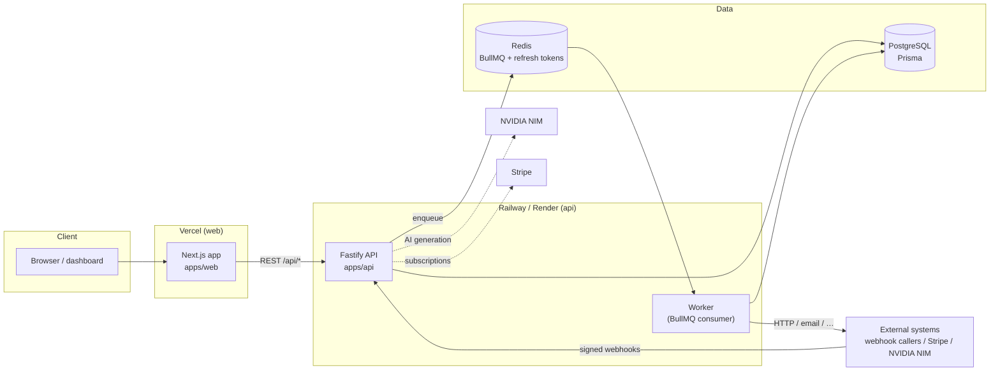

<div align="center">

# AgentFlow

**Open-source workflow automation — build, run and monitor integrations with a visual canvas, AI generation and human approvals.**

[](https://github.com/vl869101-collab/AgentFlow/actions/workflows/ci.yml)
[](https://github.com/vl869101-collab/AgentFlow/actions/workflows/deploy.yml)
[](LICENSE)
[](https://nodejs.org)
[](https://pnpm.io)

<!-- TODO: replace with a real screenshot or GIF of the workflow editor
      -->

```
 ┌─────────┐    ┌──────────┐    ┌───────────┐    ┌─────────┐
 │ Webhook │───▶│ AI Agent │───▶│ Condition │───▶│  Email  │
 └─────────┘    └──────────┘    └───────────┘    └─────────┘
                       │
                       ▼
                 ┌───────────┐
                 │ Approval  │  ← a human signs off before it continues
                 └───────────┘
```

[Quick start](#-quick-start) · [Architecture](#%EF%B8%8F-architecture) · [API reference](#-api-reference) · [Deployment](#%EF%B8%8F-deployment) · [Contributing](#%EF%B8%8F-contributing)

</div>

---

## ✨ Features

- **Visual workflow editor** — React Flow canvas with triggers (webhook, cron, manual), actions (HTTP, email, Discord, Telegram, Sheets), logic nodes (condition, transform, delay, filter, merge) and AI nodes
- **AI workflow generation** — describe an automation in plain language and get a validated workflow draft (`POST /api/ai/generate`)
- **Executions engine** — queued via BullMQ/Redis with an in-process fallback, node-level logs, cancellation and retries
- **Human-in-the-loop** — approval nodes pause executions until an owner approves or rejects
- **Organizations & RBAC** — multi-org workspaces with OWNER/ADMIN/MEMBER/VIEWER roles and member invites
- **Credentials vault** — third-party secrets encrypted at rest with AES-256-GCM, reveal restricted to admins
- **Signed webhooks** — public triggers authenticated by path + mandatory HMAC-SHA256 signatures
- **Billing-ready** — Stripe subscriptions, usage metering and per-plan quotas (workflows, monthly executions)
- **API keys** — personal `af_…` tokens (SHA-256 hashed at rest) for programmatic access
- **Interactive API docs** — OpenAPI 3.1 spec served at `/api/docs` with Swagger UI at `/api/docs/ui`

## 📦 Monorepo layout

```
AgentFlow/
├── apps/
│   ├── api/          Fastify REST API (auth, workflows, executions, billing, …)
│   └── web/          Next.js 16 dashboard + React Flow editor
├── packages/
│   ├── database/     Prisma schema, migrations and seed
│   └── shared/       Zod schemas shared between web and api
├── docker-compose.yml  Postgres + Redis + api + web for local development
└── turbo.json          Turborepo task pipeline
```

## 🚀 Quick start

**Prerequisites:** Node.js 22+, pnpm 9 (`corepack enable`), Docker (for Postgres — or any Postgres 16 instance).

```bash
# 1. Clone
git clone https://github.com/vl869101-collab/AgentFlow.git
cd AgentFlow

# 2. Install dependencies
pnpm install

# 3. Configure environment
cp .env.example .env
#    → set DATABASE_URL, JWT_SECRET and CREDENTIAL_ENCRYPTION_KEY
#      openssl rand -hex 32   # generates both secrets

# 4. Start Postgres (+ Redis, optional) and apply migrations
docker compose up -d postgres redis
pnpm --filter @agentflow/database exec prisma migrate deploy
#    optional: pnpm db:seed

# 5. Run it
pnpm dev            # api on :3001 and web on :3000 (via Turborepo)
```

Open **http://localhost:3000**, register an account (a personal organization is created automatically) and build your first workflow. API docs live at **http://localhost:3001/api/docs/ui**.

> Prefer all-Docker? See [DOCKER.md](DOCKER.md).

## 🏗️ Architecture



**Request flow.** The web app talks to the API over REST with short-lived JWT access tokens (15 min) plus rotating single-use refresh tokens (7 days). Workflow executions are enqueued in BullMQ and consumed by a worker (`apps/api/src/worker.ts`); when Redis is unavailable executions run inline, so a minimal local setup only needs Postgres. State (workflows, versions, executions, node logs, credentials, usage) lives in PostgreSQL via Prisma.

**Security posture.** Credential values are AES-256-GCM encrypted with a boot-required key; webhook triggers always verify HMAC signatures; registration and password-reset responses are enumeration-safe; Stripe webhooks verify raw-body signatures; API keys are stored as SHA-256 hashes.

## 🧰 Tech stack

| Layer      | Tech                                                                  |
| ---------- | --------------------------------------------------------------------- |
| Web        | Next.js (App Router), React, React Flow, Tailwind CSS, Framer Motion |
| API        | Fastify 5, @fastify/jwt, @fastify/rate-limit, Zod validation         |
| Data       | PostgreSQL 16, Prisma 6, Redis + BullMQ (optional queue)              |
| Payments   | Stripe (checkout sessions + webhook-driven subscription sync)         |
| AI         | NVIDIA NIM (meta/llama-3.1-8b-instruct) for workflow generation       |
| Platform   | pnpm workspaces, Turborepo, TypeScript, ESLint 9, GitHub Actions      |

## 📡 API reference

Full interactive documentation: **`GET /api/docs`** (OpenAPI 3.1) and **`/api/docs/ui`** (Swagger UI) when the API is running. Source: [`apps/api/src/docs/openapi.ts`](apps/api/src/docs/openapi.ts).

Authentication: `Authorization: Bearer <token>` — either a JWT access token or a personal API key (`af_…`). Unless noted, endpoints require authentication. List endpoints accept `page` / `limit` (max 100).

### Auth
| Method | Path                          | Auth | Description                              |
| ------ | ----------------------------- | ---- | ---------------------------------------- |
| POST   | `/api/auth/register`          | –    | Create account + default organization    |
| POST   | `/api/auth/login`             | –    | Email/password → token pair + org        |
| POST   | `/api/auth/refresh`           | –    | Rotate refresh token                     |
| POST   | `/api/auth/logout`            | –    | Revoke a refresh token                   |
| POST   | `/api/auth/forgot-password`   | –    | Request reset (enumeration-safe)         |
| GET    | `/api/auth/{provider}`        | –    | Start Google/Microsoft/Apple OAuth       |
| GET    | `/api/auth/{provider}/callback` | –  | OAuth callback (HTML auto-submit)        |

### Workflows
| Method | Path                          | Description                              |
| ------ | ----------------------------- | ---------------------------------------- |
| GET    | `/api/workflows`              | List workflows (paginated)               |
| POST   | `/api/workflows`              | Create (plan limit enforced)             |
| GET    | `/api/workflows/{id}`         | Get with canvas + latest version         |
| PUT    | `/api/workflows/{id}`         | Update metadata and/or full canvas       |
| PATCH  | `/api/workflows/{id}`         | Partial update                           |
| DELETE | `/api/workflows/{id}`         | Delete                                   |
| PUT    | `/api/workflows/{id}/canvas`  | Replace canvas (new version snapshot)    |
| POST   | `/api/workflows/{id}/run`     | Manual run → 202 execution               |

### Executions
| Method | Path                            | Description                              |
| ------ | ------------------------------- | ---------------------------------------- |
| POST   | `/api/executions/trigger`       | API-triggered run (quota-checked)        |
| GET    | `/api/executions`               | List (filter: `workflowId`, `status`)    |
| GET    | `/api/executions/{id}`          | Detail with node logs + approvals        |
| POST   | `/api/executions/{id}/cancel`   | Cancel pending/running execution         |
| GET    | `/api/executions/{id}/nodes`    | Node-level execution logs                |

### Credentials
| Method | Path                          | Description                              |
| ------ | ----------------------------- | ---------------------------------------- |
| GET    | `/api/credentials`             | List (masked values)                     |
| POST   | `/api/credentials`             | Store AES-256-GCM encrypted credential   |
| GET    | `/api/credentials/{id}/reveal` | Decrypt (OWNER/ADMIN only)               |
| DELETE | `/api/credentials/{id}`        | Delete                                   |

### Approvals
| Method | Path                            | Description                              |
| ------ | ------------------------------- | ---------------------------------------- |
| GET    | `/api/approvals`                | Pending approvals across your orgs       |
| POST   | `/api/approvals/{id}/approve`   | Approve (resumes execution)              |
| POST   | `/api/approvals/{id}/reject`    | Reject                                   |

### Organizations
| Method | Path                          | Description                              |
| ------ | ----------------------------- | ---------------------------------------- |
| GET    | `/api/orgs`                    | Your organizations + role                |
| POST   | `/api/orgs`                    | Create organization                      |
| GET    | `/api/orgs/{id}`               | Get organization                         |
| PUT    | `/api/orgs/{id}`               | Rename (OWNER/ADMIN)                     |
| GET    | `/api/orgs/{id}/members`       | List members                             |
| POST   | `/api/orgs/{id}/invite`        | Add registered user (role rules apply)   |

### AI · Billing · Keys · Webhooks · System
| Method | Path                            | Description                              |
| ------ | ------------------------------- | ---------------------------------------- |
| POST   | `/api/ai/generate`              | Prompt → validated workflow draft        |
| GET    | `/api/billing/subscription`     | Current subscription or `free`           |
| GET    | `/api/billing/usage`            | Usage records                            |
| POST   | `/api/billing/checkout`         | Stripe Checkout session                  |
| POST   | `/api/billing/webhook`          | Stripe webhook (signature-verified)      |
| GET    | `/api/api-keys`                 | List keys (hashed at rest)               |
| POST   | `/api/api-keys`                 | Create `af_…` key (shown once)           |
| DELETE | `/api/api-keys/{id}`            | Revoke key                               |
| GET    | `/api/webhooks`                 | List webhooks (no secrets)               |
| POST   | `/api/webhooks`                 | Create (secret returned once)            |
| DELETE | `/api/webhooks/{id}`            | Delete                                   |
| ANY    | `/api/webhooks/trigger/{path}`  | Public trigger — HMAC-signed             |
| GET    | `/api/settings`                 | Profile + organizations                  |
| PUT    | `/api/settings`                 | Update profile                           |
| GET    | `/health`                       | Liveness + dependency check              |
| GET    | `/api/docs` · `/api/docs/ui`    | OpenAPI 3.1 spec · Swagger UI            |

## 🔐 Environment variables

Copy `.env.example` to `.env` and fill in the required values. **The API refuses to boot** without the three required variables.

| Variable | Required | Default | Description |
| -------- | :------: | ------- | ----------- |
| `DATABASE_URL` | ✅ | – | PostgreSQL connection string |
| `JWT_SECRET` | ✅ | – | ≥32 chars — signs access/refresh tokens (`openssl rand -hex 32`) |
| `CREDENTIAL_ENCRYPTION_KEY` | ✅ | – | 64 hex chars — AES-256-GCM key for the credentials vault |
| `NODE_ENV` | – | `development` | `development` / `test` / `production` |
| `PORT` | – | `3001` | API port |
| `HOST` | – | `127.0.0.1` | Bind address (`0.0.0.0` behind proxies/containers) |
| `TRUST_PROXY` | – | `false` | `true`, `false` or comma-separated IPs/CIDRs for correct client IPs |
| `CORS_ORIGIN` | – | `http://localhost:3000` | Allowed web origin |
| `REDIS_URL` | – | `redis://localhost:6379` | Redis for BullMQ + refresh-token allowlist |
| `QUEUE_ENABLED` | – | auto | Force the execution queue on outside production |
| `JWT_EXPIRES_IN` | – | `15m` | Access token TTL |
| `REFRESH_EXPIRES_IN` | – | `7d` | Refresh token TTL |
| `NVIDIA_NIM_API_KEY` | – | – | Enables `POST /api/ai/generate` |
| `NVIDIA_NIM_BASE_URL` | – | NVIDIA endpoint | Override the AI provider base URL |
| `STRIPE_SECRET_KEY` | – | – | Enables checkout + subscription sync |
| `STRIPE_WEBHOOK_SECRET` | – | – | Verifies `/api/billing/webhook` signatures |
| `STRIPE_PRICE_ID_MONTHLY` / `_YEARLY` / `_PRO` / `_TEAM` | – | – | Allowed price IDs at checkout |
| `NEXT_PUBLIC_API_URL` | – | `http://localhost:3001` | Where the web app finds the API |
| `NEXT_PUBLIC_APP_URL` | – | `http://localhost:3000` | Public web URL (OAuth/billing redirects) |
| `NEXT_PUBLIC_STRIPE_PUBLISHABLE_KEY` | – | – | Stripe.js publishable key |
| `GOOGLE_CLIENT_ID` / `GOOGLE_CLIENT_SECRET` | – | – | Google sign-in |
| `MICROSOFT_CLIENT_ID` / `MICROSOFT_CLIENT_SECRET` | – | – | Microsoft sign-in |
| `APPLE_CLIENT_ID` / `_TEAM_ID` / `_KEY_ID` / `_PRIVATE_KEY` | – | – | Apple sign-in (Service ID + key material) |
| `OPENAI_API_KEY` / `ANTHROPIC_API_KEY` | – | – | Reserved for upcoming providers |

## 🧪 Testing & scripts

```bash
pnpm test         # backend test suite (in-memory adapter, no DB needed)
pnpm lint         # ESLint across apps/ and packages/
pnpm typecheck    # tsc --noEmit across the monorepo
pnpm build        # production builds (turbo)
pnpm db:migrate   # prisma migrate dev
pnpm db:seed      # seed demo data
pnpm db:studio    # Prisma Studio
```

CI (`.github/workflows/ci.yml`) runs lint → typecheck → tests (with a PostgreSQL 16 service container and `prisma migrate deploy`) → builds, and must pass before deployment.

## 🚢 Deployment

Pushing to `main` with a green CI run triggers `.github/workflows/deploy.yml`: the **web** app goes to Vercel and the **API** to Railway (Docker build from `apps/api/Dockerfile`). Both can also be triggered manually via `workflow_dispatch`.

### Web → Vercel

1. Import the repo at [vercel.com/new](https://vercel.com/new); set **Root Directory** to `apps/web` (framework auto-detects Next.js).
2. Add repository secrets: `VERCEL_TOKEN`, `VERCEL_ORG_ID`, `VERCEL_PROJECT_ID`.
3. Set the project env vars: `NEXT_PUBLIC_API_URL`, `NEXT_PUBLIC_APP_URL`, `NEXT_PUBLIC_STRIPE_PUBLISHABLE_KEY`.

### API → Railway

1. Create a project at [railway.app](https://railway.app); add a **PostgreSQL** plugin (and optionally Redis).
2. Deploy the repo as a service — the root [`railway.json`](railway.json) wires the Dockerfile, `/health` check and restart policy.
3. Set service variables: `DATABASE_URL`, `JWT_SECRET`, `CREDENTIAL_ENCRYPTION_KEY`, `NODE_ENV=production`, `HOST=0.0.0.0`, `TRUST_PROXY=true` (+ Stripe/OAuth as needed).
4. Run migrations once: `railway run --service <api> pnpm --filter @agentflow/database exec prisma migrate deploy`.
5. Add the `RAILWAY_TOKEN` secret to GitHub.

> **Render instead of Railway:** create a Web Service from `apps/api/Dockerfile` with health check `/health` and the same env vars — see the notes at the bottom of `deploy.yml`.

## 🤝 Contributing

Contributions are welcome! Here's how to start:

1. **Fork & branch** — `git checkout -b feat/my-feature` (conventional commits: `feat:`, `fix:`, `docs:`, `chore:` …).
2. **Set up** — follow the [Quick start](#-quick-start); copy `.env.example` to `.env`.
3. **Make changes** — keep validation schemas in `packages/shared`, API routes in `apps/api/src/routes`, and update the OpenAPI spec (`apps/api/src/docs/openapi.ts`) when you touch routes.
4. **Check locally** — `pnpm lint && pnpm typecheck && pnpm test` must pass.
5. **Open a PR** against `main` — CI must be green; describe what changed and why.

Guidelines: TypeScript strict mode everywhere, Zod-validate every external input, and no secret ever in logs or responses. Security issues → open a private advisory (Security tab) instead of a public issue.

## 📄 License

Released under the [MIT License](LICENSE).
