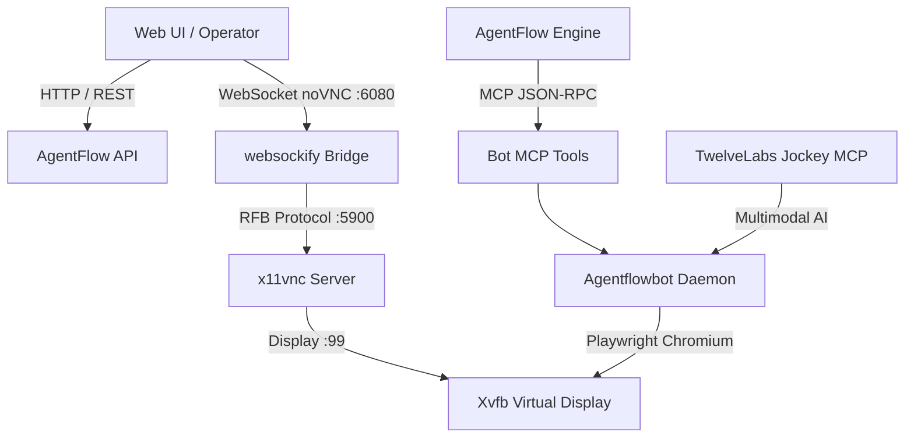

# 🚀 Live Dia 69 - O Nascimento do Overclock Bot (Autonomia 24/7, noVNC & MCP)

**Data da Sessão:** 2026-08-30 | **Video ID:** `vid_day69_genesis_live`

## 📌 Resumo Executivo

Registro detalhado da sessão de coding ao vivo do Dia 69 conduzida por Laschuk. O projeto implementa um agente autônomo com navegação web headless/headed via Playwright, virtual display Xvfb com streaming noVNC / WebSocket e interface de controle por Model Context Protocol (MCP).

## 🏗️ Arquitetura do Overclock Bot



- **Runtime:** Node.js 22 LTS / TypeScript com Fastify e worker threads isoladas
- **Motor de Browser:** Playwright Chromium em sandbox containerizado
- **Display Virtual:** Xvfb Virtual Framebuffer (:99) + X11 socket
- **Transmissão ao Vivo:** WebSocket RFB/VNC bridge com websockify e noVNC UI
- **Integrações MCP:**
  * `overclock-bot-mcp (tools: navigate, click, type, screenshot, evaluate, stream_status)`
  * `twelvelabs-jockey-mcp (tools: ingest_video, search_video, generate_text)`
  * `vault-credential-injector (injeção segura de senhas e tokens de sessão)`
- **Autonomous Loop:** Continuous self-healing loop com recovery automático após 15s de inatividade ou erro de tela.

## ⏱️ Linha do Tempo e Decisões de Código (Passo a Passo)

| Timestamp | Fase | Autor | Decisão de Engenharia | Contexto Técnico / Ação |
| :--- | :--- | :--- | :--- | :--- |
| `00:02:15` | **01. Concepção e Setup Inicial** | Laschuk | Separar o bot em pacote dedicado apps/bot desacoplado da UI web | Evita poluição de dependências pesadas de automação (Playwright, Xvfb) na API principal e permite deploy isolado em VPS leve. <br>```pnpm init -w apps/bot && pnpm add playwright ws zod dotenv``` |
| `00:24:40` | **02. Implementação do Display Virtual** | Laschuk | Utilizar Xvfb na tela :99 com resolução padrão 1280x800x24 | Permite que navegadores rodem em modo 'headed' mesmo em servidores sem monitor físico (VPS Linux headless), viabilizando streaming noVNC de baixa latência. <br>```Xvfb :99 -screen 0 1280x800x24 -nolisten tcp & export DISPLAY=:99``` |
| `01:10:15` | **03. Ponte WebSocket & noVNC Live Stream** | Laschuk | Implementar bridge websockify nativo no Node.js para transmitir frames RFB | Permite ao usuário inspecionar visualmente em tempo real o que o bot está fazendo pelo navegador sem instalar cliente VNC nativo. <br>```new WebSocketServer({ port: 6080 }) -> tcp://127.0.0.1:5900``` |
| `02:05:30` | **04. Camada de Ação e MCP Tools** | Laschuk | Expor comandos de navegação como ferramentas MCP determinísticas | O orquestrador do AgentFlow e agentes Claude podem chamar bot_navigate, bot_click e bot_type via protocolo JSON-RPC. <br>```server.registerTool('bot_navigate', { url: z.string().url() })``` |
| `03:15:00` | **05. Autonomous Bot Loop & Auto-Recovery** | Laschuk | Criar watchdog com heartbeat a cada 5s e reinício automático de página presa | Garante operação contínua 24/7 sem travamentos por modais inesperados ou quedas de conexão. <br>```setInterval(checkHealthAndRecover, 5000)``` |

## 💻 Comandos Executados e Logs de Execução da Live

### 🔹 [00:08:30] - Subir o daemon do bot em modo watch
```bash
pnpm --filter @agentflow/bot dev
```
**Resultado:** `Bot daemon running on port 3002 with DISPLAY=:99`

### 🔹 [00:45:12] - Iniciar servidor VNC local ligado ao Xvfb
```bash
x11vnc -display :99 -forever -shared -rfbport 5900 -nopw -bg
```
**Resultado:** `x11vnc started successfully on port 5900`

### 🔹 [01:40:00] - Teste de integração MCP ponta a ponta
```bash
curl -X POST http://localhost:3001/api/mcp -d '{"method":"tools/call","params":{"name":"bot_navigate","arguments":{"url":"https://app.agentflow.ai"}}}'
```
**Resultado:** `{"result":{"status":"navigated","title":"AgentFlow - AI Automation Center"}}`

## ⚠️ Armadilhas Encontradas & Resoluções (Troubleshooting)

### 🔴 Playwright travando no launch sem DISPLAY definido
- **Sintoma:** Error: Target closed / Browser closed unexpectedly on Linux
- **Resolução Aplicada:** Garantir checagem de process.env.DISPLAY e auto-spawn do Xvfb caso inexistente.
- **Lição Aprendida:** *Sempre verificar se DISPLAY existe antes de chamar chromium.launch({ headless: false }).*

### 🔴 Queda de WebSocket noVNC ao redimensionar viewport
- **Sintoma:** RFB handshake disconnects on window resize
- **Resolução Aplicada:** Travar a resolução do browser no mesmo aspect ratio do Xvfb (1280x800).
- **Lição Aprendida:** *Consistência de viewport entre servidor VNC e cliente web é mandatória.*

### 🔴 Vazamento de memória em loops de automação longos
- **Sintoma:** Chromium consome mais de 2GB de RAM após 500 navegações
- **Resolução Aplicada:** Reciclar BrowserContext a cada 100 ações mantendo apenas cookies e storage essenciais.
- **Lição Aprendida:** *Context pooling e garbage collection proativo são vitais para bots 24/7.*

---
*Gerado automaticamente pelo Pipeline TwelveLabs Multimodal AI (Marengo + Pegasus & Jockey MCP)*
