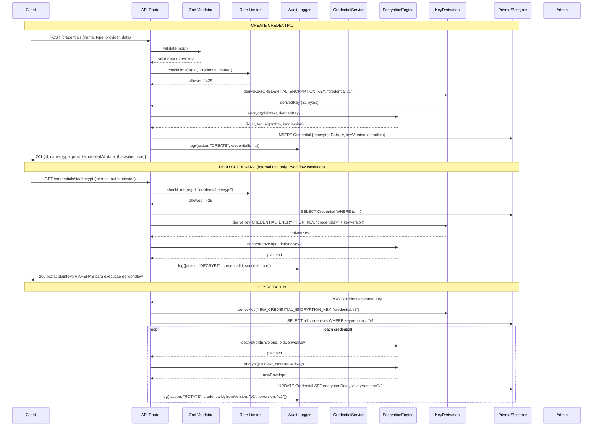

# Design: Sistema de Armazenamento Seguro de Credenciais

> **Missão**: Recriar n8n no AgentFlow  
> **Work dir**: `n8n-migration/`  
> **Data**: 2025-08-19  
> **Status**: DESIGN — não implementar, não commitar  
> **Responsável**: Pane SEGURANÇA DE CREDENCIAIS

---

## 1. Visão Geral da Arquitetura

### 1.1 Princípios de Segurança

| Princípio | Descrição |
|-----------|-----------|
| **Defense in Depth** | Múltiplas camadas: criptografia, validação, rate limit, auditoria, rotação |
| **Least Privilege** | Credenciais nunca expostas em logs, responses, ou erros |
| **Key Separation** | Chaves derivadas por propósito (HKDF com `info` distinto) |
| **Audit First** | Toda operação de credencial gera trilha imutável |
| **Fail Secure** | Erros não vazam material sensível |

### 1.2 Componentes do Sistema

```
┌─────────────────────────────────────────────────────────────────┐
│                        API LAYER                                │
│  ┌─────────────┐  ┌──────────────┐  ┌────────────────────────┐ │
│  │  Zod Schema │  │  Rate Limit  │  │  Audit Middleware      │ │
│  │  Validation │  │  (per org/IP)│  │  (request/response)    │ │
│  └──────┬──────┘  └──────┬───────┘  └───────────┬────────────┘ │
└─────────┼────────────────┼───────────────────────┼──────────────┘
          │                │                       │
          ▼                ▼                       ▼
┌─────────────────────────────────────────────────────────────────┐
│                      SERVICE LAYER                              │
│  ┌──────────────────────────────────────────────────────────┐  │
│  │              CredentialService                             │  │
│  │  • create()    • get()    • update()    • delete()        │  │
│  │  • decrypt()   • rotate()  • list()     • verifyAccess()  │  │
│  └────────────────────────────┬───────────────────────────────┘  │
└───────────────────────────────┼──────────────────────────────────┘
                                │
                                ▼
┌─────────────────────────────────────────────────────────────────┐
│                      CRYPTO LAYER                               │
│  ┌──────────────────┐  ┌────────────────────────────────────┐  │
│  │  KeyDerivation   │  │  EncryptionEngine                  │  │
│  │  • HKDF-SHA256   │  │  • AES-256-GCM (primary)           │  │
│  │  • PBKDF2 (fallback)│  │  • XChaCha20-Poly1305 (alt)     │  │
│  │  • Key Versioning│  │  • Envelope Format (JSON)          │  │
│  └──────────────────┘  └────────────────────────────────────┘  │
└───────────────────────────────┬─────────────────────────────────┘
                                │
                                ▼
┌─────────────────────────────────────────────────────────────────┐
│                      DATA LAYER (Prisma)                        │
│  ┌──────────────────┐  ┌────────────────────────────────────┐  │
│  │  Credential      │  │  CredentialAuditLog                │  │
│  │  • encryptedData │  │  • credentialId                    │  │
│  │  • iv/nonce      │  │  • action (CREATE/READ/UPDATE/...) │  │
│  │  • keyVersion    │  │  • userId, orgId, ip, userAgent    │  │
│  │  • algorithm     │  │  • success, errorMessage           │  │
│  │  • metadata      │  │  • timestamp                       │  │
│  └──────────────────┘  └────────────────────────────────────┘  │
└─────────────────────────────────────────────────────────────────┘
```

---

## 2. Fluxo de Encriptação / Desencriptação

### 2.1 Diagrama de Sequência



### 2.2 Formato do Envelope Criptográfico (JSON)

```json
{
  "iv": "base64url-encoded-12-bytes",
  "ct": "base64url-encoded-ciphertext",
  "tag": "base64url-encoded-16-byte-auth-tag",
  "alg": "AES-256-GCM",
  "kv": "v1"
}
```

**Campos:**
| Campo | Tamanho | Descrição |
|-------|---------|-----------|
| `iv` | 12 bytes (96 bits) | Nonce único por encriptação (GCM requer unicidade) |
| `ct` | Variável | Ciphertext (mesmo tamanho do plaintext) |
| `tag` | 16 bytes (128 bits) | Authentication tag do GCM |
| `alg` | String | Identificador do algoritmo: `"AES-256-GCM"` ou `"XChaCha20-Poly1305"` |
| `kv` | String | Versão da chave derivada: `"v1"`, `"v2"`, etc. |

### 2.3 Derivação de Chave (HKDF-SHA256)

```typescript
// Pseudo-código da derivação
const masterKey = Buffer.from(process.env.CREDENTIAL_ENCRYPTION_KEY, 'hex'); // 32 bytes
const salt = Buffer.from('agentflow-credential-salt-v1', 'utf8'); // Salt fixo por aplicação
const info = `credential:${keyVersion}:${purpose}`; // ex: "credential:v1:encrypt"

const derivedKey = hkdfSha256(masterKey, salt, info, 32); // 32 bytes = 256 bits
```

**Por que HKDF e não PBKDF2?**
- HKDF é mais rápido (sem iterações custosas) — adequado para chave já forte (32 bytes hex = 256 bits de entropia)
- PBKDF2 mantido como fallback para compatibilidade (`CREDENTIAL_KDF_ALGORITHM=PBKDF2`)

---

## 3. Schema Prisma Proposto

### 3.1 Modelo `Credential` (Extensão do Existente)

```prisma
model Credential {
  id            String   @id @default(cuid())
  name          String
  type          String   // "openai", "http", "database", "aws", etc.
  provider      String   // "openai", "anthropic", "generic", etc.
  
  // === CAMPOS CRIPTOGRÁFICOS (NOVOS) ===
  encryptedData String   // JSON envelope: {iv, ct, tag, alg, kv}
  iv            String   // Base64url do IV/nonce (redundante para queries rápidas)
  keyVersion    String   @default("v1")  // Versão da chave derivada (v1, v2, ...)
  algorithm     String   @default("AES-256-GCM") // Algoritmo usado
  
  // === METADADOS (NÃO SENSÍVEIS) ===
  metadata      Json?    // {description?, scopes?, testResult?, lastTestedAt?}
  
  // === RELACIONAMENTOS ===
  orgId         String
  organization  Organization @relation(fields: [orgId], references: [id], onDelete: Cascade)
  createdById   String
  createdBy     User       @relation(fields: [createdById], references: [id])
  updatedById   String?
  updatedBy     User?      @relation(fields: [updatedById], references: [id])
  
  createdAt     DateTime @default(now())
  updatedAt     DateTime @updatedAt
  
  // === AUDITORIA ===
  auditLogs     CredentialAuditLog[]
  
  @@index([orgId])
  @@index([orgId, type])
  @@index([keyVersion]) // Para rotação eficiente
}
```

### 3.2 Modelo `CredentialAuditLog` (NOVO)

```prisma
model CredentialAuditLog {
  id            String   @id @default(cuid())
  credentialId  String
  credential    Credential @relation(fields: [credentialId], references: [id], onDelete: Cascade)
  
  action        CredentialAction // Enum abaixo
  userId        String
  user          User       @relation(fields: [userId], references: [id], onDelete: Cascade)
  orgId         String
  organization  Organization @relation(fields: [orgId], references: [id], onDelete: Cascade)
  
  // Contexto da requisição
  ip            String?
  userAgent     String?
  requestId     String?    // Correlation ID para tracing
  
  // Resultado
  success       Boolean    @default(true)
  errorMessage  String?
  
  // Metadados extras (ex: keyVersion antes/depois na rotação)
  metadata      Json?
  
  createdAt     DateTime   @default(now())
  
  @@index([credentialId, createdAt])
  @@index([orgId, createdAt])
  @@index([userId, createdAt])
  @@index([action])
}

enum CredentialAction {
  CREATE
  READ           // Listagem (mascarada)
  READ_FULL      // Desencriptação (apenas execução de workflow)
  UPDATE
  DELETE
  DECRYPT        // Alias para READ_FULL
  ROTATE_KEY     // Rotação de chave mestra
  TEST           // Teste de conexão da credencial
  EXPORT         // Exportação (se permitida)
  IMPORT         // Importação
}
```

### 3.3 Modelo `CredentialKeyVersion` (NOVO - Controle de Rotação)

```prisma
model CredentialKeyVersion {
  id            String   @id @default(cuid())
  version       String   @unique // "v1", "v2", ...
  algorithm     String   @default("AES-256-GCM")
  salt          String   // Base64 do salt usado no HKDF
  infoPrefix    String   @default("credential") // Prefixo do info no HKDF
  active        Boolean  @default(true)   // Versão ativa para novas encriptações
  deprecatedAt  DateTime?                // Quando foi desativada
  rotatedAt     DateTime?                // Quando rotação concluída
  rotatedById   String?
  rotatedBy     User?      @relation(fields: [rotatedById], references: [id])
  createdAt     DateTime   @default(now())
  
  @@index([active])
}
```

---

## 4. Helpers TypeScript (Assinaturas)

### 4.1 `packages/shared/src/credentials.ts` — Schemas Zod

```typescript
import { z } from "zod";

/** Tipos de credenciais suportados */
export const CredentialTypeSchema = z.enum([
  "openai",
  "anthropic", 
  "google",
  "aws",
  "azure",
  "database",
  "http",
  "webhook",
  "smtp",
  "slack",
  "discord",
  "telegram",
  "generic",
]);

/** Provedores conhecidos (para UI) */
export const CredentialProviderSchema = z.enum([
  "openai",
  "anthropic",
  "google",
  "aws",
  "azure", 
  "postgresql",
  "mysql",
  "mongodb",
  "redis",
  "generic",
]);

/** Schema para CREATE — dados sensíveis entram aqui */
export const createCredentialSchema = z.object({
  name: z.string().min(1).max(100),
  type: CredentialTypeSchema,
  provider: CredentialProviderSchema,
  data: z.record(z.unknown()).refine(
    (obj) => Object.keys(obj).length > 0,
    "Credential data cannot be empty"
  ),
  metadata: z
    .object({
      description: z.string().max(500).optional(),
      scopes: z.array(z.string()).optional(),
    })
    .optional(),
});

/** Schema para UPDATE — dados opcionais */
export const updateCredentialSchema = z.object({
  name: z.string().min(1).max(100).optional(),
  data: z.record(z.unknown()).optional(),
  metadata: z
    .object({
      description: z.string().max(500).optional(),
      scopes: z.array(z.string()).optional(),
    })
    .optional(),
}).refine(
  (obj) => Object.keys(obj).length > 0,
  "At least one field must be provided"
);

/** Schema para resposta mascarada (listagem) */
export const maskedCredentialSchema = z.object({
  id: z.string(),
  name: z.string(),
  type: CredentialTypeSchema,
  provider: CredentialProviderSchema,
  createdAt: z.date(),
  data: z.object({ hasValue: z.literal(true) }),
});

/** Schema para resposta completa (APENAS execução de workflow) */
export const decryptedCredentialSchema = z.object({
  id: z.string(),
  name: z.string(),
  type: CredentialTypeSchema,
  provider: CredentialProviderSchema,
  data: z.record(z.unknown()),
  metadata: z.unknown().optional(),
});

/** Tipos inferidos */
export type CreateCredentialInput = z.infer<typeof createCredentialSchema>;
export type UpdateCredentialInput = z.infer<typeof updateCredentialSchema>;
export type MaskedCredential = z.infer<typeof maskedCredentialSchema>;
export type DecryptedCredential = z.infer<typeof decryptedCredentialSchema>;
```

### 4.2 `apps/api/src/lib/credential-crypto.ts` — Engine Criptográfico

```typescript
import { 
  createCipheriv, 
  createDecipheriv, 
  randomBytes,
  createHash,
  timingSafeEqual 
} from "node:crypto";
import { hkdf } from "@noble/hashes/hkdf";
import { sha256 } from "@noble/hashes/sha256";

/** Configuração vinda de env vars (nomes apenas) */
interface CryptoConfig {
  masterKeyHex: string;           // CREDENTIAL_ENCRYPTION_KEY
  kdfAlgorithm: "HKDF" | "PBKDF2"; // CREDENTIAL_KDF_ALGORITHM
  pbkdf2Iterations: number;        // CREDENTIAL_PBKDF2_ITERATIONS
  defaultAlgorithm: "AES-256-GCM" | "XChaCha20-Poly1305"; // CREDENTIAL_DEFAULT_ALG
  keyVersion: string;              // CREDENTIAL_KEY_VERSION (ex: "v1")
  salt: string;                    // CREDENTIAL_HKDF_SALT (base64)
}

/** Resultado da encriptação */
export interface EncryptedEnvelope {
  iv: string;      // base64url
  ct: string;      // base64url
  tag: string;     // base64url
  alg: string;     // "AES-256-GCM" | "XChaCha20-Poly1305"
  kv: string;      // "v1", "v2", ...
}

/** Interface do serviço de criptografia */
export interface ICredentialCrypto {
  /** Encripta plaintext string → envelope JSON */
  encrypt(plaintext: string, keyVersion?: string): Promise<EncryptedEnvelope>;
  
  /** Desencripta envelope → plaintext string */
  decrypt(envelope: EncryptedEnvelope | string): Promise<string>;
  
  /** Deriva chave para uma versão específica */
  deriveKey(keyVersion: string, purpose: "encrypt" | "decrypt"): Buffer;
  
  /** Verifica se consegue desencriptar (para health check) */
  verify(envelope: EncryptedEnvelope): Promise<boolean>;
  
  /** Rotaciona envelope de versão antiga para nova */
  rotate(envelope: EncryptedEnvelope, fromVersion: string, toVersion: string): Promise<EncryptedEnvelope>;
}

/** Constantes do algoritmo */
const ALGO_CONFIG = {
  "AES-256-GCM": { ivLength: 12, tagLength: 16, keyLength: 32 },
  "XChaCha20-Poly1305": { ivLength: 24, tagLength: 16, keyLength: 32 },
} as const;

type Algorithm = keyof typeof ALGO_CONFIG;

/** Implementação padrão */
export class CredentialCrypto implements ICredentialCrypto {
  private config: CryptoConfig;
  private keyCache: Map<string, Buffer> = new Map();

  constructor(config: CryptoConfig) {
    this.config = config;
    this.validateConfig();
  }

  private validateConfig(): void {
    if (!/^[0-9a-fA-F]{64}$/.test(this.config.masterKeyHex)) {
      throw new Error("CREDENTIAL_ENCRYPTION_KEY must be 64 hex chars (32 bytes)");
    }
    if (this.config.kdfAlgorithm === "PBKDF2" && this.config.pbkdf2Iterations < 100000) {
      throw new Error("CREDENTIAL_PBKDF2_ITERATIONS must be >= 100000");
    }
  }

  /** Deriva chave via HKDF-SHA256 (padrão) ou PBKDF2 */
  deriveKey(keyVersion: string, purpose: "encrypt" | "decrypt"): Buffer {
    const cacheKey = `${keyVersion}:${purpose}`;
    if (this.keyCache.has(cacheKey)) {
      return this.keyCache.get(cacheKey)!;
    }

    const masterKey = Buffer.from(this.config.masterKeyHex, "hex");
    const salt = Buffer.from(this.config.salt, "base64");
    const info = Buffer.from(`${this.config.infoPrefix}:${keyVersion}:${purpose}`, "utf8");

    let derived: Buffer;
    if (this.config.kdfAlgorithm === "HKDF") {
      // HKDF-SHA256 (rápido, adequado para chave já forte)
      derived = Buffer.from(hkdf(sha256, masterKey, salt, info, 32));
    } else {
      // PBKDF2 (compatibilidade legada)
      const { pbkdf2Sync } = await import("node:crypto");
      derived = pbkdf2Sync(masterKey, salt, this.config.pbkdf2Iterations, 32, "sha256");
    }

    this.keyCache.set(cacheKey, derived);
    return derived;
  }

  async encrypt(plaintext: string, keyVersion?: string): Promise<EncryptedEnvelope> {
    const version = keyVersion ?? this.config.keyVersion;
    const algorithm = this.config.defaultAlgorithm;
    const { ivLength, tagLength, keyLength } = ALGO_CONFIG[algorithm];
    
    const key = this.deriveKey(version, "encrypt");
    const iv = randomBytes(ivLength);
    
    const cipher = createCipheriv(algorithm.toLowerCase().replace("-", ""), key, iv);
    const ciphertext = Buffer.concat([cipher.update(plaintext, "utf8"), cipher.final()]);
    const authTag = cipher.getAuthTag();

    const envelope: EncryptedEnvelope = {
      iv: this.toBase64Url(iv),
      ct: this.toBase64Url(ciphertext),
      tag: this.toBase64Url(authTag),
      alg: algorithm,
      kv: version,
    };

    return envelope;
  }

  async decrypt(envelope: EncryptedEnvelope | string): Promise<string> {
    const env = typeof envelope === "string" ? JSON.parse(envelope) : envelope;
    
    // Validação de estrutura
    if (!env.iv || !env.ct || !env.tag || !env.alg || !env.kv) {
      throw new Error("Invalid credential envelope structure");
    }

    const algorithm = env.alg as Algorithm;
    const { ivLength, tagLength } = ALGO_CONFIG[algorithm];
    
    const key = this.deriveKey(env.kv, "decrypt");
    const iv = this.fromBase64Url(env.iv);
    const ciphertext = this.fromBase64Url(env.ct);
    const authTag = this.fromBase64Url(env.tag);

    if (iv.length !== ivLength || authTag.length !== tagLength) {
      throw new Error("Invalid envelope: IV/tag length mismatch");
    }

    const decipher = createDecipheriv(algorithm.toLowerCase().replace("-", ""), key, iv);
    decipher.setAuthTag(authTag);
    
    const plaintext = Buffer.concat([
      decipher.update(ciphertext),
      decipher.final(),
    ]);

    return plaintext.toString("utf8");
  }

  async verify(envelope: EncryptedEnvelope): Promise<boolean> {
    try {
      await this.decrypt(envelope);
      return true;
    } catch {
      return false;
    }
  }

  async rotate(
    envelope: EncryptedEnvelope, 
    fromVersion: string, 
    toVersion: string
  ): Promise<EncryptedEnvelope> {
    // Desencripta com chave antiga
    const plaintext = await this.decrypt({ ...envelope, kv: fromVersion });
    // Encripta com chave nova
    return this.encrypt(plaintext, toVersion);
  }

  private toBase64Url(buf: Buffer): string {
    return buf.toString("base64").replace(/\+/g, "-").replace(/\//g, "_").replace(/=/g, "");
  }

  private fromBase64Url(str: string): Buffer {
    const padding = str.length % 4 === 0 ? "" : "=".repeat(4 - (str.length % 4));
    const base64 = str.replace(/-/g, "+").replace(/_/g, "/") + padding;
    return Buffer.from(base64, "base64");
  }
}

/** Factory para criar instância configurada via env */
export function createCredentialCrypto(): ICredentialCrypto {
  return new CredentialCrypto({
    masterKeyHex: process.env.CREDENTIAL_ENCRYPTION_KEY!,
    kdfAlgorithm: (process.env.CREDENTIAL_KDF_ALGORITHM as "HKDF" | "PBKDF2") ?? "HKDF",
    pbkdf2Iterations: parseInt(process.env.CREDENTIAL_PBKDF2_ITERATIONS ?? "600000", 10),
    defaultAlgorithm: (process.env.CREDENTIAL_DEFAULT_ALG as Algorithm) ?? "AES-256-GCM",
    keyVersion: process.env.CREDENTIAL_KEY_VERSION ?? "v1",
    salt: process.env.CREDENTIAL_HKDF_SALT ?? "YWdlbnRmbG93LWNyZWRlbnRpYWwtc2FsdC12MQ==", // base64 de "agentflow-credential-salt-v1"
  });
}
```

### 4.3 `apps/api/src/services/credential.service.ts` — Service Layer

```typescript
import { prisma } from "../lib/prisma.js";
import { ICredentialCrypto, EncryptedEnvelope, createCredentialCrypto } from "../lib/credential-crypto.js";
import { createCredentialSchema, updateCredentialSchema, CreateCredentialInput, UpdateCredentialInput, MaskedCredential } from "@agentflow/shared";
import { AuditService } from "./audit.service.js";

export interface CredentialServiceConfig {
  crypto: ICredentialCrypto;
  audit: AuditService;
  rateLimiter: RateLimiter;
}

export class CredentialService {
  private crypto: ICredentialCrypto;
  private audit: AuditService;
  private rateLimiter: RateLimiter;

  constructor(config: CredentialServiceConfig) {
    this.crypto = config.crypto;
    this.audit = config.audit;
    this.rateLimiter = config.rateLimiter;
  }

  /** Cria nova credencial — encripta dados sensíveis */
  async create(
    orgId: string, 
    userId: string, 
    input: CreateCredentialInput,
    requestMeta: { ip?: string; userAgent?: string; requestId?: string }
  ): Promise<MaskedCredential> {
    // Rate limit
    await this.rateLimiter.check(`${orgId}:credential:create`, 30, 60_000); // 30/min

    // Validação
    const data = createCredentialSchema.parse(input);
    
    // Encripta
    const plaintext = JSON.stringify(data.data);
    const envelope = await this.crypto.encrypt(plaintext);

    // Persiste
    const credential = await prisma.credential.create({
      data: {
        name: data.name,
        type: data.type,
        provider: data.provider,
        encryptedData: JSON.stringify(envelope),
        iv: envelope.iv,
        keyVersion: envelope.kv,
        algorithm: envelope.alg,
        metadata: data.metadata,
        orgId,
        createdById: userId,
        updatedById: userId,
      },
    });

    // Auditoria
    await this.audit.log({
      credentialId: credential.id,
      action: "CREATE",
      userId,
      orgId,
      success: true,
      ...requestMeta,
    });

    return this.toMasked(credential);
  }

  /** Lista credenciais (mascaradas) */
  async list(
    orgId: string,
    userId: string,
    options: { page?: number; limit?: number; type?: string } = {},
    requestMeta: { ip?: string; userAgent?: string; requestId?: string }
  ): Promise<{ items: MaskedCredential[]; total: number }> {
    await this.rateLimiter.check(`${orgId}:credential:list`, 100, 60_000);

    const where: Record<string, unknown> = { orgId };
    if (options.type) where.type = options.type;

    const [items, total] = await Promise.all([
      prisma.credential.findMany({
        where,
        orderBy: { createdAt: "desc" },
        skip: (options.page ?? 1 - 1) * (options.limit ?? 20),
        take: options.limit ?? 20,
      }),
      prisma.credential.count({ where }),
    ]);

    await this.audit.log({
      credentialId: "bulk",
      action: "READ",
      userId,
      orgId,
      success: true,
      metadata: { count: items.length, filters: options },
      ...requestMeta,
    });

    return { items: items.map(this.toMasked), total };
  }

  /** Obtém credencial mascarada por ID */
  async getById(
    id: string,
    orgId: string,
    userId: string,
    requestMeta: { ip?: string; userAgent?: string; requestId?: string }
  ): Promise<MaskedCredential | null> {
    await this.rateLimiter.check(`${orgId}:credential:get`, 60, 60_000);

    const credential = await prisma.credential.findFirst({
      where: { id, orgId },
    });

    if (!credential) return null;

    await this.audit.log({
      credentialId: credential.id,
      action: "READ",
      userId,
      orgId,
      success: true,
      ...requestMeta,
    });

    return this.toMasked(credential);
  }

  /** Desencripta credencial — APENAS para execução de workflow (internal) */
  async decryptForExecution(
    id: string,
    orgId: string,
    requestMeta: { ip?: string; userAgent?: string; requestId?: string }
  ): Promise<{ id: string; name: string; type: string; provider: string; data: Record<string, unknown> } | null> {
    await this.rateLimiter.check(`${orgId}:credential:decrypt`, 200, 60_000); // Mais permissivo para execução

    const credential = await prisma.credential.findFirst({
      where: { id, orgId },
    });

    if (!credential) return null;

    let plaintext: string;
    try {
      const envelope: EncryptedEnvelope = JSON.parse(credential.encryptedData);
      plaintext = await this.crypto.decrypt(envelope);
    } catch (error) {
      await this.audit.log({
        credentialId: credential.id,
        action: "DECRYPT",
        userId: "system",
        orgId,
        success: false,
        errorMessage: error instanceof Error ? error.message : "Decryption failed",
        ...requestMeta,
      });
      throw new Error("Failed to decrypt credential");
    }

    await this.audit.log({
      credentialId: credential.id,
      action: "DECRYPT",
      userId: "system",
      orgId,
      success: true,
      ...requestMeta,
    });

    return {
      id: credential.id,
      name: credential.name,
      type: credential.type,
      provider: credential.provider,
      data: JSON.parse(plaintext),
    };
  }

  /** Atualiza credencial — re-encripta se data mudou */
  async update(
    id: string,
    orgId: string,
    userId: string,
    input: UpdateCredentialInput,
    requestMeta: { ip?: string; userAgent?: string; requestId?: string }
  ): Promise<MaskedCredential> {
    await this.rateLimiter.check(`${orgId}:credential:update`, 30, 60_000);

    const data = updateCredentialSchema.parse(input);
    const existing = await prisma.credential.findFirst({ where: { id, orgId } });
    if (!existing) throw new Error("Credential not found");

    let encryptedData = existing.encryptedData;
    let iv = existing.iv;
    let keyVersion = existing.keyVersion;
    let algorithm = existing.algorithm;

    if (data.data) {
      const plaintext = JSON.stringify(data.data);
      const envelope = await this.crypto.encrypt(plaintext);
      encryptedData = JSON.stringify(envelope);
      iv = envelope.iv;
      keyVersion = envelope.kv;
      algorithm = envelope.alg;
    }

    const updated = await prisma.credential.update({
      where: { id },
      data: {
        name: data.name ?? existing.name,
        encryptedData,
        iv,
        keyVersion,
        algorithm,
        metadata: data.metadata ?? existing.metadata,
        updatedById: userId,
      },
    });

    await this.audit.log({
      credentialId: updated.id,
      action: "UPDATE",
      userId,
      orgId,
      success: true,
      metadata: { fieldsUpdated: Object.keys(data) },
      ...requestMeta,
    });

    return this.toMasked(updated);
  }

  /** Deleta credencial */
  async delete(
    id: string,
    orgId: string,
    userId: string,
    requestMeta: { ip?: string; userAgent?: string; requestId?: string }
  ): Promise<void> {
    await this.rateLimiter.check(`${orgId}:credential:delete`, 10, 60_000);

    const existing = await prisma.credential.findFirst({ where: { id, orgId } });
    if (!existing) throw new Error("Credential not found");

    await prisma.credential.delete({ where: { id } });

    await this.audit.log({
      credentialId: id,
      action: "DELETE",
      userId,
      orgId,
      success: true,
      ...requestMeta,
    });
  }

  /** Rotação de chave mestra — re-encripta todas as credenciais de uma versão */
  async rotateKey(
    orgId: string,
    userId: string,
    fromVersion: string,
    toVersion: string,
    requestMeta: { ip?: string; userAgent?: string; requestId?: string }
  ): Promise<{ rotated: number; failed: number }> {
    // Rate limit agressivo para rotação
    await this.rateLimiter.check(`${orgId}:credential:rotate`, 1, 3600_000); // 1/hora

    const credentials = await prisma.credential.findMany({
      where: { orgId, keyVersion: fromVersion },
    });

    let rotated = 0;
    let failed = 0;

    for (const cred of credentials) {
      try {
        const envelope: EncryptedEnvelope = JSON.parse(cred.encryptedData);
        const newEnvelope = await this.crypto.rotate(envelope, fromVersion, toVersion);

        await prisma.credential.update({
          where: { id: cred.id },
          data: {
            encryptedData: JSON.stringify(newEnvelope),
            iv: newEnvelope.iv,
            keyVersion: newEnvelope.kv,
            algorithm: newEnvelope.alg,
            updatedById: userId,
          },
        });

        await this.audit.log({
          credentialId: cred.id,
          action: "ROTATE_KEY",
          userId,
          orgId,
          success: true,
          metadata: { fromVersion, toVersion },
          ...requestMeta,
        });
        rotated++;
      } catch (error) {
        failed++;
        await this.audit.log({
          credentialId: cred.id,
          action: "ROTATE_KEY",
          userId,
          orgId,
          success: false,
          errorMessage: error instanceof Error ? error.message : "Rotation failed",
          metadata: { fromVersion, toVersion },
          ...requestMeta,
        });
      }
    }

    // Atualiza registro de versão
    await prisma.credentialKeyVersion.update({
      where: { version: toVersion },
      data: { active: true, rotatedAt: new Date(), rotatedById: userId },
    });

    await prisma.credentialKeyVersion.update({
      where: { version: fromVersion },
      data: { active: false, deprecatedAt: new Date() },
    });

    return { rotated, failed };
  }

  /** Testa credencial (valida conexão sem expor dados) */
  async test(
    id: string,
    orgId: string,
    userId: string,
    requestMeta: { ip?: string; userAgent?: string; requestId?: string }
  ): Promise<{ success: boolean; message?: string }> {
    await this.rateLimiter.check(`${orgId}:credential:test`, 10, 60_000);

    const decrypted = await this.decryptForExecution(id, orgId, { ...requestMeta, userId });
    if (!decrypted) throw new Error("Credential not found");

    // TODO: Implementar teste específico por tipo/provider
    // Ex: OpenAI → testar API key; Database → testar conexão; HTTP → testar auth
    
    await this.audit.log({
      credentialId: id,
      action: "TEST",
      userId,
      orgId,
      success: true,
      ...requestMeta,
    });

    return { success: true, message: "Credential test passed" };
  }

  private toMasked(cred: { id: string; name: string; type: string; provider: string; createdAt: Date }): MaskedCredential {
    return {
      id: cred.id,
      name: cred.name,
      type: cred.type as any,
      provider: cred.provider as any,
      createdAt: cred.createdAt,
      data: { hasValue: true },
    };
  }
}
```

### 4.4 `apps/api/src/services/audit.service.ts` — Auditoria

```typescript
import { prisma } from "../lib/prisma.js";

export interface AuditLogEntry {
  credentialId: string;
  action: "CREATE" | "READ" | "READ_FULL" | "UPDATE" | "DELETE" | "DECRYPT" | "ROTATE_KEY" | "TEST" | "EXPORT" | "IMPORT";
  userId: string;
  orgId: string;
  success: boolean;
  errorMessage?: string;
  metadata?: Record<string, unknown>;
  ip?: string;
  userAgent?: string;
  requestId?: string;
}

export class AuditService {
  async log(entry: AuditLogEntry): Promise<void> {
    // Fire-and-forget para não bloquear a operação principal
    // Em produção, usar queue (bullmq) para confiabilidade
    prisma.credentialAuditLog.create({
      data: {
        credentialId: entry.credentialId,
        action: entry.action,
        userId: entry.userId,
        orgId: entry.orgId,
        success: entry.success,
        errorMessage: entry.errorMessage,
        metadata: entry.metadata,
        ip: entry.ip,
        userAgent: entry.userAgent,
        requestId: entry.requestId,
      },
    }).catch((err) => {
      // Log estruturado para observabilidade
      console.error("[AUDIT] Failed to write audit log", { 
        error: err.message, 
        entry: { ...entry, errorMessage: undefined } // Não logar erro do erro
      });
    });
  }

  /** Query de auditoria com filtros */
  async query(filters: {
    orgId: string;
    credentialId?: string;
    userId?: string;
    action?: string;
    from?: Date;
    to?: Date;
    page?: number;
    limit?: number;
  }): Promise<{ items: any[]; total: number }> {
    const where: Record<string, unknown> = { orgId: filters.orgId };
    if (filters.credentialId) where.credentialId = filters.credentialId;
    if (filters.userId) where.userId = filters.userId;
    if (filters.action) where.action = filters.action;
    if (filters.from || filters.to) {
      where.createdAt = {};
      if (filters.from) (where.createdAt as Record<string, Date>).gte = filters.from;
      if (filters.to) (where.createdAt as Record<string, Date>).lte = filters.to;
    }

    const [items, total] = await Promise.all([
      prisma.credentialAuditLog.findMany({
        where,
        orderBy: { createdAt: "desc" },
        skip: (filters.page ?? 1 - 1) * (filters.limit ?? 50),
        take: filters.limit ?? 50,
        include: { user: { select: { id: true, name: true, email: true } } },
      }),
      prisma.credentialAuditLog.count({ where }),
    ]);

    return { items, total };
  }

  /** Estatísticas de auditoria para dashboard */
  async stats(orgId: string, from: Date, to: Date): Promise<Record<string, number>> {
    const logs = await prisma.credentialAuditLog.groupBy({
      by: ["action"],
      where: {
        orgId,
        createdAt: { gte: from, lte: to },
      },
      _count: true,
    });

    return Object.fromEntries(logs.map((l) => [l.action, l._count]));
  }
}
```

### 4.5 `apps/api/src/middleware/rate-limit.ts` — Rate Limiter

```typescript
import { Redis } from "ioredis";

export interface RateLimitConfig {
  redis: Redis;
  defaultLimit: number;
  defaultWindowMs: number;
}

export class RateLimiter {
  private redis: Redis;
  private defaults: { limit: number; windowMs: number };

  constructor(config: RateLimitConfig) {
    this.redis = config.redis;
    this.defaults = { limit: config.defaultLimit, windowMs: config.defaultWindowMs };
  }

  /** Verifica e incrementa contador. Lança se excedido. */
  async check(key: string, limit?: number, windowMs?: number): Promise<void> {
    const l = limit ?? this.defaults.limit;
    const w = windowMs ?? this.defaults.windowMs;
    const redisKey = `ratelimit:${key}`;

    const current = await this.redis.incr(redisKey);
    if (current === 1) {
      await this.redis.pexpire(redisKey, w);
    }

    if (current > l) {
      const ttl = await this.redis.pttl(redisKey);
      const error = new Error("Rate limit exceeded") as Error & { 
        statusCode: number; 
        retryAfter: number;
        limit: number;
        remaining: number;
        resetAt: number;
      };
      error.statusCode = 429;
      error.retryAfter = Math.ceil(ttl / 1000);
      error.limit = l;
      error.remaining = 0;
      error.resetAt = Date.now() + ttl;
      throw error;
    }
  }

  /** Retorna info atual sem incrementar */
  async getInfo(key: string): Promise<{ limit: number; remaining: number; resetAt: number }> {
    const redisKey = `ratelimit:${key}`;
    const current = parseInt(await this.redis.get(redisKey) ?? "0", 10);
    const ttl = await this.redis.pttl(redisKey);
    return {
      limit: this.defaults.limit,
      remaining: Math.max(0, this.defaults.limit - current),
      resetAt: Date.now() + (ttl > 0 ? ttl : this.defaults.windowMs),
    };
  }

  /** Reseta contador (admin) */
  async reset(key: string): Promise<void> {
    await this.redis.del(`ratelimit:${key}`);
  }
}
```

---

## 5. Variáveis de Ambiente Necessárias

| Variável | Obrigatória | Padrão | Descrição |
|----------|-------------|--------|-----------|
| `CREDENTIAL_ENCRYPTION_KEY` | **SIM** | — | Chave mestra 32 bytes (64 hex chars). **Nunca imprimir valor.** |
| `CREDENTIAL_KDF_ALGORITHM` | Não | `HKDF` | `HKDF` ou `PBKDF2` |
| `CREDENTIAL_PBKDF2_ITERATIONS` | Não | `600000` | Iterações se PBKDF2 (≥100000) |
| `CREDENTIAL_DEFAULT_ALG` | Não | `AES-256-GCM` | `AES-256-GCM` ou `XChaCha20-Poly1305` |
| `CREDENTIAL_KEY_VERSION` | Não | `v1` | Versão atual da chave derivada |
| `CREDENTIAL_HKDF_SALT` | Não | `agentflow-credential-salt-v1` (base64) | Salt para HKDF (base64) |
| `CREDENTIAL_RATE_LIMIT_DEFAULT` | Não | `100` | Limite padrão por janela |
| `CREDENTIAL_RATE_LIMIT_WINDOW_MS` | Não | `60000` | Janela em ms (60s) |

**Geração da chave mestra (uma única vez):**
```bash
# Gerar chave segura de 32 bytes (64 hex chars)
node -e "console.log(require('crypto').randomBytes(32).toString('hex'))"
# Exemplo saída: a1b2c3d4e5f6789012345678901234567890abcdef1234567890abcdef123456
```

**Exemplo `.env` (apenas nomes, valores são segredos):**
```env
# Credential Encryption
CREDENTIAL_ENCRYPTION_KEY=<32-bytes-hex>
CREDENTIAL_KDF_ALGORITHM=HKDF
CREDENTIAL_DEFAULT_ALG=AES-256-GCM
CREDENTIAL_KEY_VERSION=v1
CREDENTIAL_HKDF_SALT=YWdlbnRmbG93LWNyZWRlbnRpYWwtc2FsdC12MQ==

# Rate Limiting
CREDENTIAL_RATE_LIMIT_DEFAULT=100
CREDENTIAL_RATE_LIMIT_WINDOW_MS=60000
```

---

## 6. Checklist de Segurança

### 6.1 Criptografia
- [ ] **AES-256-GCM** como algoritmo primário (autenticação integrada)
- [ ] **XChaCha20-Poly1305** como alternativa (não requer IV único por chave)
- [ ] **IV/Nonce de 96 bits (AES-GCM) ou 192 bits (XChaCha)** gerado via `randomBytes` por encriptação
- [ ] **Chave derivada via HKDF-SHA256** com `info` contextual (`credential:v1:encrypt`)
- [ ] **Salt fixo por aplicação** (não por credencial) — chave mestra já tem entropia total
- [ ] **Versionamento de chave** (`kv` no envelope) para rotação suave
- [ ] **Validação de tag de autenticação** obrigatória na desencriptação
- [ ] **Constant-time comparison** para verificação de tags (já feito pelo `createDecipheriv`)

### 6.2 Armazenamento
- [ ] **NUNCA** armazenar plaintext — apenas envelope JSON encriptado
- [ ] **NUNCA** logar `encryptedData`, `iv`, `ct`, `tag` em logs de aplicação
- [ ] **IV redundante** em coluna separada para queries/índices (não sensível)
- [ ] **Chave mestra APENAS em env var** — nunca em código, config, ou vault do app
- [ ] **Rotação de chave** suportada via `keyVersion` + job de re-encriptação

### 6.3 Validação (Zod)
- [ ] Schema `createCredentialSchema` valida `data` não-vazio
- [ ] Schema `updateCredentialSchema` exige pelo menos um campo
- [ ] Tipos `type` e `provider` restritos a enums conhecidos
- [ ] `metadata` opcional com campos limitados (description, scopes)
- [ ] **Nenhum campo sensível** em schemas de resposta (apenas `hasValue: true`)

### 6.4 Rate Limiting
- [ ] **Por organização** (tenant isolation)
- [ ] **Por ação** (create, read, decrypt, update, delete, rotate, test)
- [ ] Limites diferenciados: `decrypt` mais alto (execução de workflow), `rotate` muito baixo (1/hora)
- [ ] Headers de resposta: `X-RateLimit-Limit`, `X-RateLimit-Remaining`, `X-RateLimit-Reset`
- [ ] Redis como backend (já existente no stack via bullmq/ioredis)

### 6.5 Auditoria
- [ ] **Toda operação** gera `CredentialAuditLog`
- [ ] Campos: `credentialId`, `action`, `userId`, `orgId`, `success`, `errorMessage`, `ip`, `userAgent`, `requestId`, `metadata`, `createdAt`
- [ ] `READ_FULL`/`DECRYPT` logados separadamente de `READ` (listagem)
- [ ] `ROTATE_KEY` loga `fromVersion` → `toVersion` em `metadata`
- [ ] Falhas de desencriptação logadas com `success: false`
- [ ] Retenção: mínimo 1 ano (LGPD/Compliance)

### 6.6 Rotação de Chave
- [ ] Procedimento documentado: nova `CREDENTIAL_ENCRYPTION_KEY` + nova `CREDENTIAL_KEY_VERSION`
- [ ] Job de re-encriptação em lote (background, idempotente)
- [ ] Versão antiga mantida ativa até rotação completar
- [ ] `CredentialKeyVersion` trackea estado (`active`, `deprecatedAt`, `rotatedAt`)
- [ ] Rollback possível (manter versão anterior por 30 dias)

### 6.7 Acesso aos Dados
- [ ] **API pública** retorna apenas `MaskedCredential` (`data: { hasValue: true }`)
- [ ] **Desencriptação real** apenas via método interno `decryptForExecution()`
- [ ] `decryptForExecution` marcado como `internal: true` no OpenAPI
- [ ] Worker de execução de workflow chama endpoint interno autenticado (mTLS ou shared secret)
- [ ] **Nenhum endpoint público** retorna plaintext de credencial

### 6.8 Hardening Adicional
- [ ] `helmet()` no Fastify para headers de segurança
- [ ] CSP restritivo (já configurado no repo)
- [ ] `trustProxy: true` para rate limit behind proxy
- [ ] Sanitização de `ip` / `userAgent` antes de logar
- [ ] `requestId` propagado via header `x-request-id` para correlation

---

## 7. Integração com Stack Existente

### 7.1 Dependências Já Disponíveis
| Pacote | Versão | Uso |
|--------|--------|-----|
| `@prisma/client` | 6.19.3 | Models `Credential`, `CredentialAuditLog`, `CredentialKeyVersion` |
| `zod` | 3.25.76 | Validação de schemas |
| `ioredis` | 5.11.1 | Rate limiter backend |
| `bullmq` | 5.81.3 | Job de rotação de chave (background) |
| `node:crypto` | Built-in | AES-GCM, HKDF (via `@noble/hashes`) |
| `@noble/hashes` | — | HKDF-SHA256 (adicionar ao `api/package.json`) |

### 7.2 Nova Dependência Recomendada
```json
{
  "@noble/hashes": "^1.5.0"
}
```
*Leve, auditado, sem dependências — ideal para HKDF.*

### 7.3 Arquivos a Criar/Modificar
| Arquivo | Tipo | Descrição |
|---------|------|-----------|
| `packages/database/prisma/schema.prisma` | Modificar | Adicionar campos `Credential` + models `CredentialAuditLog`, `CredentialKeyVersion` |
| `packages/shared/src/credentials.ts` | Novo | Schemas Zod + tipos compartilhados |
| `apps/api/src/lib/credential-crypto.ts` | Novo | Engine criptográfico (substitui/estende `crypto.ts`) |
| `apps/api/src/services/credential.service.ts` | Novo | Service layer com lógica de negócio |
| `apps/api/src/services/audit.service.ts` | Novo | Auditoria imutável |
| `apps/api/src/middleware/rate-limit.ts` | Novo | Rate limiter por org/ação |
| `apps/api/src/routes/credentials.ts` | Modificar | Usar novo service, remover lógica inline |
| `apps/api/src/middleware/auth.ts` | Modificar | Adicionar `requestId` para correlation |

---

## 8. Próximos Passos (Fora do Escopo deste Design)

1. **Migração Prisma** — `prisma migrate dev` com os novos modelos
2. **Implementação do Service** — Conectar routes ao `CredentialService`
3. **Job de Rotação** — BullMQ job para `rotateKey` em lote
4. **Testes** — Unit (crypto), Integration (service), E2E (routes + audit)
5. **Documentação OpenAPI** — `@asteasolutions/zod-to-openapi` nos schemas
6. **Observabilidade** — Métricas Prometheus: `credential_encrypt_total`, `credential_decrypt_total`, `credential_rotate_duration_seconds`

---

**Fim do Documento de Design**  
*Este documento especifica a arquitetura completa. A implementação será feita em tarefas separadas.*