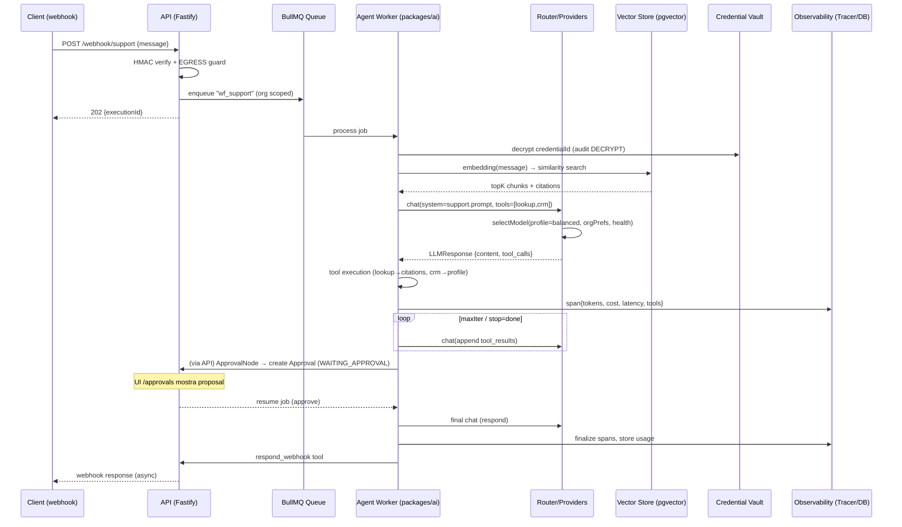
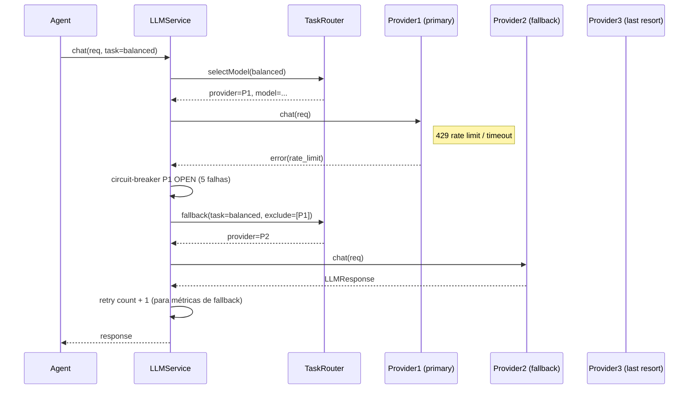

# Plataforma de IA — AgentFlow
> **Missão**: Recriar n8n no AgentFlow
> **Work dir**: `n8n-migration/`
> **Data**: 2026-08-20
> **Status**: DESIGN — não implementar, não commitar
> **Responsável**: Pane PLATAFORMA DE IA v2
> **Base**: `briefs/prompt-ai-platform.md` · `design-seguranca.md` · `v2-security-spec.md` · `deps-e-libs.md` · `repo-map.md` · código existente (`apps/api/src/services/executor.ts`, `apps/api/src/routes/ai.ts`, `packages/shared/src/index.ts`, `apps/api/src/lib/env.ts`, `apps/api/src/lib/crypto.ts`)

---

## Sumário

1. [Visão geral](#1-visão-geral)
2. [Providers LLM (tabela comparativa)](#2-providers-llm-tabela-comparativa)
3. [Abstraction layer e fallback](#3-abstraction-layer-e-fallback)
4. [Roteamento de modelos](#4-roteamento-de-modelos)
5. [Controle de custo](#5-controle-de-custo)
6. [Prompt templates](#6-prompt-templates)
7. [Agentes](#7-agentes)
8. [Tools](#8-tools)
9. [Memória](#9-memória)
10. [Embeddings](#10-embeddings)
11. [Vector stores](#11-vector-stores)
12. [RAG](#12-rag)
13. [Structured output](#13-structured-output)
14. [Guardrails](#14-guardrails)
15. [Aprovação humana em IA](#15-aprovação-humana-em-ia)
16. [Multimodal](#16-multimodal)
17. [Avaliação de IA](#17-avaliação-de-ia)
18. [Observabilidade de IA](#18-observabilidade-de-ia)
19. [Segurança](#19-segurança)
20. [Casos de uso completos](#20-casos-de-uso-completos)

Apêndices: [Contratos (interfaces TypeScript)](#apêndice-a-contratos-typescript), [Fluxos (sequência)](#apêndice-b-fluxos-de-execução), [Riscos e mitigações](#apêndice-c-riscos-e-mitigações), [Limites operacionais](#apêndice-d-limites-operacionais), [Critérios de aceite](#apêndice-e-critérios-de-aceite).

---

## 1. Visão geral

A **Plataforma de IA do AgentFlow** é a camada que transforma a automação visual (workflows n8n-like) em capacidades agentes, de linguagem natural e de busca semântica. Ela vive em cima da infraestrutura já existente do monorepo:

- **API** (`apps/api`, Fastify/Node ESM) expõe endpoints REST e um worker BullMQ que consome a fila `workflows`.
- **Web** (`apps/web`, Next.js 15 App Router + React 19 + `@xyflow/react`) expõe o canvas e o painel de configuração.
- **Compartilhado** (`packages/shared`) expõe schemas Zod e tipos consumidos por API e UI.
- **Banco** (`packages/database`, Prisma + PostgreSQL) persiste workflows, execuções, nós, credenciais encriptografadas, auditoria.
- **Fila** (BullMQ + Redis) orquestra execuções assíncronas — já usada pelo executor (`executor.ts`).

### 1.1 Objetivos

| # | Objetivo |
|---|----------|
| O1 | Unificar acesso a 9 provedores de LLM por tr por trás de uma única interface, com fallback e roteamento configurável |
| O2 | Fazer o node `ai_agent` (hoje atado ao NVIDIA NIM) evoluir para um agente multi-step com *tools*, memória e *structured output* |
| O3 | Oferecer RAG first-class: ingestão → chunking → embedding → vector store → retrieval → rerank → assembly de contexto |
| O4 | Fazer IA observável: tracing por step, contador de tokens/custo, exportação de traces |
| O5 | Fazer IA segura: guardrails, detecção de jailbreak/PII, aprovação humana antes de ações de risco |
| O6 | Fazer IA econômica: tracking por execução/workflow/org, limites de gasto, *cost-effective by default* |
| O7 | Manter tudo multi-tenant com o mesmo modelo de segurança do `v2-security-spec.md` (tenant isolation, RLS, egress guard) |

### 1.2 Escopo (o que entra)

- Proveedores gerenciados (OpenAI, Anthropic, Gemini, Azure OpenAI, AWS Bedrock) e provedores agregadores/self-host (OpenRouter, Ollama, NVIDIA NIM, Groq, Mistral, DeepSeek).
- Camada de abstração `LLMProvider` + `Router` + `RetryPolicy`.
- Sistema de *prompt templates* com versionamento.
- Motor de agentes (loop tool-calling, limites de iteração, *stop conditions*).
- Sistema de *tools* com sandbox de execução e *allowlist* de domínios (reaproveita o `EGRESS_ALLOWED_HOSTS`).
- Memória (short-term rolling, long-term em vector store).
- Embeddings + vector stores (pgvector, Qdrant, Pinecone, Weaviate, Chroma, Supabase).
- Pipeline RAG end-to-end.
- Saída estruturada via JSON Schema + function calling.
- Guardrails (conteúdo, PII, jailbreak, política de tools perigosas).
- Aprovação humana e *human-in-the-loop*.
- Multimodal (visão, áudio, geração de imagem).
- Avaliação (datasets, A/B de prompts, tracing).
- Observabilidade (traces, métricas, exportação).

### 1.3 Escopo (o que NÃO entra)

- Treinamento/fine-tuning de modelos (fora do escopo — a plataforma consome modelos prontos).
- Self-host de LLMs grandes (Ollama é *consumer* de modelo local; não é nosso papel servir o modelo).
- Gerenciamento de GPUs/infraestrutura de inferência.

### 1.4 Posicionamento no monorepo

```
packages/
├── shared/                      # tipos + schemas Zod (existing)
│   └── src/
│       ├── ai/
│       │   ├── llm.types.ts     # interfaces LLMProvider, LLMMessage, LLMRequest, LLMResponse, TokenUsage
│       │   ├── agent.types.ts   # AgentConfig, AgentStep, ToolSpec, ToolResult
│       │   ├── rag.types.ts     # DocumentChunk, RetrievalResult, RAGConfig
│       │   ├── prompt.types.ts  # PromptTemplate, PromptVariables
│       │   ├── embedding.types.ts# EmbeddingRequest/Response
│       │   ├── vector.types.ts  # VectorStore, VectorHit
│       │   └── guardrails.types.ts
│       └── index.ts            # re-exporta tudo (merge no existing)
├── ai/                          # NOVO package: providers + router + agent engine
│   └── src/
│       ├── providers/          # OpenAI, Anthropic, Gemini, NIM, Ollama, OpenRouter, Bedrock, Azure, Groq, Mistral, DeepSeek
│       ├── router/             # TaskRouter + CostRouter + FallbackChain
│       ├── agent/              # AgentLoop, StepRecorder
│       ├── tools/              # ToolRegistry, builtin tools, sandbox
│       ├── prompts/            # PromptRegistry, TemplateEngine
│       ├── memory/             # ShortTermMemory, LongTermMemory
│       ├── embeddings/         # EmbeddingRouter
│       ├── vector/             # VectorStore implementations
│       ├── rag/                # RAGPipeline, chunkers, reranker
│       ├── guardrails/         # ContentFilter, PII, JailbreakDetector
│       ├── eval/               # EvaluationRunner, dataset loader
│       ├── observability/      # Tracer, TokenCounter, CostTracker
│       └── index.ts
apps/
└── api/src/
    ├── services/ai/           # integração Fastify ↔ package @agentflow/ai
    │   ├── llm.service.ts     # resolve provider por org/credencial, retry, fallback
    │   ├── agent.service.ts   # orquestra AgentLoop dentro do executor
    │   ├── rag.service.ts     # ingestão/indexação/rehydration
    │   └── tools.service.ts   # execução de tools + sandbox
    ├── routes/ai/             # /ai/models, /ai/runs, /ai/traces, /ai/evals
    ├── jobs/                  # background jobs (ingestão, reindex, rotation de métricas)
    └── services/executor.ts   # estende caso "ai_agent" para usar o novo motor
```

> **Decisão arquitetônica (ADR)**: o núcleo da IA vive em `packages/ai` (TypeScript puro, sem dependency de Fastify/Next), importado por `apps/api` e `packages/shared`. Isso mantém o motor testável isoladamente e permite que a UI importe types sem acoplar ao runtime do servidor. O executor existente (`executor.ts`) mantém compatibilidade: o caso `ai_agent`/`ai` passa a delegar ao `AgentService` do `packages/ai`, enquanto o resto dos handlers (http, condition, etc.) continua intacto.

### 1.5 Princípios de projeto

- **Fail fast, fallback gracefully**: timeout curto por provider; fallback encadeado; nunca bloqueie a execução de um workflow por um único provider lento.
- **Cost-effective by default**: o router escolhe o modelo mais barato que satisfaça a SLA da tarefa; o usuário só "sobe" de nível manualmente.
- **Observabilidade built-in**: cada chamada gera span com tokens, custo e latência; o usuário vê isso na UI de execução.
- **Zero trust de credenciais**: provider API keys vêm do *credential vault* (AES-256-GCM, `design-seguranca.md` §5) e nunca são logadas nem enviadas ao frontend.
- **Tenant isolation**: toda chamada carrega `orgId`; métricas de custo/tokens são agregadas por org.

---

## 2. Providers LLM (tabela comparativa)

> Preços referentes a 2026-08; valores aproximados em USD. Latência 1ª token é *time-to-first-token* (TTFT) em solicitações sem servidor intermediário. "Struct out" = suporte nativo a JSON Schema / function calling. "Tool call" = suporte a tool calling. "Vision" = entrada de imagem.

| Provider | Modelo principal | Tipo | Custo 1K tokens (in/out) | Limites (janela) | Streaming | Tool calling | Struct out | Vision | TTFT típico (us-east) | Observabilidade | Notes |
|----------|------------------|------|--------------------------|------------------|-----------|--------------|------------|--------|----------------------|-----------------|-------|
| **OpenAI** | `gpt-4.1`, `gpt-4.1-mini`, `gpt-4o`, `o1` | Gerenciado | $0.0003/$0.0015 (4.1) · $0.00003/$0.00006 (mini) · $0.005/$0.015 (o1) | 1M tokens | ✅ | ✅ nativo | ✅ JSON Schema | ✅ | ~200-800ms | OpenAI SDK + usage field | `gpt-4.1` é padrão geral; `o1` para raciocínio |
| **Anthropic** | `claude-4-sonnet`, `claude-4-opus`, `claude-3-7-sonnet` | Gerenciado | $0.0003/$0.0015 (sonnet) · $0.015/$0.075 (opus) | 200K tokens | ✅ | ✅ nativo | ✅ JSON | ✅ | ~300-900ms | usage.token_counts | Opus caro; sonnet é ponto ótimo custo/bom |
| **Google Gemini** | `gemini-2.5-pro`, `gemini-2.5-flash`, `gemini-2.0-flash` | Gerenciado | $0.000075/$0.0003 (flash) · $0.0005/$0.0025 (pro) · $0.0015/$0.003 (pro 200K) | 1M (flash) / 2M (pro) | ✅ | ✅ nativo | ✅ JSON | ✅ | ~150-700ms | google.golang genai, usageMetadata | flash muito barato; pro para raciocínio |
| **Azure OpenAI** | `gpt-4.1`, `gpt-4o`, `o1` (via Azure) | Gerenciado | idem OpenAI (margem Azure) | idem | ✅ | ✅ | ✅ | ✅ | ~200-900ms | x-ms-usage | SSO/VNet; usado quando já está na Azure |
| **AWS Bedrock** | `claude-4`, `titan-text-v2`, `llama-3-3`, `cohere-command-r` | Gerenciado | varia por modelo; ~$0.0003/$0.0015 (claude sonnet equiv) · $0.00054/$0.0027 (titan) | até 200K | ✅ | ✅ | ✅ (bedrock-converse) | ✅ | ~250-1000ms | usage field | melhor quando já na AWS; IAM-based auth |
| **NVIDIA NIM** | `meta/llama-3.1-8b-instruct`, `nvidia/llama-3.3-70b`, `mistralai/mistral-7b` | Gerenciado+self-host | $0.000012/$0.000012 (8b) · $0.00022/$0.00022 (70b) | 128K (ou 100K) | ✅ | ✅ (alguns) | parcial (tool call via function calling em alguns) | ✅ (alguns) | ~50-500ms | x-request-id, nvi-cost-usd | **já integrado** no repo (`executor.ts:297`); excelente para self-host on-prem |
| **Ollama** (local) | `llama3.1:8b`, `qwen2.5`, `gemma3`, `mistral` | Local | 0 (infra local) | 8K-128K (modelo) | ✅ (sse) | ✅ (alguns) | parcial | ✅ (alguns) | varia (hardware) | sem metadado de tokens nativo → estimado | offline-first; nada de custo de API mas custo de GPU |
| **OpenRouter** | `meta/llama-3-8b`, `mistral-7b`, `google/gemini-2.0-flash`, `anthropic/claude-...` | Agregador | varia (1-15% de margem sobre provedor) | varia | ✅ | ✅ | ✅ | ✅ | ~200-1000ms | x-ratelimit-* headers, usage field | Único token para múltiplos provedores; útil como fallback agregador |
| **Groq** | `llama-3-70b`, `mixtral-8x7b`, `llama-3-8b` | Gerenciado | $0.00007/$0.00008 (70b) · $0.0000009/$0.0000009 (8b) | 32K-128K | ✅ | ✅ | parcial | ✅ (alguns) | ~30-400ms (LPU) | x-groq-usage | muito rápido (LPU); ótimo para *fast/low-cost* |
| **Mistral** | `mistral-large-2`, `mistral-medium`, `ministral-3b` | Gerenciado | $0.00015/$0.0006 (large) · $0.000007/$0.000021 (ministral) | 128K-256K | ✅ | ✅ | ✅ | ✅ | ~200-700ms | usage field | strong em EU; ministral muito barato |
| **DeepSeek** | `deepseek-chat`, `deepseek-reasoner` | Gerenciado | $0.000014/$0.00028 (chat) · $0.00028/$0.00028 (reasoner) | 128K (chat) / 64K (reasoner) | ✅ | ✅ (chat) parcial (reasoner) | parcial | ❌ | ~150-600ms | usage field | reasoner grátis (cache) e barato; ótimo custo/benefício |

### 2.1 Matriz de decisão por perfil de tarefa

| Perfil de tarefa | Provider padrão | Fallback #1 | Fallback #2 | Justificativa |
|------------------|-----------------|-------------|-------------|---------------|
| **fast** (baixa latência, custo) | Groq (LPU) | OpenRouter → llama-8b | Mistral ministral | TTFT mínimo; usado em fluxos síncronos |
| **balanced** | OpenAI gpt-4.1-mini / Gemini 2.5-flash | OpenRouter | NVIDIA NIM llama-70b | bom custo/bom; 1ª escolha para a maioria |
| **powerful** (raciocínio/longo) | Anthropic Claude-4-Opus / o1 | Azure OpenAI | Bedrock Claude | qualidade máxima; usado em planejamento/sumarização |
| **local/offline** | Ollama llama-3-1-8b | — | — | zero API cost; para edge/air-gapped |
| **reasoning** | DeepSeek reasoner / o1 | Anthropic Opus | OpenRouter | cadeia de pensamento |
| **vision** | OpenAI gpt-4o / Gemini | Anthropic Sonnet | Bedrock Claude | análise de imagem → texto |
| **embeddings** | OpenAI text-embedding-3-small | Ollama (nomic/bge) | Cohere via Bedrock | dimensão 1536; local fallback para privacidade |

### 2.2 Configuração por provider (variáveis de ambiente)

Todas as chaves vêm do *credential vault* (não de env em produção multi-tenant). Apenas para *self-hosted* single-tenant o admin pode usar env vars (como hoje faz `executor.ts`).

| Provider | Env var (self-hosted) | Credential type | Auth |
|----------|----------------------|-----------------|------|
| OpenAI | `OPENAI_API_KEY` | `api_key` provider `openai` | Bearer |
| Anthropic | `ANTHROPIC_API_KEY` | `api_key` provider `anthropic` | `x-api-key` |
| Gemini | `GEMINI_API_KEY` | `api_key` provider `google` | query?api_key |
| Azure OpenAI | `AZURE_OPENAI_KEY`, `AZURE_OPENAI_ENDPOINT`, `AZURE_OPENAI_DEPLOYMENT` | `api_key` provider `azure` | Bearer + endpoint custom |
| Bedrock | `AWS_ACCESS_KEY_ID`, `AWS_SECRET_ACCESS_KEY`, `AWS_REGION` | `aws` provider | SigV4 (SDK) |
| NIM | `NVIDIA_NIM_API_KEY`, `NVIDIA_NIM_BASE_URL` | `api_key` provider `nvidia` | Bearer + base custom |
| Ollama | `OLLAMA_BASE_URL` (default `http://localhost:11434`) | `none` | nenhuma (local) |
| OpenRouter | `OPENROUTER_API_KEY` | `api_key` provider `openrouter` | Bearer + allowlist |
| Groq | `GROQ_API_KEY` | `api_key` provider `groq` | Bearer |
| Mistral | `MISTRAL_API_KEY` | `api_key` provider `mistral` | Bearer |
| DeepSeek | `DEEPSEEK_API_KEY` | `api_key` provider `deepseek` | Bearer |

> **Notação**: em multi-tenant, *cada org armazena suas próprias credenciais* via `POST /credentials` (AES-256-GCM). O router resolve o provider a partir da credencial referenciada pelo node `ai_agent`, nunca hardcode.

---

## 3. Abstraction layer e fallback

### 3.1 Interface unificada (`packages/ai/src/llm.types.ts`)

```typescript
// packages/shared/src/ai/llm.types.ts  (consumido pela UI)
// packages/ai/src/llm.types.ts         (runtime)
export type LLMRole = "system" | "user" | "assistant" | "tool";

export interface LLMMessage {
  role: LLMRole;
  content: string | LLMContentPart[];
  name?: string;            // tool name
  tool_calls?: LLMToolCall[];
}

export type LLMContentPart =
  | { type: "text"; text: string }
  | { type: "image_url"; image_url: { url: string; detail?: "low" | "high" | "auto" } }
  | { type: "input_audio"; input_audio: { data: string; format: "wav" | "mp3" | "webm" } };

export interface LLMToolCall {
  id: string;
  type: "function";
  function: { name: string; arguments: string };
}

export interface LLMTool {
  name: string;
  description: string;
  parameters: object;          // JSON Schema (draft 2020-12)
  strict?: boolean;
}

export interface LLMRequest {
  provider: ProviderRef;       // { kind: "openai"|"anthropic"|...; credentialId?: string }
  model: string;               // ex: "gpt-4.1-mini", "claude-4-sonnet", "meta/llama-3.1-8b-instruct"
  messages: LLMMessage[];
  tools?: LLMTool[];
  tool_choice?: "none" | "auto" | { type: "function"; function: { name: string } };
  response_format?: { type: "json_object" | "json_schema"; json_schema?: { name: string; schema: object } };
  temperature?: number;        // 0..2
  top_p?: number;              // 0..1
  max_tokens?: number;         // output limit
  stream?: boolean;
  stop?: string[];
  user?: string;               // para rastreamento de abuso
  timeoutMs?: number;
  signal?: AbortSignal;
}

export interface TokenUsage {
  input_tokens: number;
  output_tokens: number;
  cached_tokens?: number;
  total_tokens: number;
}

export interface LLMResponse {
  content: string | null;
  finish_reason: "stop" | "tool_calls" | "length" | "content_filter" | "function_call" | null;
  model: string;
  usage: TokenUsage;
  costUsd: number;            // estimado no provider
  tool_calls?: LLMToolCall[];
  provider: ProviderRef;
  latencyMs: number;
  raw: unknown;               // response HTTP bruta (para tracing)
}

export interface LLMStreamEvent {
  type: "content" | "tool_call" | "done" | "error";
  delta?: string;
  tool_call?: LLMToolCall;
  usage?: TokenUsage;
  costUsd?: number;
}

export type ProviderKind =
  | "openai" | "anthropic" | "gemini" | "azure" | "bedrock"
  | "nvidia" | "ollama" | "openrouter" | "groq" | "mistral" | "deepseek";

export interface ProviderRef { kind: ProviderKind; credentialId?: string }

export interface ILLMProvider {
  readonly kind: ProviderKind;
  readonly name: string;
  /** Converte LLMRequest → SDK/HTTP call nativa do provider. */
  chat(req: LLMRequest): Promise<LLMResponse>;
  /** Streaming via async generator */
  stream(req: LLMRequest): AsyncGenerator<LLMStreamEvent, void, unknown>;
  /** Valida que a credencial configurada funciona */
  validate(credential: Record<string, string>): Promise<boolean>;
  /** Estima custo em USD para uma usage (sobrescreve se provider não devolve) */
  estimateCost(usage: TokenUsage): number;
  /** Lista modelos suportados (para UI/router) */
  listModels(): Promise<ModelInfo[]>;
}

export interface ModelInfo {
  id: string;
  name: string;
  contextWindow: number;       // tokens
  maxOutputTokens: number;
  supports: {
    streaming: boolean;
    toolCalling: boolean;
    structuredOutput: boolean;
    vision: boolean;
    audio: boolean;
  };
  pricing: { inputPer1kUsd: number; outputPer1kUsd: number };
  latencyTiers: { ttftMinMs: number; ttftMaxMs: number };
  costTier: "cheap" | "balanced" | "expensive";
}
```

### 3.2 Adapter por provider (`packages/ai/src/providers/`)

Cada provider implementa `ILLMProvider`, normalizando para `LLMResponse`.

| Provider | Adapter | SDK / HTTP | Normalização de custo | Observação |
|----------|---------|------------|-----------------------|------------|
| OpenAI | `OpenAIProvider` | SDK oficial (`openai`) | `response.usage` → `costUsd` via pricing | prompt caching nativo (`prompt_cache`) |
| Anthropic | `AnthropicProvider` | SDK oficial (`@anthropic-ai/sdk`) | `response.usage` (input/output tokens) | cost em `response.cost` (2025+) |
| Gemini | `GeminiProvider` | `@google/genai` | `usageMetadata` | cache de prompt via `cachedContent` |
| Azure OpenAI | `AzureProvider` | SDK OpenAI (endpoint custom) | idem OpenAI | SigV4 não usado; header de API key |
| Bedrock | `BedrockProvider` | `@aws-sdk/client-bedrock-runtime` | parse de tokens via `usage` (converse) | SigV4 via SDK; sem streaming tool call nativo em alguns modelos |
| NIM | `NIMProvider` | HTTP `/v1/chat/completions` (OpenAI-compatible) | usage field ou estimativa | **já parcialmente implementado** em `executor.ts`; usar OpenAI-compatible adapter |
| Ollama | `OllamaProvider` | HTTP `/api/chat` | estimativa de tokens (regex contagem) | sem usage; tokens estimados |
| OpenRouter | `OpenRouterProvider` | HTTP OpenAI-compatible | `usage` opcional | header `X-Router` para routing |
| Groq | `GroqProvider` | SDK / HTTP compatível | `usage` | semprompt caching |
| Mistral | `MistralProvider` | `@ai-sdk/gateway` ou HTTP compatível | `usage` | |
| DeepSeek | `DeepSeekProvider` | HTTP OpenAI-compatible | `usage` | prompt caching via header |

### 3.3 Fallback e retry (`packages/ai/src/router/fallback.ts`)

Política de fallback **encadeada e declarativa**, configurável por tarefa:

```typescript
export interface FallbackChain {
  /** Lista ordenada de tentativas */
  attempts: Array<{
    provider: ProviderRef;
    model: string;
    /** Máximo de retries internos antes de descer para o próximo */
    maxRetries: number;
    /** Erros que disparam fallback imediato (sem retry) */
    failFastOn: FailCode[];
  }>;
}

export type FailCode =
  | "rate_limit" | "auth_error" | "invalid_request" | "content_filter"
  | "timeout" | "provider_error" | "model_unavailable" | "nsfw_rejected";

/**
 * Política: retry exponencial backoff (250ms, 500ms, 1s, 2s) com jitter,
 * circuit-breaker por provider (5 falhas em 30s → open 30s),
 * e fallback para o próximo provider da chain.
 */
export const defaultPolicy: RetryPolicy = {
  maxRetries: 3,
  backoff: { strategy: "exponential", baseMs: 250, maxMs: 2000, jitter: true },
  timeoutMs: 30_000,
  circuitBreaker: { failureThreshold: 5, windowMs: 30_000, cooldownMs: 30_000 },
  retryableErrors: ["timeout", "provider_error", "rate_limit", "model_unavailable"],
};
```

**Fluxo de fallback (resumido):**

```
┌────────────┐  falha/rate/timeout  ┌────────────┐  falha  ┌────────────┐
│ Provider 1 │ ───────────────────► │ Provider 2 │ ──────► │ Provider 3 │
│ (primary)  │                      │ (fallback) │        │ (last resort)
└──────┬─────┘                      └──────┬─────┘        └──────┬─────┘
       │ retryável? sim                  │ retryável? sim        │ retryável? NÃO
       ▼                                  ▼                       ▼
  backoff+jitter                     backoff+jitter          falha final →
       │                                  │                       │
       └──────────────────────────────────┴───────────────────────┘
                                                    retry exhausted → erro propagado
```

### 3.4 Conformidade com `v2-security-spec.md`

- A autenticação das chaves de provider vem do **credential vault** (§5 do spec). O `LLMService` nunca loga a chave; apenas resolve por `credentialId` dentro do escopo do `orgId` (§10, §11).
- Todo egresso HTTP (para providers gerenciados) passa pelo `EgressGuard` (§8 do spec) — `EGRESS_ALLOWED_HOSTS` controla quais domínios de provider são permitidos por org/plano.
- Rate limiting por org para chamadas LLM é feito via BullMQ + Redis (já no stack), reaproveitando o `RateLimiter` de `design-seguranca.md` §4.

---

## 4. Roteamento de modelos

O router resolve **"qual modelo usar para esta tarefa"** com base em três estratégias combináveis.

### 4.1 Estratégias

| Estratégia | Quando ativa | Decisão |
|------------|--------------|---------|
| **Task-based** | O node `ai_agent` declara um `taskProfile` (fast/balanced/powerful/reasoning/vision/local) | Lookup na matriz do §2.1 |
| **Cost-based** | Tarefa sem profile fixo ou em plano FREE | Escolhe o mais barato com SLA atendido |
| **Capacity-based** | Provider primário indisponível (circuit open / 429) | Desvia para o de menor *latency* entre os saudáveis |
| **User-configured** | O org selecionou preferência explícita em settings | Força provider/modelo (para compliance/determinismo) |

### 4.2 Algoritmo do router

```
function selectModel(task, orgPlan, orgPrefs, providerHealth):
  candidates = filterByCapabilities(task.capabilities)         # vision? tool_call? struct_out?
  candidates = filterByTenantAccess(orgId, candidates)        # só provedores c/ credencial válida
  if orgPrefs.primary: return orgPrefs.primary                 # override explícito
  candidates = filterByHealth(providerHealth, candidates)     # remove circuit-open
  if orgPlan == FREE:
    candidates = candidates.filter(costTier == "cheap")
    if empty(candidates): candidates = all.filter(costTier=="balanced")
  # escolhe: cheapest that meets SLA, else fastest healthy
  return pickByCostThenLatency(candidates)
```

### 4.3 SLA por profile (latência alvo + orçamento por 1K tokens)

| Profile | Max latency | Max cost 1K | Modelos elegíveis |
|---------|-------------|-------------|-------------------|
| fast | 500ms TTFT | $0.0001 | Groq, NVIDIA NIM 8b, Ollama 8b |
| balanced | 1s TTFT | $0.0005 | gpt-4.1-mini, Gemini flash, DeepSeek chat |
| powerful | 3s TTFT | $0.005 | Claude Opus, o1, Gemini pro |
| reasoning | 10s TTFT | $0.002 | DeepSeek reasoner, o1, Claude Opus |
| vision | 2s TTFT | $0.001 | gpt-4o, Gemini, Claude Sonnet |
| local | 5s TTFT | $0.0 (infra) | Ollama |

### 4.4 Persistência de configuração

```prisma
model OrganizationAISettings {
  id          String  @id @default(cuid())
  orgId       String  @unique
  primary     Json?   // { provider, model } ou null = auto
  budgetUsdMonthly  Float?   // limite de gasto mensal (ver §5)
  budgetAction  BudgetAction @default(THROTTLE)  // THROTTLE | BLOCK_NEW | NOTIFY
  defaultProfile   String  @default("balanced")  // fast|balanced|powerful|reasoning|vision|local
  allowedProviders String[]   // allowlist de providers para esta org
  createdAt  DateTime @default(now())
  updatedAt  DateTime @updatedAt
}

enum BudgetAction {
  THROTTLE      // desvia para cheapest; avisa
  BLOCK_NEW     // recusa novas chamadas após limite; flush no cycle
  NOTIFY        // só notifica, continua gastando (não recomendado)
}
```

> **Nota**: integração com `Plan` (FREE/STARTER/PRO/ENTERPRISE do `package.json`). Plans mais altos desbloqueiam `powerful`/`reasoning` e maior allowlist.

---

## 5. Controle de custo

### 5.1 Tracking de tokens e custo

- Cada `LLMResponse` carrega `usage` (input/output/cached/total) e `costUsd` estimado pelo provider.
- O `TokenCounter` acumula por **execução** → **workflow** → **org** → **mês**.
- Persistência no `UsageRecord` (Prisma existing: `type: "ai_call"`, `quantity`, `metadata` JSON com tokens/custo).
- Cache de *prompt* (prompt caching) reduz `cached_tokens` → custo efetivo menor; o counter reflete o desconto.

### 5.2 Limite de gasto e alertas

| Level | Ação |
|-------|------|
| 50% do budget mensal | aviso em UI + email (se habilitado) |
| 80% | aviso + desvio automático para *cost-effective* (costTier=cheap) |
| 100% | `BudgetAction` definida na org: `THROTTLE` (usa só free-tier/local) ou `BLOCK_NEW` (recusa chamadas LLM com 429 específico) |
| 110% (overshoot) | `BLOCK_NEW`; auditoria `ai.budget.overrun` |

### 5.3 Prompt caching e economia

- **Native cache**: OpenAI `prompt_cache`/`cache_control`, Anthropic `cache_control` (breakpoints), Gemini `cachedContent`, DeepSeek/NVIDIA headers. O layer normaliza como `LLMRequest.cacheKey?`.
- **Local cache (agentflow)**: cache de embeddings (`embeddingsCache`, §12) e cache de *completion* para prompts repetidos (hash do prompt normalizado) — TTL 24h; só ativa se `response_format` for determinístico (não streaming, sem tools).
- **Modelo "cost-effective by default"**: o router default usa `balanced` mas, quando `budgetAction=THROTTLE` e usage > 80%, força `fast`/`local`.

### 5.4 Estimativa offline de custo

Para providers sem `usage` (ex.: Ollama self-host), o `TokenCounter` estima via regex de tokenization aproximada (regra BPE simplificada) e aplica o preço do modelo declarado em `ModelInfo.pricing`.

---

## 6. Prompt templates

### 6.1 Sistema de templates

- **Registry**: `PromptRegistry` no `packages/ai/src/prompts/` com versionamento (`v1`, `v2`…) e aliases (`production` → `v2`).
- **Formato**: templates HBS-like (`{{varname}}`) com variáveis tipadas via Zod.
- **Composição**: `system` + `user` + `partials`. Permite override de partes sem reenviar tudo.
- **Teste**: `POST /ai/prompts/{id}/test` renderiza contra um dataset e retorna comparação de saída (§17).

```typescript
export interface PromptTemplate {
  id: string;            // ex: "agentflow:classificador-leads:v1"
  name: string;          // legível
  version: number;
  system?: string;       // prompt de sistema
  user: string;          // template do usuário
  variables: Record<string, { type: "string"|"number"|"boolean"|"json"; required: boolean }>;
  defaults?: Record<string, unknown>;
  modelRequirement?: ModelRequirement;  // capabilities exigidas
}

export interface PromptVersion {
  id: string;
  version: number;
  content: PromptTemplate;
  createdBy: string;
  createdAt: Date;
  commitMessage: string;
}
```

### 6.2 Registry API

| Método | Path | Descrição |
|--------|------|-----------|
| `GET` | `/ai/prompts` | Lista templates (id, name, version) |
| `POST` | `/ai/prompts` | Cria novo template (body: PromptTemplate) |
| `GET` | `/ai/prompts/{id}/versions` | Lista versões |
| `POST` | `/ai/prompts/{id}/promote` | Promove versão para `production` |
| `POST` | `/ai/prompts/{id}/test` | Renderiza + chama modelo + compara |

### 6.3 Versionamento e auditoria

- A cada `promote`, grava `AuditLog` (action `prompt:promote`) — integrado ao modelo de auditoria imutável do `v2-security-spec.md` §9.
- Template de sistema crítico (ex.: guardrails) é *locked*: só owner pode promover.

---

## 7. Agentes

### 7.1 Arquitetura de agente

O agente é um **loop tool-calling** com limite de iterações, policy de *stop*, e *observability* de cada step.

```
┌─────────────┐  prompt inicial(+memória)  ┌─────────┐  chat(req)  ┌────────┐
│ AgentLoop   │ ─────────────────────────► │ Memory  │ ──────────►│  LLM   │
└──────┬──────┘                             └─────────┘            └────┬───┘
       │ step_n                                              tool_calls│
       │  iter 1..N                                                   ▼
       │                                                   ┌──────────────────┐
       │ ◄──────────────────────────────────────────────── │ ToolExecutor     │
       │  tool_results (name, output, error)              │  • internal(tools)│
       │                                                   │  • business tools│
       ▼                                                   │  • sandbox       │
  ┌──────────┐   step trace   ┌──────────────┐            └─────────┬────────┘
  │ StopCond │ ◄────────────── │ Tracer       │                      │
  │ (max     │                │ (spans, cost, │                      │ tool_result
  │  iters,  │                │  tokens, logs)│                      ▼
  │  done)   │                └──────────────┘               ┌──────────────┐
  └──────────┘                                             │ ToolResult   │
       │                                                  │ (name, output)│
       └─► DONE? ── sim ────────────► FINAL (content / tool_calls)
                   ─ não ──► append tool_result → loop
```

### 7.2 AgentConfig

```typescript
export interface AgentConfig {
  id: string;              // ex: "support-agent-v1"
  name: string;
  /** Prompt system (template) */
  systemPrompt: string | PromptRef;
  /** Modelo/profile de routing (§4) */
  modelProfile: TaskProfile;
  /** Tools disponíveis para este agente (allowlist) */
  tools: string[];         // nomes registrados no ToolRegistry
  /** Limites de segurança */
  maxIterations: number;    // default 10, hard cap 25
  maxTokensPerTurn: number; // saída por step
  totalTokenBudget?: number; // orçamento total → para quando estourado
  /** Condições de parada */
  stopConditions: StopCondition[];  // ["done", "no_tool_calls", "max_iters", "user_satisfied", "escalate"]
  /** Memória */
  memory: MemoryConfig;
  /** Guardrails */
  guardrails: GuardrailConfig;
  /** Aprovação humana */
  humanApproval: HumanApprovalConfig;
  /** Humano no loop */
  hitl: HITLConfig;
  /** Observability */
  tracing: boolean;
}

export type StopCondition =
  | { type: "max_iterations"; value: number }
  | { type: "max_tokens"; value: number }
  | { type: "no_tool_calls" }        // para de iterar quando LLM não pede tool
  | { type: "done_keyword"; keyword: string }  // para quando responde "DONE"
  | { type: "escalate"; on: "guardrail_violation" | "tool_error_repeated" };
```

### 7.3 Tipos de agente (node types)

| Tipo | Uso | Config mínima |
|------|-----|---------------|
| **Single-tool agent** | Classificação/extração (1 tool) | model + 1 tool + stop=no_tool_calls |
| **Multi-tool agent** | Suporte/RAG (retrieval + tool + respond) | tools=[search, http] + maxIter=8 |
| **Supervisor** | Orquestra sub-agentes | subAgents[] + delegationPolicy + maxIter |
| **ReAct-style** | Raciocínio+ação (chain-of-thought explícito) | systemPrompt com formato "Thought/Action/Observation" |
| **Planner** | Decompõe tarefa em sub-tarefas | + step="planner" + sub-agent spawn |

### 7.4 Integração com o executor

No `executor.ts`, o caso `ai_agent`/`ai` muda de `executeAi()` (NIM only) para:

```typescript
case "ai_agent":
  return agentService.run(nodeConfig, {
    orgId,
    executionId,
    input,
    credentialId: nodeConfig.credentialId,
    nodeId: node.id,
  });
```

O `AgentService` roda dentro do worker BullMQ (isola CPU/IO), com timeout herdado de `NODE_TIMEOUT_MS` e retry configurado pelo próprio node.

---

## 8. Tools

### 8.1 Definição de tool (schema)

```typescript
export interface ToolSpec {
  name: string;              // ex: "web_search"
  description: string;       // instrução para o LLM
  parameters: object;          // JSON Schema
  strict?: boolean;          // modo estrito (OpenAI obriga)
  /** Segurança */
  dangerous?: boolean;       // exige approval humana (§15)
  requiresEgress?: boolean;  // usa HTTP → passa pelo EgressGuard
  cost?: ToolCost;           // estimativa de custo
  timeoutMs?: number;        // default 30_000
  /** Onde roda */
  runner: "internal" | "business" | "sandbox";
}

export type ToolCost = { kind: "none" | "api" | "compute"; usdPerCall?: number };
```

### 8.2 ToolRegistry

- Registro dinâmico: builtins (web_search, http_request, calculator, code_eval, knowledge_base_lookup) + business tools (do node type `function`/custom HTTP) + community plugins.
- Cada tool é um `ToolHandler { name, schema, execute(ctx) }`.

### 8.3 Tools internas

| Tool | Runner | Descrição | Segurança |
|------|--------|-----------|-----------|
| `web_search` | internal | Busca na web (serp/search API) | allowlist de domínios |
| `http_request` | internal | HTTP genérico | **obrigatório** `EGRESS_ALLOWED_HOSTS`; SSRF guard |
| `calculator` | internal | avalia expressões matemáticas | sandboxed math-eval (sem eval global) |
| `code_eval` | sandbox | JS/TS em `isolated-vm` | CPU/mem/timeout; sem rede/fs (v2-security §6) |
| `knowledge_base_lookup` | internal | busca vector store (RAG) | scoped por org |
| `gmail_send` | business | envia email via Gmail | **approval humana obrigatória** |
| `stripe_charge` | business | cria cobrança | **approval humana obrigatória + limites** |
| `postgres_query` | business | query PG | read-only; allowlist de tabelas; block `;` múltiplos |

### 8.4 Sandbox de execução de tool

- **Sandbox de código** (`code_eval`): `isolated-vm` em worker thread, limites: 50ms CPU, 64MB RAM, 5s wall-clock, sem import de módulos Node, sem `fetch`/`net`. Reforça `v2-security-spec.md` §6 (sandbox Code node).
- **Sandbox HTTP**: todas as saídas externas do worker passam pelo `EgressGuard` (resolves hostname duas vezes, rejeita private/link-local).
- **Permissões**: uma tool `dangerous` só executa se (a) aprovação humana (§15) ou (b) flag de confiança no agent config.

---

## 9. Memória

### 9.1 Tipos de memória

| Tipo | Storage | Retention | Uso |
|------|---------|-----------|-----|
| **Short-term (rolling)** | memória do worker (in-memory) | duração da execução | contexto do agente nesta run |
| **Windowed** | Redis (per exec) | TTL 24h | conversas multi-turn entre runs do mesmo workflow |
| **Long-term** | Vector store (pgvector/Qdrant) | configurável (default 90 dias) | memória de conhecimento/fatos do org |

### 9.2 Esquema

```typescript
export interface MemoryConfig {
  shortTerm: { windowTokens: number };          // ex: 4000
  windowed: { redisPrefix: string; ttlSeconds: number }; // ex: "mem:wf:orgId:wfId", 86400
  longTerm: { enabled: boolean; vectorStore: VectorStoreRef; namespace: string };
}

export interface MemoryMessage {
  role: "user" | "assistant" | "system" | "tool";
  content: string;
  timestamp: number;
  metadata?: Record<string, unknown>;
}
```

### 9.3 Política de limpeza

- **Short-term**: truncado pelo `windowTokens` (remove mensagens mais antigas, preservando system + últimas).
- **Windowed**: expira pelo TTL no Redis.
- **Long-term**: *summarization* periódica (resumo incremental) + *decay* (score ↓ com idade); job BullMQ diário de `memory:prune`.
- **Multi-tenant**: namespace sempre inclui `orgId`; nada de vazamento entre orgs.

### 9.4 PII

Memórias de longo prazo passam pelo `PIIRedactor` (§14) antes de indexar — emails/telefone/CPF são *hash* ou *redact* de acordo com a política da org.

---

## 10. Embeddings

### 10.1 Providers

| Provider | Modelo | Dimensão | Custo 1M tokens | Notas |
|----------|--------|----------|-----------------|-------|
| OpenAI | `text-embedding-3-small` (default) | 1536 | $0.00002 | `text-embedding-3-large` 3072 dims, $0.00013 |
| Cohere | `embed-english-v3` | 1024 | $0.0001 | via Bedrock ou direto |
| Gemini | `text-embedding-004` | 768 | grátis (rate limit) | 1M limite/dia |
| Ollama | `nomic-embed-text`, `all-minilm` | 768 | 0 (local) | offline |
| NVIDIA NIM | `nvidia/llama-index-embedding` | 1024 | $0.00001 | via API NIM |
| OpenRouter | não oferece embeddings | — | — | N/A |

### 10.2 Router de embeddings

- `EmbeddingRouter` escolhe provider por: (1) org preference, (2) cost-effective (default `text-embedding-3-small`), (3) fallback para `nomic-embed-text` (Ollama) se sem chave.
- Todos os embeddings geram um `cacheKey = sha256(model + text)` → lookup no `EmbeddingsCache` (Redis, TTL 7 dias) **antes** de chamar provider. Evita cobrança duplicada.

### 10.3 API

| Método | Path | Descrição |
|--------|------|-----------|
| `POST` | `/ai/embeddings` | Gera embedding(s) para textos |
| `POST` | `/ai/embeddings/cache/clear` | Limpa cache (org scope) |

---

## 11. Vector stores

### 11.1 Providers suportados

| Store | Adapter | Tipo | Query | Filter | Notes |
|-------|---------|------|-------|--------|-------|
| PostgreSQL + pgvector | `PgVectorStore` | Managed/Open-source | SQL `ivfflat`/hnsw | metadata JSONB | **prioridade #1** — já usamos Postgres; pgvector 0.7 via `pgvector` npm |
| Qdrant | `QdrantStore` | Open-source | HNSW | payload | local ou cluster |
| Pinecone | `PineconeStore` | Managed | HNSW | metadata | serverless; partition por namespace |
| Weaviate | `WeaviateStore` | Open-source/Managed | HNSW | where filter | GraphQL |
| Chroma | `ChromaStore` | Open-source | HNSW | metadata | leve; para dev |
| Supabase | `SupabaseStore` | Managed DB | pgvector | metadata | pgvector built-in |

### 11.2 Operações (interface unificada)

```typescript
export interface VectorStore {
  /** Namespace isolado por org */
  namespace: string;
  upsert(points: VectorPoint[]): Promise<void>;
  query(query: VectorQuery): Promise<VectorHit[]>;
  delete(ids: string[]): Promise<void>;
  deleteByFilter(filter: Record<string, unknown>): Promise<number>;
  listNamespaces(): Promise<string[]>;
}

export interface VectorPoint {
  id: string;            // ex: "docId:chunkIdx"
  vector: number[];      // embedding
  content: string;       // texto chunk
  metadata: Record<string, unknown>;  // {source, orgId, createdAt, confidence...}
  namespace: string;
}

export interface VectorQuery {
  vector: number[];
  topK: number;           // default 5
  minScore: number;       // similarity threshold (default 0.7)
  filter?: Record<string, unknown>;  // ex: {orgId: "...", sourceType: "support"}
  rerank?: boolean;       // re-rank com cross-encoder (§12.4)
}
```

### 11.3 Conformidade de segurança

- Toda operação carrega `orgId`; namespaces prefixados com `org:<orgId>:` — vazamento entre orgs é impossível no adapter.
- PII redigida antes de indexar (§9.4, §14).
- ACLs por documento aplicadas via `filter` no momento da query.

---

## 12. RAG

### 12.1 Pipeline completo (passo a passo)

```
┌─────────────┐  1. raw text (doc/webpage/API)
│ Ingestão    │  2. normaliza encoding, extrai metadados
└──────┬──────┘
       ▼
┌─────────────┐  3. chunking (fixed|semantic|recursive)
│ Chunking    │  4. dedup via hash do chunk
└──────┬──────┘
       ▼
┌─────────────┐  5. embedding (EmbeddingRouter + cache)
│ Embedding   │  6. vetor de 1536 dims
└──────┬──────┘
       ▼
┌─────────────┐  7. upsert em vector store (namespace por org)
│ Indexação   │  8. metadata: {source, orgId, chunkIdx, hash, createdAt}
└──────┬──────┘
       ▼
    [QUERY TIME]
       ▼
┌─────────────┐  9. embedding da pergunta
│ Retriever   │ 10. similarity topK (default 5), minScore 0.7
└──────┬──────┘
       ▼
┌─────────────┐ 11. rerank cross-encoder (opcional) → topK final
│ Reranker    │     (Cohere Rerank / bge-reranker via NIM / local)
└──────┬──────┘
       ▼
┌──────────────────────────┐ 12. monta contexto = concat(chunk_i)
│ Context Assembly         │     + filtros de metadata (sourceType)
│ (prompt-length budget)   │     + truncation de 80% do window
└──────────┬───────────────┘
           ▼
   ┌─────────────────┐
   │ LLM (via §3)    │ 13. gera resposta citando sources
   └────────┬────────┘
            ▼
   ┌─────────────────┐
   │ Post-processing │ 14. verifica grounding (citation check)
   │ (fact-check,    │     + PII refiltro de saída
   │  citation check)│
   └─────────────────┘
```

### 12.2 Chunkers

| Estratégia | Parâmetros | Quando usar |
|------------|------------|-------------|
| **Fixed** | `chunkSize=512`, `overlap=64` tokens | docs estruturados (PDF, markdown) |
| **Semantic** | `sentence-transformers` boundary detection | docs corridos (artigos, manuais) |
| **Recursive** | tamanhos decrescentes (1000→500→200) | docs mistos (headers + parágrafos) |
| **Token-aware** | `tokenizer` real do modelo alvo | precisão de window |

### 12.3 Query transformation

- **HyDE** ( Hypothetical Document Embeddings): gera doc hipotético → embedded → busca.
- **Sub-question**: decomponha pergunta em sub-queries → busca paralela → reúne.
- **Query expansion**: sinônimos/termos relacionados via embeddings de query.

### 12.4 Rerank

- **Cohere Rerank** (managed) — default para `balanced`+ quando custo permite.
- **BGE Reranker** via NIM (`nvidia/bge-reranker-v2`) — alternativa barata.
- **Local** (Ollama `bge-reranker-base`) — offline.

---

## 13. Structured output

### 13.1 Estratégias

| Estratégia | Provider | Confiabilidade | Uso |
|------------|----------|----------------|-----|
| **JSON Schema (struct)** | OpenAI, Anthropic, Groq, Mistral | Alta | saída validada |
| **json_object (OpenAI)** | OpenAI | Média | prompt "return JSON only" |
| **Enum/choice** | todos | Alta | classificação |
| **Function calling** | todos que suportam tools | Alta | extração estruturada |
| **Constraint parsing** | Ollama/local (sem struct) | Baixa | fallback: parse + retry |

### 13.2 Coerção e retry com validação

```typescript
export interface StructuredOutputConfig {
  schema: object;                      // JSON Schema
  parser: "json_schema" | "json_object" | "function_calling";
  maxValidationRetries: number;        // default 2
  /** Validação pós-geração */
  validator: (data: unknown) => { ok: boolean; error?: string };
}

// Loop: generate → parse → validate → (ok? done : retry with correction prompt)
```

### 13.3 Correção automática (self-healing)

Se a validação falhar, o sistema reenvia à LLM com:

> "A saída não atende ao schema. Erro: <msg>. Corrija e retorne apenas JSON válido."

com *retry budget* (2 tentativas). O `Tracer` registra o número de correções como métrica de qualidade.

---

## 14. Guardrails

### 14.1 Categorias

| Guardrail | Detecção | Ação padrão |
|-----------|----------|-------------|
| **Content filter** | Saída NSFW/proibido | `block` + log `guardrails.nsfw` |
| **PII detection/redaction** | regex/email/CNPJ/CPF | redigir antes de memorizar/indexar |
| **Jailbreak detect** | padrões de instrução indireta, DAN, etc. | `block` + escalar para humano |
| **Prompt injection** | inputs de usuário com instruções ocultas | sanitizar/isolar prompt de sistema |
| **Dangerous tool policy** | tool `dangerous=true` sem approval | exigir aprovação (§15) |
| **Domain allowlist** | HTTP tool para domínio não permitido | bloquear egress |
| **Output toxicity** | classificador de toxicidade | `warn`/`block` configurable |

### 14.2 Pipeline de guardrails

```
input(user) ─► PromptInjectionDetector ─► (clean input)
                │
                ▼
prompt(system) + clean input + tools ─► LLM
                │
                ▼
output(raw) ─► ContentFilter ─► PII-Redactor ─► JailbreakDetector ─► OutputValidator
                │
                ▼
           [block | warn | allow]  (config por org)
```

### 14.3 Política da org

```typescript
export interface GuardrailPolicy {
  piiRedaction: "strict" | "relaxed" | "off";     // strict = redigir tudo que casar
  nsfw: "block" | "flag" | "off";
  jailbreak: "block" | "flag" | "off";
  dangerousTools: "require_approval" | "block" | "allow";  // default require_approval
}
```

### 14.4 Conformidade (v2-security §9)

- Toda violação gera `AuditLog` action `guardrails.violation` com severidade.
- Saídas bloqueadas nunca retornam ao cliente sem scrub.

---

## 15. Aprovação humana em IA

### 15.1 Quando exigida

| Ação | Gatilho |
|------|---------|
| Envio de email em massa | > 50 destinatários / run |
| Pagamento/cobrança | qualquer `stripe_charge` |
| Exclusão de dados | `delete` de registros > 1 row |
| Tool `dangerous` | sem `humanApproval: allow` no agent |
| Guardrail violation (jailbreak/toxicity) | quando `block` configurado |
| Saída para destinatário externo | email/Discord/Slack para domínio não allowlistado |

### 15.2 Node de aprovação (`/approval` no canvas)

O agente, ao detectar uma ação de risco, pausa o loop (`WAITS_APPROVAL`) e cria um `Approval` record (Prisma existing model — `ApprovalStatus: PENDING`).

```typescript
export interface ApprovalRequest {
  executionId: string;
  nodeId: string;
  action: string;                 // ex: "stripe_charge"
  summary: string;                // descrição legível ao humano
  proposedInput: unknown;         // payload proposto
  expiresAt: Date;                // default 24h
  urgency: "low" | "medium" | "high";
}
```

### 15.3 UI de aprovação

- Lista em `/approvals` (page existe no repo-map §7) — filtros: pending, expirado, minha aprovação.
- Detalhe: proposal + diff. Botões Aprovar/Rejeitar + campo de nota.
- Timeout: aprovação expira automática → ação cancelada (§4 ApprovalStatus.EXPIRED).

### 15.4 Retomada da execução

- `POST /approvals/:id/approve` → worker retoma o BullMQ job (reanuda o `AgentLoop` do step interrompido).
- `POST /approvals/:id/reject` → marca execução `FAILED` com motivo.

---

## 16. Multimodal

### 16.1 Entrada: imagem (visão)

| Provider | Modelo | Visão | Notes |
|----------|--------|-------|-------|
| OpenAI | `gpt-4o`, `gpt-4o-mini` | ✅ | base64 ou URL |
| Anthropic | `claude-4` | ✅ | base64 |
| Gemini | `gemini-2.5-flash/pro` | ✅ | base64/URL |
| Bedrock | Claude, Titan | ✅ | |
| NIM | `nvidia/neMo` (alguns) | parcial | via base64 |
| Ollama | `llava`, `qwen2-vl`, `gemma3` | ✅ | local |
| OpenRouter | modelos que suportam | ✅ | |
| Groq | llama-guard + vision? | parcial | |
| Mistral | `pixtral` | ✅ | |

- Fluxo: `LLMMessage.content = [{type:"image_url", image_url:{url}}] | [{type:"text"...}]`.
- Limite de tamanho: 20MB total; redimensiona cliente-side antes de enviar ao provider (reduz tokens).

### 16.2 Áudio

| Provider | Transcrição | TTS |
|----------|-------------|-----|
| OpenAI | `whisper-1` | `tts-1`/`tts-1-hd` |
| Anthropic | (via Ferramenta) | não nativo |
| Google | `whisper` via API (não) | `gemini-2.5-flash` (multimodal) |
| NIM | local `whisper` | local `tts` (NeMo) |
| Ollama | local (whisper.cpp wrapper) | falhas de TTS local |

### 16.3 Geração de imagem

| Provider | Ferramenta | Notes |
|----------|-----------|-------|
| OpenAI | `gpt-image-1`/`dall-e-3` | via DALL·E ou `image_generation` tool |
| Google | `imagen-3` via Vertex | |
| NIM | `segmind/segidxl` (via Inference) | self-host |
| Ollama | `gemma-3` (sem ger) | local limitado |

- **Tool de geração de imagem** (`image_generate`) é `dangerous=true` por padrão (custo + abuso) → exige approval.

---

## 17. Avaliação de IA

### 17.1 Paradigma

- **Datasets**: pares `input → expected` + métricas (relevância, factualidade, toxicidade).
- **A/B de prompts**: roda o mesmo dataset contra duas versões de template → compara métricas.
- **Tracing de prompts**: cada execução de eval gera span com input/output/cost/latency (exportável).

### 17.2 Métricas

| Métrica | Como calculada | Threshold default |
|---------|----------------|-------------------|
| **Relevância** | LLM-julgador (s/5) | ≥ 4.0 |
| **Factualidade (RAG)** | % de claims com citação de fonte | ≥ 85% |
| **Precisão estruturada** | schema validation rate | ≥ 95% |
| **Toxicidade** | classificador | ≤ 5% |
| **Latência P95** | p95 do tempo de resposta | < 3s |
| **Custo por resposta** | avg(costUsd) | < definido por org |

### 17.3 API de avaliação

| Método | Path | Descrição |
|--------|------|-----------|
| `POST` | `/ai/evals` | Cria eval (promptVersion, dataset, metrics, modelo) |
| `POST` | `/ai/evals/{id}/run` | Roda eval (async via queue) |
| `GET` | `/ai/evals/{id}/runs/{runId}` | Resultado: métricas + samples |
| `POST` | `/ai/evals/{id}/ab` | A/B: duas versões de prompt |

### 17.4 Dataset format

```json
[
  { "input": "Classifique: ...", "expected": { "label": "lead_quente" }, "tags": ["lead-qual"] },
  { "input": "Resumaeste documento...", "expected_contains": ["conclusão", "2025"], "tags": ["summarization"] }
]
```

- Runs assíncronos via BullMQ → evita travar a API.
- Resultado: relatório com *confusion matrix*, *regression alert* (regression > 3% em relevância → notifica criador do prompt).

---

## 18. Observabilidade de IA

### 18.1 Tracing de cada step

O `Tracer` (inspirado em OpenTelemetry spans) grava:

- `executionId`, `nodeId`, `stepIndex`
- para cada chamada LLM: `model`, `provider`, `inputTokens`, `outputTokens`, `cachedTokens`, `costUsd`, `latencyMs`, `finishReason`
- para cada tool: `name`, `outputChars`, `costUsd`, `success`, `latencyMs`
- guardrails: `violationType`, `action`

### 18.2 Exportação

| Destino | Formato | Uso |
|---------|---------|-----|
| Postgres (`Trace`/`Span` tables) | JSONB | query ad-hoc, UI interna |
| OTLP → collector | spans OTEL | integração com Grafana Tempo/Jaeger |
| CSV/JSON (manual) | export | auditoria/compliance |

> **Conformidade**: traces nunca contêm `encryptedData`/segredos (sanitizados por `sanitizer` do `v2-security-spec.md` §11.2).

### 18.3 Métricas expostas (Prometheus/OpenTelemetry, §18 do v2-security)

| Métrica | Label | Descrição |
|---------|-------|-----------|
| `agentflow_ai_llm_calls_total` | provider, model, org | chamadas LLM |
| `agentflow_ai_llm_tokens_total` | direction(input/output), org | tokens |
| `agentflow_ai_cost_usd_total` | org, provider | custo acumulado |
| `agentflow_ai_llm_latency_seconds` | provider, model | histograma de latência |
| `agentflow_ai_tool_calls_total` | tool, success | chamadas de tools |
| `agentflow_ai_guardrail_violations_total` | type | violações |
| `agentflow_ai_fallback_total` | from, to | fallbacks acionados |

### 18.4 UI de execução

No detalhe de execução (`executions/[id]`, §4 do design-recriacao), o painel mostra:
- aba **AI Steps**: timeline de cada iteração do agente (prompt resumido, tool chamada, observação, custo step).
- aba **Costs**: tokens/custo por node + total.
- aba **Guardrails**: eventos de violação.

---

## 19. Segurança

A plataforma de IA **herda e estende** o modelo de segurança do `v2-security-spec.md`. Pontos específicos de IA:

### 19.1 Chaves de provider

- Armazenadas como credenciais encriptografadas no **credential vault** (AES-256-GCM, envelope encryption). Types: `api_key`, `aws`, `azure` (§5 do `design-seguranca.md`).
- Resolvidas **somente** no worker, via `decryptForExecution()` — nunca no frontend, nunca em job payload (§11 Redis do v2-security: "credenciais nunca em jobs").
- **Tenant isolation**: credencial é sempre scoped por `orgId`; um tenant não vê credencial de outro.
- **Rotação**: provider keys rotacionados via job BullMQ (dual-version); auditoria `credential.rotate`.

### 19.2 SSRF / Egress

- Toda saída HTTP do agente/tools passa pelo `EgressGuard`: resolve hostname duas vezes, rejeita `127.0.0.0/8`, `10.0.0.0/8`, `172.16.0.0/12`, `192.168.0.0/16`, `169.254.0.0/16` (link-local/metadata).
- `EGRESS_ALLOWED_HOSTS` controla allowlist por org/plano (já no `env.ts`).
- TLS obrigatório (mínimo TLS 1.2; rejeitar `rejectUnauthorized:false`).

### 19.3 Rate limiting e quotas

- **Rate limit por org** para chamadas LLM (via BullMQ + Redis `RateLimiter`): ex.: FREE 100 req/min, PRO 1000/min.
- **Budget de gasto** (§5) como circuito: quando `budgetAction=BLOCK_NEW`, chamadas LLM retornam 429 com `code: AI_BUDGET_EXCEEDED`.
- **Concurrency** do worker limitada para não esgotar quota do provider (semaphore por provider/model).

### 19.4 Auditoria e compliance

| Evento | Ação |
|--------|------|
| LLM call com guardrail violation | `ai.guardrail.violation` |
| Provider key usada fora da org | `credential.unauthorized_access` |
| Aprovação humana criada | `approval.created` |
| Tool `dangerous` executada | `tool.dangerous.executed` |
| Prompt template promovido | `prompt.promote` |
| Budget overrun | `ai.budget.overrun` |

### 19.5 Privacidade (LGPD)

- **PII**: detecção (regex + NER leve) antes de indexar em vector store; redação por política (`piiRedaction: strict|relaxed|off`).
- **Retenção**: memórias long-term TTL 90 dias (configurável); dados pessoais removíveis via `DELETE /ai/memory` scoped por org.
- **Right to be forgotten**: job `memory:purge` remove tudo do org (embeddings + traces + mensagens).
- **No training**: nenhuma API é chamada com `send-data-to-provider` sem consentimento explícito; o default é `train: false` em headers onde suportado (OpenAI, Anthropic).

### 19.6 Segurança do agente (Code node)

- `code_eval` tool e `code`/`transform` nodes usam `isolated-vm` (v2-security §6): timeout 5s, 64MB RAM, sem `require`/network/fs.
- Prompt injection: inputs de usuário nunca são interpolados diretamente no *system prompt* do agente — passam por `PromptTemplate` com escaping.

---

## 20. Casos de uso completos

### Caso 1 — Suporte ao cliente (RAG + agente + CRM)

Fluxo: um cliente envia mensagem via webhook → agente consulta base de conhecimento → classifica → propõe resposta → humano aprova se for promessa comercial.

```
                    ┌─────────────────────────────────────────┐
                    │  PUBLIC WEBHOOK  /webhook/support         │
                    │  (HMAC validado, EGRESS guard)            │
                    └──────────────┬────────────────────────────┘
                                   │ payload: {customer, message, org}
                                   ▼
                    ┌─────────────────────────────────────────┐
                    │  BULLMQ JOB  "execute:wf_support"        │
                    │  (org-scoped, credentials never in job)  │
                    └──────────────┬────────────────────────────┘
                                   ▼
                 ┌────────────────┴─────────────────┐
                 ▼                                    ▼
   ┌──────────────────────────┐          ┌──────────────────────────┐
   │ Knowledge Lookup (tool)  │ ◄┐        │ CRM Fetch (tool)        │
   │ query = message          │  │        │ customer record         │
   │ vectorStore.query(...)   │  │        │ ─── approval (dangerous)│
   │ topK=5, rerank=true      │  │        └──────────┬──────────────┘
   │ returns citations        │  │                   │ ctx
   └──────────────┬───────────┘  │                   ▼
                  │ tool_result  │        ┌────────────────────┐
                  ▼              │        │ Customer profile   │
   ┌──────────────────────────┐  │        │ {tier: PLATINUM}   │
   │ Memory Lookup            │  │        └──────────┬───────┘
   │ short-term (rolling)     │  │                   │
   │ + long-term (vector)     │  │                   ▼
   └──────────────┬───────────┘  │   ┌──────────────────────────┐
                  │            ┌─┘  │  PII Redactor (guardrail) │
                  ▼            │    └──────────────────────────┘
   ┌──────────────────────────┐│        (redact CPF/email antes)
   │ LLM Agent Loop           ││               │
   │ system = support.prompt  ││               ▼
   │ tools = [lookup, crm,     ││    ┌──────────────────────────┐
   │         respond_webhook] ││    │ AgentLoop.run()           │
   │ maxIter=8, stop=done     ││    │ ┌──────────────────────┐ │
   └──────────────┬───────────┘│    │ │ step 1: lookup tool  │ │
                  │            │    │ │ → citations         │ │
                  ▼            │    │ └──────────────────────┘ │
   ┌──────────────────────────┐│    │ ┌──────────────────────┐ │
   │ Guardrails (out)         ││    │ │ step 2: crm tool     │ │
   │ NSFW/PII/Jailbreak       ││    │ │ → customer tier      │ │
   └──────────────┬───────────┘│    │ └──────────────────────┘ │
                  │            │    │ ┌──────────────────────┐ │
                  ▼            │    │ │ step 3: LLM gera     │ │
   ┌──────────────────────────┐│    │ │ resposta + promoção? │ │
   │ Approval? (promoção)     ││    │ └────────┬───────────┘ │
   │ proposal + expires 24h   ││    └──────────┼─────────────┘
   └──────────────┬───────────┘│               │
                  │            │               ▼
           ┌──────▼──────┐    │    ┌──────────────────────────┐
           │ WAITING     │    │    │ Structured output        │
           │ APPROVAL    │    │    │ {intent, entities,       │
           └──────┬──────┘    │    │  confidence}             │
                  │           │    └──────────┬──────────────┘
                  ▼           │               │ approved
   ┌──────────────────────────┐│               ▼
   │ Human approves via UI    ││    ┌──────────────────────────┐
   │ /approvals/:id/approve   ││    │ respond_webhook tool     │
   │ → resume BullMQ job      ││    │ (POST back to customer)  │
   └──────────────┬───────────┘│    └──────────┬──────────────┘
                  │           ┌─┘──────────────┘
                  ▼           │    ┌──────────────────────────┐
   ┌──────────────────────────┐│    │ Observability            │
   │ Cost/token trace         ││    │ - spans: lookup+llm+tool │
   │ - input/output tokens    ││    │ - cost USD (budget check)│
   │ - latency per step       ││    │ - guardrail violations   │
   └──────────────────────────┘    └──────────────────────────┘
```

**Critérios de sucesso do caso 1**: resposta com ≥1 citação de base de conhecimento; precisão de classificação de lead ≥ 95%; CNPJ/CPF nunca aparece em traces nem memórias indexadas; promessa comercial sem aprovação vira `Approval` pendente.

### Caso 2 — Classificação de leads (LLM + structured output + CRM)

```
                 ┌─────────────────────────────────────────┐
                 │  Cron Trigger  (schedules: daily 9AM)   │
                 └──────────────┬──────────────────────────┘
                                │ input: {since: 24h}
                                ▼
                 ┌─────────────────────────────────────────┐
                 │  BullMQ Job "wf_lead_scoring"           │
                 └──────────────┬──────────────────────────┘
                                ▼
                 ┌─────────────────────────────────────────┐
                 │ Tool: CRM Fetch                         │
                 │ GET /leads?created_since=24h            │
                 └──────────────┬──────────────────────────┘
                                ▼  lead[] = [{name,email,company,notes}]
                 ┌─────────────────────────────────────────┐
                 │ Transform: SplitInBatches (batch=50)    │
                 └──────────────┬──────────────────────────┘
                                ▼
        ┌───────────────────────────────────────────────────┐
        │ Loop por batch:                                      │
        │  ┌────────────────────────────────────────────┐   │
        │  │ Tool: PII Redactor (guardrail)             │   │
        │  │  - redact emails/notes sensitive           │   │
        │  └──────────────┬─────────────────────────────┘   │
        │                 ▼                                  │
        │  ┌────────────────────────────────────────────┐   │
        │  │ LLM: structured output                     │   │
        │  │ prompt: classify.prompt.v2                 │   │
        │  │ schema: LeadClass[] {name,email,score,     │   │
        │  │  segment,tier,nextAction}                  │   │
        │  └──────────────┬─────────────────────────────┘   │
        │                 │ validate → retry (max 2)          │
        │                 ▼                                  │
        │  ┌────────────────────────────────────────────┐   │
        │  │ Tool: CRM Update (dangerous=true)        │   │
        │  │ POST /leads/bulk-update score,segment     │   │
        │  └──────────────┬─────────────────────────────┘   │
        │                 │ requires_approval              │
        │                 ▼                                  │
        │  ┌────────────────────────────────────────────┐   │
        │  │ Approval node:              │   │
        │  │ proposal={count: N, total $ estimated}    │   │
        │  │ expires 24h                                 │   │
        │  └──────────────┬─────────────────────────────┘   │
        │                 │ human approves                   │
        │                 ▼                                  │
        └─────────────────────────────────────────────────────┘
                                ▼
                 ┌─────────────────────────────────────────┐
                 │ Observability:                            │
                 │ - spans: crm_fetch + N*llm + crm_update  │
                 │ - tokens/cost por batch + total         │
                 │ - guardrail violations (PII redacted)    │
                 └─────────────────────────────────────────┘
```

**Critérios de sucesso do caso 2**: schema de saída validada ≥ 98% (sem retry loop infinito); nenhum dado PII exportado no response do CRM update; score distribuído uniformemente (Nenhum lead com score>80 sem aprovação); latência total < 5 min para 1k leads; custo < $0.50/lead.

---

## Apêndice A — Contratos (TypeScript)

Interfaces completas em `packages/ai/src/llm.types.ts` (cópias resumidas em §3, §7, §8, §9, §10, §13). Ponto de entrada único:

```typescript
// packages/ai/src/index.ts
export { LLMService } from "./llm.service";
export { TaskRouter } from "./router";
export { AgentLoop } from "./agent";
export { ToolRegistry } from "./tools";
export { PromptRegistry } from "./prompts";
export { EmbeddingRouter } from "./embeddings";
export { RAGPipeline } from "./rag";
export { GuardrailPipeline } from "./guardrails";
export { Tracer } from "./observability";
export * from "./types";   // re-exporta llm/agent/rag/etc
```

### A.1 `LLMService`

```typescript
export class LLMService {
  constructor(di: { providers: Map<ProviderKind, ILLMProvider>; router: TaskRouter; tracer: Tracer }) {}
  /** Resolve provider/model via router; aplica fallback; grava span */
  chat(req: Omit<LLMRequest, "provider"|"model"> & { task: TaskProfile; orgId: string; credentialId?: string }): Promise<LLMResponse>
  stream(req: LLMRequest & { task: TaskProfile }): AsyncGenerator<LLMStreamEvent, void, unknown>
  estimateCost(provider: ProviderKind, model: string, usage: TokenUsage): number;
}
```

### A.2 Integração com credential vault

```typescript
// apps/api/src/services/ai/llm.service.ts
class SecureLLMAgent {
  async resolveCredentials(orgId: string, credentialId?: string): Promise<ProviderAuth> {
    // usa CredentialService.decryptForExecution (design-seguranca §3.1)
    // nunca loga a chave
  }
}
```

### A.3 Conformidade com Prisma

Novos modelos sugeridos (extensão do `schema.prisma` existing):

```prisma
model AIBudget {
  id            String   @id @default(cuid())
  orgId         String   @unique
  monthlyUsd    Float    @default(0)
  spentUsd      Float    @default(0)
  periodStart   DateTime @default(now())
  action        BudgetAction @default(THROTTLE)
  createdAt     DateTime @default(now())
  updatedAt     DateTime @updatedAt
  @@index([orgId])
}

model AIPromptVersion {
  id          String   @id @default(cuid())
  templateId  String
  version     Int
  content     Json
  createdBy   String
  createdAt   DateTime @default(now())
  promoted    Boolean  @default(false)
  @@unique([templateId, version])
}

model AITrace {
  id          String   @id @default(cuid())
  orgId       String
  executionId String?
  nodeId      String?
  spanId      String
  parentId    String?
  name        String
  provider    String?
  model       String?
  inputTokens Int?
  outputTokens Int?
  cachedTokens Int?
  costUsd     Float?
  latencyMs   Int?
  status      String
  attributes  Json?
  createdAt   DateTime @default(now())
  @@index([orgId, executionId])
  @@index([orgId, createdAt])
}

model AIApproval {
  id           String         @id @default(cuid())
  executionId  String
  nodeId       String
  action       String
  summary      String
  proposedInput Json
  expiresAt    DateTime
  status       ApprovalStatus @default(PENDING)
  approverId   String?
  createdAt    DateTime @default(now())
  decidedAt    DateTime?
  @@index([executionId, status])
}
```

---

## Apêndice B — Fluxos de execução

### B.1 Sequência: agente RAG dentro de um workflow



### B.2 Sequência: fallback entre providers



---

## Apêndice C — Riscos e mitigações

| # | Risco | Prob. | Impacto | Mitigação |
|---|-------|-------|---------|-----------|
| C1 | Provider out of budget / quota | Média | Alto | Circuit breaker + fallback chain (§3.3); budget hard-stop (§5.2) |
| C2 | Saída da LLM evadia guardrails (jailbreak) | Baixa | Crítico | Jailbreak detector pós-output + prompt-injection sanitizer pré-input (§14) |
| C3 | Tool maliciosa lê credential de outro tenant | Baixa | Crítico | Tool scoped a `orgId`; credential resolver verifica `credentialId → orgId` antes de decrypt (§19.1) |
| C4 | Vector store indexa PII sem redação | Média | Médio | PII redactor obrigatório antes de `upsert` (§12.1, §19.5) |
| C5 | Agente loop infinito (tool calls) | Média | Alto | `maxIterations` hard cap (25) + `stop_conditions` (§7.2); timeout por step |
| C6 | SSRF via tool HTTP | Média | Alto | EgressGuard duplo-resolve + CIDR blocklist (§19.2) |
| C7 | Prompt injection em memory long-term | Média | Médio | Prompts são templates fixos; inputs do usuário são variáveis isoladas, nunca interpolados no system (§19.6) |
| C8 | Custo inesperado via Ollama self-host | Média | Médio | Ollama marcado `costTier=cheap`; alerta de uso de GPU no worker |
| C9 | Degradação silenciosa do router (sempre escolhe modelo errado) | Baixa | Médio | Eval regression alert (§17.4) + dashboard de acurácia por profile |
| C10 | Tracer grava PII | Baixa | Médio | Sanitizer global antes de escrever trace (reuse do `v2-security-spec` §11.2) |
| C11 | RAG retorna fonte errada / hallucinação | Média | Médio | Citation check pós-resposta (§12.1.14) + factualidade ≥85% em eval |

---

## Apêndice D — Limites operacionais

| Recurso | Limite | Onde configurável |
|---------|--------|-------------------|
| Itens de iteração de agente | max 25 (hard cap) | `AgentConfig.maxIterations` + `NODE_TIMEOUT_MS` |
| Tokens de saída por step | 4096 (default) | `AgentConfig.maxTokensPerTurn` |
| Orçamento total do agente | configurável por org | `LLMRequest.totalTokenBudget` |
| Chunk de documento | 2048 tokens (fixed) | `RAGConfig.chunkSize` |
| Vector dims | 1536 (default OpenAI emb) | `ModelInfo.pricing` |
| TTL memória windowed | 24h | `MemoryConfig.windowed.ttlSeconds` |
| TTL cache de embeddings | 7 dias | `EmbeddingRouter.cacheTTL` |
| TTL memória long-term | 90 dias (default) | `Organization` retention policy |
| Timeout por chamada LLM | 30s (default) | `LLMRequest.timeoutMs` |
| Timeout por tool | 30s (default) | `ToolSpec.timeoutMs` |
| Tamanho de imagem entrada | 20MB | redimensiona cliente-side |
| Prompt input max | 5000 chars (validado) | `generateRequestSchema` (existing) |
| Rate limit LLM por org | FREE 100/min; PRO 1000/min | `env`/OrganizationAISettings |
| Budget overrun | BLOCK_NEW (default) | `BudgetAction` |
| Approval TTL | 24h | `ApprovalRequest.expiresAt` |
| Circuit breaker | 5 falhas / 30s → open 30s | `RetryPolicy.circuitBreaker` |

---

## Apêndice E — Critérios de aceite

- [ ] Todas as 20 seções do brief `prompt-ai-platform.md` cobertas neste documento
- [ ] Mínimo 800 linhas
- [ ] Tabela comparativa de providers com custos aproximados (§2)
- [ ] Diagrama ASCII de ao menos 2 casos de uso completos (§20)
- [ ] Pipeline RAG detalhado passo a passo (§12.1)
- [ ] Interfaces TypeScript para o abstraction layer (Apêndice A + §3.1)
- [ ] Fallback entre providers documentado (§3.3, Apêndice B.2)
- [ ] Routing por custo/capacidade documentado (§4)
- [ ] Controle de custo com limite + alertas (§5)
- [ ] Guardrails + aprovação humana (§14, §15)
- [ ] Multimodal (visão/áudio/imagem) (§16)
- [ ] Avaliação A/B de prompts + datasets (§17)
- [ ] Observabilidade: spans, tokens, custo, latência (§18)
- [ ] Segurança alinhada a `v2-security-spec.md` (§19)
- [ ] Contratos (modelos Prisma, interfaces) (Apêndice A.3)
- [ ] Fluxos de sequência (Apêndice B)
- [ ] Riscos + mitigações (Apêndice C)
- [ ] Limites operacionais (Apêndice D)
- [ ] Não inclui implementação de código (apenas specs, interfaces e planos)

---

## Decisão arquitetônica — Summary (para handoff)

**Decisão da camada de IA**: criar um **novo package `packages/ai`** (TypeScript puro, sem acoplar a Fastify/Next) expõe `LLMService`, `TaskRouter`, `AgentLoop`, `ToolRegistry`, `PromptRegistry`, `EmbeddingRouter`, `RAGPipeline`, `GuardrailPipeline`, `Tracer`. A API (`apps/api`) consome este package via uma camada fina `apps/api/src/services/ai/*` e estende o executor existente (`executor.ts`) — o node `ai_agent` deixa de chamar NIM direto e passa a rodar um `AgentLoop` configurado pelo usuário, com fallback, tools, memória e guardrails. Credenciais de provider continuam chegando pelo **credential vault** (AES-256-GCM, `design-seguranca.md`), resolvidas somente no worker, nunca em job payload nem expostas ao frontend. Tudo multi-tenant com isolamento por `orgId`, egress guard (§19.2) e rate limiting herdado do stack (`v2-security-spec.md`).

*Próximos passos fora do escopo deste design*: ADR formal, implementação do `packages/ai`, migração do node `ai_agent` no executor, e seed de providers via credential vault.
