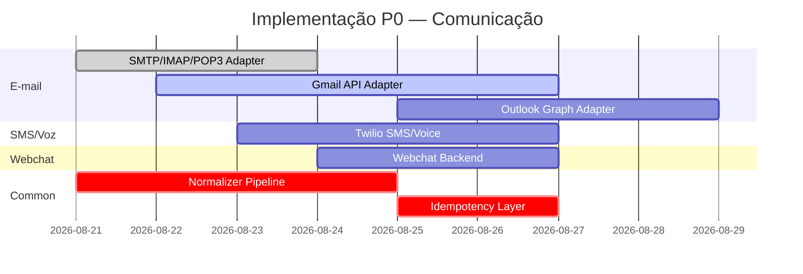

# Especificação v2 — Integrações de Comunicação

> **Missão**: Recriar n8n no AgentFlow
> **Work dir**: `n8n-migration/`
> **Data**: 2026-08-20
> **Status**: DESIGN — não implementar, não commitar
> **Responsável**: Pane INTEGRAÇÕES DE COMUNICAÇÃO
> **Base**: `briefs/prompt-comunicacao.md`, `guia-webhooks.md`, `integracoes-existentes.md`
> **Complementa**: `v2-security-spec.md`, `design-seguranca.md`
> **Linguagem**: Português (identificadores, payloads e nomes de API em inglês)
> **Formato**: ASCII diagrams + tabelas + exemplos JSON reais

---

## Sumário

1. [Visão Geral e Princípios Transversais](#1-visão-geral-e-princípios-transversais)
2. [Arquitetura de Gateway de Comunicação](#2-arquitetura-de-gateway-de-comunicação)
3. [Especificações por Integração](#3-especificações-por-integração)
   - 3.1 [E-mail: SMTP / IMAP / POP3 / Gmail / Outlook](#31-e-mail-smtp--imap--pop3--gmail--outlook)
   - 3.2 [WhatsApp (Meta Cloud API + BSPs)](#32-whatsapp-meta-cloud-api--bsps)
   - 3.3 [Telegram (Bot API)](#33-telegram-bot-api)
   - 3.4 [Discord](#34-discord)
   - 3.5 [Slack](#35-slack)
   - 3.6 [Microsoft Teams (Graph API)](#36-microsoft-teams-graph-api)
   - 3.7 [SMS (Twilio / Vonage / MessageBird)](#37-sms-twilio--vonage--messagebird)
   - 3.8 [Voz (Twilio Voice)](#38-voz-twilio-voice)
   - 3.9 [Webchat / Chat Widget](#39-webchat--chat-widget)
   - 3.10 [Outros: Signal, iMessage, Google Chat, Facebook Messenger, Instagram DM, TikTok DM, Push, Zoom](#310-outros)
4. [Matriz Comparativa Final](#4-matriz-comparativa-final)
5. [Roteiro de Implementação](#5-roteiro-de-implementação)
6. [Riscos e Limitações Conhecidas](#6-riscos-e-limitações-conhecidas)
7. [Glossário](#7-glossário)

---

## 1. Visão Geral e Princípios Transversais

### 1.1 Objetivo

Esta especificação cataloga e projeta **todos os canais de comunicação** suportados pela
plataforma AgentFlow (recriação do n8n), cobrindo **triggers** (inbound) e **ações**
(outbound) em cada canal. Cada integração segue um contrato unificado de normalização
de payload, mas preserva as **limitações reais das APIs** de cada provedor — nada é
simplificado ou omitido.

### 1.2 Princípios Fundamentais

| # | Princípio | Aplicação |
|---|-----------|-----------|
| T1 | **Dual delivery model** | Cada canal suporta inbound (trigger) e/ou outbound (action) conforme API do provedor. |
| T2 | **Async-first** | Triggers assíncronos (webhook/polling) enfileiram execução; ações são síncronas com retry. |
| T3 | **Webhook antes de polling** | Preferir webhooks reais (push) sobre polling; polling apenas quando webhook indisponível ou como fallback. |
| T4 | **Idempotência em tudo** | Chaves de idempotência em ações e deduplication em triggers; sempre que a API suportar. |
| T5 | **Rate limit residente** | Limites por tenant + por credential + backoff exponencial; sempre respeitar `Retry-After`. |
| T6 | **Fail secure** | Erros de integração não vazam segredos; falhas não travam a fila; dead-letter após N retries. |
| T7 | **Mínimo privilégio OAuth** | Escopos pedidos são os mínimos necessários (ex.: `gmail.readonly` vs `gmail.modify`). |
| T8 | **Dados sensíveis isolados** | Credenciais descriptografadas apenas no executor; nunca em logs/triggers/responses. |

### 1.3 Padrões Transversais de Trigger

```
┌─────────────────────────────────────────────────────────────────────┐
│                    PADRAO ASSINCRONA DE TRIGGER                     │
│                                                                      │
│  Provider Event (email, mensagem, etc)                               │
│         │                                                            │
│         ▼                                                            │
│  ┌──────────────────┐   ┌──────────────────┐   ┌─────────────────┐   │
│  │  Webhook Receiver│   │  Polling Worker   │   │  Long-poll/SSE  │   │
│  │ (push): HMAC      │   │ (poll): etag/last │   │  (opcional)    │   │
│  │  verify + dedup   │   │  timestamp watermark│  verify +        │   │
│  └────────┬─────────┘   └────────┬─────────┘   └────────┬────────┘   │
│           │                    │                        │            │
│           ▼                    ▼                        ▼            │
│  ┌──────────────────────────────────────────────────────────────┐     │
│  │  Deduplication Layer (idempotency key from event ID + ts)   │     │
│  │  - Redis SETNX com TTL = window de reentrega                 │     │
│  │  - event ID do provedor + checksum do payload                │     │
│  └──────────────────────────┬──────────────────────────────────┘     │
│                             │                                         │
│                             ▼                                         │
│  ┌─────────────────────────────────────────────────┐                  │
│  │  Normalization Pipeline                          │                  │
│  │  - Unified payload (§1.4)                        │                  │
│  │  - Sanitização de conteúdo (XSS, tamanho)       │                  │
│  │  - Enriquecimento (timestamp humano, timezone)   │                  │
│  └────────────────────┬────────────────────────────┘                  │
│                       │                                              │
│                       ▼                                              │
│  ┌─────────────────────────────────────────────────┐                  │
│  │  Execution Enqueuer                             │                  │
│  │  - Cria WorkflowExecution + NodeExecution        │                  │
│  │  - ACK 2xx imediato (webhook)                    │                  │
│  │  - Job BullMQ para processamento async           │                  │
│  └─────────────────────────────────────────────────┘                  │
└─────────────────────────────────────────────────────────────────────┘
```

### 1.4 Esquema de Payload Normalizado (Unified Event Schema)

Todos os triggers de comunicação normalizam para este schema antes de enfileirar a
execução. Ações recebem payloads no mesmo formato para testes e simulação.

```jsonc
{
  "eventType": "message.received",   // message.sent / message.failed / delivery.received / read
  "source": "gmail",                 // provedor/canal canônico
  "message": {
    "id": "17a8f3d2c4b",            // ID único no provedor
    "threadId": "t001",             // opcional (e-mail, chat)
    "direction": "inbound",         // inbound | outbound
    "from": { "email": "user@example.com", "name": "John Doe" },
    "to": [{ "email": "bot@corp.com", "name": null }],
    "cc": [],
    "bcc": [],
    "subject": "Pedido #1234",      // e-mail
    "text": "Olá, gostaria de saber...",
    "html": "<p>Olá, gostaria...</p>", // opcional, sanitizado
    "attachments": [
      { "id": "att_1", "filename": "invoice.pdf", "mimeType": "application/pdf",
        "sizeBytes": 4096, "url": null }
    ],
    "timestamp": "2026-08-20T14:30:00.000Z"
  },
  "contact": {
    "id": "user@example.com",
    "phone": "+14151234567",        // SMS/WhatsApp/Voz
    "name": "John Doe",
    "avatarUrl": null,
    "isBot": false,
    "verified": true
  },
  "raw": { /* payload original do provedor — preservado para debug, nunca logado */ },
  "metadata": {
    "organizationId": "org_abc123",
    "credentialId": "cred_def456",    // credential usada para resolver o trigger
    "workflowId": "wf_ghi789",
    "webhookId": "wh_jkl012",         // se via webhook
    "idempotencyKey": "sha256(event_id+timestamp)",
    "receivedAt": "2026-08-20T14:30:01.000Z",
    "providerRegion": "us-central1"   // onde disponível
  }
}
```

### 1.5 Credenciais Compartilhadas e Reutilização

> Reforça `design-seguranca.md` §5 (Credential Vault) e `v2-security-spec.md` §5.

- Uma **credencial** (ex.: conta Gmail corporativa) alimenta múltiplos nodes do mesmo
  workflow e de workflows distintos. Resolvida uma vez pelo `executor.ts` (see
  `credentialHeaders`) e **reatualizada** quando expirada.
- **Refresh transparente**: para OAuth2, o executor detecta `401` no primeiro request,
  aciona o refresh token via `oauth.ts` flow, renova a credencial (re-encripta) e retry.
- **Compromisso de reutilização**: o mesmo credential pode ter triggers (read) e ações
  (write) simultaneamente — ex.: Gmail Trigger lê novos e-mails e um action node envia.
- **Tenant isolation**: credentialId sempre validado contra `orgId` do workflow
  (`prisma.credential.findFirst({ where: { id, orgId } })` em `executor.ts`).
- **Auto-teste**: `POST /credentials/:id/test` valida conexão sem vazar segredo
  (see `design-seguranca.md` §5.5).

### 1.6 Segurança Específica por Categoria

| Categoria | Segurança de Inbound | Segurança de Outbound | Requisito de API |
|-----------|----------------------|----------------------|-------------------|
| E-mail | SPF/DKIM/DMARC (proven at delivery, not enforced by platform) | Content sanitization (XSS), size limit | TLS obrigatório para SMTP/IMAP |
| WhatsApp/Messenger | HMAC signature de webhook (Meta) | Template approval obrigatório | Webhook verify token |
| Telegram | Nenhuma (getUpdates polling), ou webhook com secret_token | Content sanitization | Bot token seguro |
| Discord | Nenhuma (evento público do bot) | Privileged intents, sanitize embed | Bot token + intents |
| Slack | HMAC signature do evento | Permissions granulares | signing secret + scopes |
| Teams | HMAC do notification URL | App permissions (Graph) | Token do app + tenant |
| SMS/Voz | De duas vias (reply) via webhook | Content filtering (carrier blocklist) | Sender ID aprovado |
| Webchat | Session token do widget | XSS sanitization do visitor | Origin allowlist do widget |

### 1.7 Testes e Ambientes de Simulação

| Canal | Sandbox/Test | Número/Conta Teste | Modo Simulação | Mock Provider |
|-------|-------------|--------------------|----------------|---------------|
| Gmail | Gmail API (conta dev) | Conta Google de teste | `https://www.googleapis.com/gmail/v1/users/me/` | `@openfga/mock`-style |
| Outlook | Microsoft Graph Explorer | Conta de desenvolvedor Microsoft | Graph Explorer (scopes de teste) | Microsoft Graph mock (não oficial) |
| SMTP | smtp4dev, MailHog, Ethereal | Ethereal (credenciais efêmeras) | `smtp.ethereal.email` | MailHog local |
| IMAP | `bigfoot.vmguery.io` IMAP | Conta de teste IMAP | — | MailHog (limitado) |
| WhatsApp | Meta Business Suite Sandbox | Número de teste do Sandbox | Mensagens pré-aprovadas | — (sem sandbox público) |
| Telegram | BotFather (bot real) | Nenhum necessário — testes via `chatId` real | Bot API em modo test (sem sandbox) | `telegraf/testing` |
| Discord | Servidor de teste | Bot convidado com `applications.commands` | Privileged intents em dev | — |
| Slack | Slack app em workspace de teste | Workspace free de desenvolvimento | Event API em workspace | `@slack/events-api` mock |
| Teams | Microsoft 365 Developer Subscription | Tenant de desenvolvedor (90 dias free) | Graph Explorer | — |
| SMS (Twilio) | Twilio Dev Tools | Números mágicos `+15005550006` (sempre sucesso) | Simulação de erro | — |
| Voz (Twilio) | Twilio Voice SDK | `+15005550001` (falha de conexão) | Simulação de áudio | — |

---

## 2. Arquitetura de Gateway de Comunicação

### 2.1 Contexto de Integração no Stack Existente

O codebase atual (`apps/api/src/`) já possui:

- **`oauth.ts`**: fluxo OAuth2 para Google, Microsoft, Apple (authorization code +
  PKCE, state nonce, token exchange, refresh implicit no frontend).
- **`webhooks.ts`**: receiver HMAC-SHA256 (`x-webhook-signature`), quota monthly por org,
  enfileiramento via `enqueueExecution`.
- **`credentials.ts`**: CRUD de credenciais com `encryptCredential`/`decryptCredential`
  (AES-256-GCM, `crypto.ts`), mascaramento em listagem (`data: { hasValue: true }`).
- **`executor.ts`**: engine DAG (`executeNode`, `executeHttp`, `credentialHeaders`),
  SSRF guard (`assertSafeUrl`, `assertSafeResolved`), egress allowlist.
- **Prisma schema**: `Credential` (type/provider/data/encrypted), `Integration`,
  `Webhook`, `WorkflowNode` (com tipos `email`, `discord`, `telegram`, `gmail`, etc.).

### 2.2 Novos Componentes Propostos

```
┌─────────────────────────────────────────────────────────────────────┐
│                          COMMUNICATION GATEWAY                      │
│  (nova layer: apps/api/src/services/communication/)                  │
│                                                                      │
│  ┌───────────────────────────────────────────────────────────────┐  │
│  │  TransportRegistry                                            │  │
│  │  - resolve(source) → TransportAdapter                         │  │
│  │  - singleton por tenant                                       │  │
│  └────────────────────────┬──────────────────────────────────────┘  │
│                           │                                         │
│            ┌──────────────┼──────────────┐                          │
│            ▼              ▼              ▼                          │
│  ┌────────────────┐ ┌────────────────┐ ┌──────────────────────┐     │
│  │ InboundDriver  │ │ OutboundDriver │ │ WebhookController    │     │
│  │ - GmailPoller  │ │ - GmailSender  │ │ - /webhook/:org/:path│     │
│  │ - ImapPoller   │ │ - SmtpSender   │ │   HMAC verify +      │     │
│  │ - TwilioRecv   │ │ - TwilioSend   │ │   dedup → enqueue    │     │
│  │ - ...          │ │ - ...          │ │   ACK 2xx            │     │
│  └───────┬────────┘ └───────┬────────┘ └──────────┬───────────┘     │
│          │                  │                     │                 │
│          ▼                  ▼                     ▼                 │
│  ┌──────────────────────────────────────────────────────────────┐   │
│  │    Normalizer (§1.4: unified event schema)                   │   │
│  └────────────────────────┬─────────────────────────────────────┘   │
│                           │                                         │
│                           ▼                                         │
│  ┌──────────────────────────────────────────────────────────────┐   │
│  │    ExecutionEnqueuer                                          │   │
│  │    - dedup (Redis SETNX)                                     │   │
│  │    - WorkflowExecution.create                                │   │
│  │    - enqueueExecution (BullMQ)                               │   │
│  └──────────────────────────────────────────────────────────────┘   │
└─────────────────────────────────────────────────────────────────────┘

┌───────────────────────────┐   ┌──────────────────────────────────┐
│   INTEGRATION CREDENTIAL │   │  RATE LIMITER + BACKOFF           │
│   STORE (Credential DB)  │   │  (per-tenant, per-credential)     │
│   - DEK por tenant        │   │  - token bucket Redis             │
│   - re-encryption on ttl  │   │  - jitter exponential backoff      │
│   - testConnection()      │   │  - Retry-After honoring            │
└───────────────────────────┘   └──────────────────────────────────┘
```

### 2.3 Contrato do TransportAdapter

Cada provedor implementa este contrato. A factory `TransportRegistry` registra
adapters por `source`. O `executor.ts` já chama adapters via `executeNode` (case
`email`, `discord`, `telegram`, `gmail`, `emailReadImap`).

```typescript
// contracts/transport.ts — interface compartilhada por todos os adapters
export interface InboundDriver {
  /** Inicia polling/webhook listener; resolve quando pronto */
  start(credential: ResolvedCredential, opts: InboundOpts): Promise<void>;
  /** Para listener e libera recursos */
  stop(): Promise<void>;
  /** Trigger manual (para testes) */
  simulate?(event: unknown): Promise<UnifiedEvent>;
}

export interface OutboundDriver {
  /** Envia mensagem; resolve ao confirmar entrega ou falhar */
  send(message: OutboundMessage, credential: ResolvedCredential): Promise<SendResult>;
  /** Idempotência: opcional */
  supportsIdempotency?: boolean;
}

export interface WebhookController {
  /** Valida HMAC/signature do provedor */
  verify(req: InboundHttpRequest): Promise<boolean>;
  /** Extrai eventId para dedup */
  extractEventId(req: InboundHttpRequest): string | null;
}

export interface InboundOpts {
  orgId: string;
  credentialId: string;
  /** Para polling: intervalo base em ms (default 60s) */
  pollIntervalMs?: number;
  /** Watermark inicial (polling/email) */
  since?: string;
}

export interface OutboundMessage {
  to: ContactId | ContactId[];
  subject?: string;        // e-mail
  text?: string;
  html?: string;
  attachments?: AttachmentRef[];
  template?: string;       // nome do template (Twilio, etc.)
  templateData?: Record<string, unknown>;
  /** Idempotência: chave única por envio */
  idempotencyKey?: string;
  /** Metadados de rastreamento */
  metadata?: Record<string, unknown>;
}

export interface SendResult {
  success: boolean;
  providerMessageId: string | null;  // ID no provedor
  /** Para retries: indica se o erro é transitório */
  retryable: boolean;
  /** HTTP/DNS/etc error detalhe (sanitizado) */
  error?: string;
}
```

### 2.4 Plano de Credenciais por Categoria

| Credencial | Tipo (credential.type) | Provider | Campos (encrypted) | TTL / Refresh |
|------------|------------------------|----------|---------------------|--------------|
| Gmail OAuth | `oauth2` | `google` | `clientId`, `clientSecret`, `accessToken`, `refreshToken`, `expiresAt` | Auto-refresh via executor (see `oauth.ts`) |
| Outlook OAuth | `oauth2` | `microsoft` | `clientId`, `clientSecret`, `accessToken`, `refreshToken`, `expiresAt` | Auto-refresh Graph API |
| SMTP | `basic` | `smtp` | `host`, `port`, `username`, `password`, `tls` | N/A (password fixa) |
| IMAP | `basic` | `imap` | `host`, `port`, `username`, `password`, `tls` | N/A |
| POP3 | `basic` | `pop3` | `host`, `port`, `username`, `password`, `tls` | N/A |
| WhatsApp BSP | `token` | `whatsapp` | `phoneNumberId`, `accessToken`, `verifyToken`, `businessAccountId` | 24h — app refresh; token rotation via UI |
| Telegram Bot | `token` | `telegram` | `botToken`, `webhookUrl` (opcional) | Nunca expira (BotFather) |
| Discord | `token` | `discord` | `botToken`, `clientId`, `clientSecret`, `publicKey` | Bot token fixa |
| Slack | `oauth2` | `slack` | `clientId`, `clientSecret`, `accessToken`, `refreshToken`, `botUserId`, `teamId` | Auto-refresh (granular permissions) |
| Teams (Graph) | `oauth2` | `microsoft` | `clientId`, `clientSecret`, `tenantId`, `accessToken`, `refreshToken` | Auto-refresh Graph |
| Twilio SMS/Voz | `token` | `twilio` | `accountSid`, `authToken`, `phoneNumber` (origem) | Auth token — rotation via UI |
| Webchat | `config` | `webchat` | `widgetId`, `secret` (moderação) | Secret opcional |

> `Credential` schema Prisma já define: `type`, `provider`, `data` (encrypted JSON string),
> `orgId`. Novos types: `oauth2`, `token`, `basic`, `config`.

---

## 3. Especificações por Integração

---

### 3.1 E-mail: SMTP / IMAP / POP3 / Gmail / Outlook

**Prioridade**: P0 (core — e-mail é o canal mais usado no n8n)

#### 3.1.1 Visão geral

| Protocolo | Tipo de acesso | Portas padrão | TLS | Autenticação |
|-----------|---------------|---------------|-----|--------------|
| SMTP | Outbound | 587 (submissão), 465 (SMTPS), 25 (fallback) | STARTTLS / implícito | PASSWORD (plaintext via TLS) |
| IMAP | Inbound (poll) | 993 (IMAPS), 143 (STARTTLS) | STARTTLS / implícito | PASSWORD |
| POP3 | Inbound (poll) | 995 (POP3S), 110 (STARTTLS) | STARTTLS / implícito | PASSWORD |
| Gmail API | Inbound + Outbound | HTTPS 443 | HTTP/TLS | OAuth2 (scopes) |
| Outlook / Microsoft Graph | Inbound + Outbound | HTTPS 443 | HTTP/TLS | OAuth2 (scopes) |

> **Limitação crítica**: SMTP/IMAP/POP3 não oferecem webhooks reais. Polling é
> obrigatório e stateful (precisa de `UIDVALIDITY`, `UIDNEXT` / `MAIL` index). Gmail e
> Graph oferecem **push notifications** (webhooks) para novos e-mails.

#### 3.1.2 Arquitetura SMTP/IMAP/POP3

```
┌─────────────────────────────────────────────────────────────────────┐
│                    EMAIL POLLING / SENDING                           │
│                                                                      │
│  ┌──────────────────┐    ┌───────────────┐    ┌──────────────────┐  │
│  │ ImapPoller       │    │ SmtpSender    │    │ Pop3Poller       │  │
│  │ - idle (IMAP4    │    │ - STARTTLS    │    │ - delege após    │  │
│  │   IDLE ext)      │    │ - auth plain  │    │   process        │  │
│  │ - fallback poll  │    │ - retry 3x    │    │ - UID tracking   │  │
│  │   (cada 30-60s)  │    │               │    │   per folder     │  │
│  └────────┬─────────┘    └───────┬───────┘    └────────┬─────────┘  │
│           │                      │                       │           │
│           ▼                      ▼                       ▼           │
│  ┌──────────────────────────────────────────────────────────────┐   │
│  │  Normalizer (§1.4)                                           │   │
│  │  - IMAP: FETCH RFC822.HEADER + BODY.PEEK[text]               │   │
│  │  - SMTP: Message-ID gerado (RFC 5322)                        │   │
│  └──────────────────────────────────────────────────────────────┘   │
│                            │                                        │
│                            ▼                                        │
│  ┌──────────────────────────────────────────────────────────────┐   │
│  │  ExecutionEnqueuer                                          │   │
│  └──────────────────────────────────────────────────────────────┘   │
└─────────────────────────────────────────────────────────────────────┘
```

#### 3.1.3 Gmail (API REST v1)

##### Auth & Credenciais
- OAuth2 com escopos: `gmail.readonly` (trigger), `gmail.modify` (ação — mover,
  archivar, marcar como lido), `gmail.compose` / `gmail.send` (enviar).
- Token refresh automático no executor (detecta 401 → refresh → retry).
- **Limitação**: escopo `gmail.send` requer verificação Google para produção;
  contas de teste limitadas a 100 usuários. Escopo `gmail.modify` não pode ser
  concedido a usuários externos sem verificação.

##### Triggers

| Trigger | Evento | Polling/Webhook | Rate limit | Observação |
|---------|--------|-----------------|------------|------------|
| `gmailTrigger` | `messageReceived` | **Push** (Pub/Sub) ou poll (cada 1 min) | 250 users/100s; 1000 messages | Push: requer topic name + watch(); revalidar a cada 6h |
| `gmailTrigger` | `messageAdded` (rótulo) | Polling (cada 5 min) | `users.messages.list` — 1 quota unit | Watch expira em 6-8h (expiração de push) |
| N/A | Novo rótulo | Polling via `users.labels.list` | 1 unidade | Não há webhook para mudança de rótulo |

##### Actions

| Action | Endpoint | Payload (exemplo) |
|--------|----------|-------------------|
| Enviar e-mail | `POST /gmail/v1/users/me/messages/send` | `raw` (RFC 5322 base64url), `threadId` opcional |
| Adicionar rótulo | `POST /gmail/v1/users/me/messages/{id}/modlabels` | `{"addLabelIds":["Label_123"]}` |
| Remover rótulo | `POST /gmail/v1/users/me/messages/{id}:modify` | `{"removeLabelIds":["UNREAD"]}` |
| Arquivar | `POST /gmail/v1/users/me/messages/{id}:modify` | `{"removeLabelIds":["INBOX"]}` |
| Marcar lido | `POST /gmail/v1/users/me/messages/{id}:modify` | `{"removeLabelIds":["UNREAD"]}` |
| Excluir | `DELETE /gmail/v1/users/me/messages/{id}` | `{}` |
| Listar threads | `GET /gmail/v1/users/me/threads` | `?q=is:unread&maxResults=100` |

```jsonc
// Exemplo de trigger payload normalizado (n8n workflow fixture Gmail Trigger)
{
  "eventType": "message.received",
  "source": "gmail",
  "message": {
    "id": "17a8f3d2c4b6a8f3",
    "threadId": "t001",
    "direction": "inbound",
    "from": { "email": "client@example.com", "name": "Cliente X" },
    "to": [{ "email": "support@company.com", "name": "Support Team" }],
    "subject": "Dúvida sobre pedido #5678",
    "text": "Preciso de suporte...",
    "attachments": [
      { "id": "attachment_0", "filename": "screenshot.png",
        "mimeType": "image/png", "sizeBytes": 81920 }
    ]
  },
  "raw": {
    "historyId": 2743904,
    "messagesAdded": [{ "message": { "id": "17a8f3d2c4b6a8f3", "threadId": "t001" } }]
  }
}
```

##### Paginação
- `users.messages.list` e `users.threads.list`: usam `pageToken` (opaque).
- `maxResults` máximo: 500 (messages), 100 (threads).
- **Limitação**: `users.messages.list` não retorna corpo — requer `users.messages.get`
  adicional por mensagem (custo de quota).

##### Rate Limits & Quotas
- **Limites diários**: 100 unidades de quota por dia (padrão) × usuário; estende-se
  com uso verificado.
- **Rate limits por usuário**: 250 users/100s para `watch()`; 1000 messages/segundo
  para `messages.get`.
- **Limite de resposta**: 8 MB (messages.get).
- **Limite de envio**: 340 MB/dia (incl. anexos); anexo individual ≤ 25 MB (100 MB
  se `enableSmtnUtf8` via API avançada).

##### Retries & Dead Letter
| HTTP | Condição | Retry | Backoff | Dead Letter |
|------|----------|-------|---------|-------------|
| 429 | Quota excedida | Sim | `Retry-After` + jitter exponential | Após 5 tentativas |
| 503 | Indisponível | Sim | Exponential (1s, 2s, 4s, 8s, 16s) | Após 5 tentativas |
| 401 | Token expirado | Sim (refresh) | Imediato | N/A (refresh loop) |
| 403 | Permissão insuficiente | Não | — | Imediato (config error) |
| 400 | Parâmetro inválido | Não | — | Imediato (config error) |

##### Idempotência
- Gmail: não há idempotência nativa em `messages.send`. Implementar com
  `Message-ID` (RFC 5322) — o Gmail deduplica e-mails com o mesmo `Message-ID`
  + destinatário (máx. 7 dias de janela).
- Gmail: `history.list` usa `historyId` (monotonic) para deduplicação de eventos.

##### Erros & Dados Sensíveis
- **Dados sensíveis**: access token contém escopo total do e-mail; nunca logar
  headers `Authorization`. Sanitizar `raw` base64 na auditoria.
- **Erros críticos**: `dailyLimitExceeded` (403) — requer aprovação Google;
  `user-rate-limit-exceeded` (429) — backoff por usuário.

##### Testes & Configuração
- Sandbox: conta Google Cloud de desenvolvedor + OAuth consent screen testado
  (máximo 100 test users).
- Config: `clientId`, `clientSecret`, `refreshToken`, `redirectUri` (match),
  `delegatedAdminEmail` (GSuite domain-wide delegation — opcional).
- Env vars no `.env.docker`: `GMAIL_CLIENT_ID`, `GMAIL_CLIENT_SECRET`,
  `GMAIL_REDIRECT_URI`.

#### 3.1.4 Outlook / Microsoft Graph

##### Auth & Credenciais
- OAuth2: `Mail.Read` (trigger), `Mail.ReadWrite` (ação), `Mail.Send` (enviar).
- Escopo `Mail.ReadWrite` e `Mail.Send` requerem **admin consent** em organizações
  gerenciadas.
- Token refresh via Microsoft Identity Platform (endpoint `login.microsoftonline.com`).

##### Triggers

| Trigger | Evento | Tipo | Payload | Rate limit |
|---------|--------|------|---------|------------|
| `outlookTrigger` | `messageReceived` | **Webhook** (subscription) | Resource: `users/{id}/messages` | 1000 subscriptions/org; 30-day max TTL |
| `outlookTrigger` | `messageReceived` | Polling (fallback) | `GET /users/{id}/messages?$filter=isRead eq false` | 10000 requests/10min/app |
| `outlookTrigger` | Mensagem nova (shared mailbox) | Webhook (shared) | Resource: `users/{shared}/messages` | Requer app-only token (client_credentials) |

> **Limitação**: subscriptions expiram em 4230 minutos (~30 dias) para Mail; renovação
> obrigatória via `PATCH /subscriptions/{id}`. App-only (client_credentials) permite
> acesso a mailboxes sem consentimento do usuário, mas requer admin do locatário.

##### Actions

| Action | Endpoint | Payload (exemplo) | Rate limit |
|--------|----------|-------------------|------------|
| Enviar e-mail | `POST /users/{id}/sendMail` | `{ "message": { "subject": "...", "body": {...}, "toRecipients": [...] } }` | 30 msg/min por usuário |
| Listar e-mails | `GET /users/{id}/messages` | `?$top=20&$filter=isRead eq false` | 10k req/10min |
| Marcar lido | `PATCH /users/{id}/messages/{id}` | `{ "isRead": true }` | 10k req/10min |
| Mover e-mail | `POST /users/{id}/messages/{id}/move` | `{ "destinationId": "Inbox" }` | 10k req/10min |
| Excluir | `DELETE /users/{id}/messages/{id}` | `{}` | 10k req/10min |

```jsonc
// Exemplo de trigger payload normalizado (Graph webhook notification)
{
  "eventType": "message.received",
  "source": "outlook",
  "message": {
    "id": "AQAAAAEAAAIgAAAA...",
    "threadId": "2.kgmail.189c...",
    "direction": "inbound",
    "from": { "email": "vendor@supplier.com", "name": "Supplier Inc" },
    "to": [{ "email": "purchasing@company.com", "name": null }],
    "subject": "NF-e 12345",
    "text": "Fatura em anexo."
  },
  "raw": {
    "value": [{
      "subscriptionId": "sub_abc123",
      "clientState": "secretClientValue",
      "changeType": "created",
      "resource": "users('email')/messages",
      "resourceData": { "tenantId": "...", "newId": "AQAAAAEAAAIgAAAA..." }
    }]
  }
}
```

##### Paginação
- `?$top=N` (máx 1000); `@odata.nextLink` para próxima página (cursor opaco).
- **Limitação**: `?$top=1000` em messages não retorna `bodyPreview` completo;
  requer fetch adicional.

##### Rate Limits & Quotas
- **Limite de aplicação**: 10 000 requests a cada 10 minutos, por app + usuário.
- **Limite por tenant**: varia por SKU; E5/E3 têm limites distintos.
- **Retry-After**: Graph retorna `Retry-After` header em HTTP 429.
- **Limite de e-mail**: 10 000 e-mails/dia por usuário (Exchange Online plan 2).

##### Retries & Dead Letter
| HTTP | Condição | Retry | Backoff | Dead Letter |
|------|----------|-------|---------|-------------|
| 429 | Rate limit (throttled) | Sim | `Retry-After` (pode ser até 2 min) | Após 7 tentativas |
| 503 | Service unavailable | Sim | Exponential (início 5s) | Após 5 tentativas |
| 429 + `code: "TooManyRequests"` | App throttle | Sim | 30s + jitter | Após 7 tentativas |
| 412 | Conditional fail (ETag mismatch) | Sim (re-fetch) | Linear | Após 3 tentativas |

##### Idempotência
- `sendMail`: header `Message-ID` (RFC 5322) para deduplicação por destinatário
  (janela 24h do Exchange).
- Webhooks Graph: `clientState` para validação de origem + `subscriptionId`
  para roteamento. Deduplicação por `resourceData.newId`.

##### Erros & Dados Sensíveis
- **Dados sensíveis**: ID do usuário/tenant em headers `Authorization`;
  aplicar sanitização em logs.
- **Erros críticos**: `MailboxQuotaExceeded` (507) — não retryável até liberação;
  `InvalidRecipients` (400) — falha permanente.

##### Testes & Configuração
- Sandbox: Microsoft 365 Developer Subscription (tenant gratuito por 90 dias).
- Config: `clientId`, `clientSecret`, `tenantId`, `redirectUri`, `delegated` ou
  `appOnly` (para shared mailboxes).
- Env vars: `AZURE_CLIENT_ID`, `AZURE_CLIENT_SECRET`, `AZURE_TENANT_ID`.

#### 3.1.5 SMTP / IMAP / POP3 — Server Connection Config

##### Auth & Credenciais
- **SMTP**: `USERNAME`/`PASSWORD` via STARTTLS (port 587) ou TLS implícito (465).
  Autenticação `PLAIN` (recomendado sobre TLS) ou `LOGIN` (legacy).
- **IMAP**: `USERNAME`/`PASSWORD`; IDLE (RFC 3501) para push quasi-tempo-real
  (se servidor suportar) ou polling a cada 30-60s.
- **POP3**: `USERNAME`/`PASSWORD`; não há push; polling obrigatório; mensagens
  deletadas do servidor após `DELE` (mover flag opcional).
- **Limitação**: muitos provedores (GoDaddy, Zoho, etc.) desabilitam STARTTLS ou
  requerem `XOAUTH2` (especialmente Gmail via IMAP/SMTP em vez da API).

##### Triggers (Polling)

| Protocolo | Trigger | Mecanismo | Intervalo default | Observação |
|-----------|---------|-----------|-------------------|------------|
| IMAP | `emailReadImap` | IDLE (se suportado) ou `SELECT inbox` + `SEARCH UNSEEN` | 30s (idle) / 60s (poll) | `UIDVALIDITY` invalidado → resync total |
| IMAP | Novo anexo | `SEARCH HAS ATTACHMENT UNSEEN` | 60s | Anexo baixado via `FETCH BODY[]` |
| POP3 | `emailReadPop3` | `LIST` diferença + `RETR` | 60s | Mensagens não removidas → re-trigger (idempotência via Message-ID) |
| SMTP | Nenhum | N/A | N/A | SMTP é outbound-only |

##### Actions

| Action | Protocolo | Comando | Observação |
|--------|-----------|---------|------------|
| Enviar e-mail | SMTP | `MAIL FROM`, `RCPT TO`, `DATA` | Base64 `Message-ID` header para idempotência |
| Marcar lido | IMAP | `STORE +FLAGS \Seen` | Flag por `UID` |
| Arquivar | IMAP | `UID MOVE {uid} {archive-folder}` | Requer IMAP4rev1 (RFC 9051) |
| Excluir | IMAP | `UID STORE +FLAGS \Deleted` + `EXPUNGE` | `EXPUNGE` pode apagar msgs de outra sessão |
| Deletar do servidor | POP3 | `DELE {msg}` | Irreversível — não fazer por padrão |

##### Rate Limits & Retries
| Protocolo | Limitação | Retry |
|-----------|----------|-------|
| SMTP | 10-50 conexões concorrentes por host (varia por provedor); 100-500 msg/min por conexão | Exponential (15s, 30s, 60s) |
| IMAP | 16 conexões simultâneas (RFC); muitos provedores 5-10 max | Exponential (5s) |
| POP3 | 1 conexão simultânea (lock); timeout 10 min após IDLE | Linear (10s) |
| SMTP/IMAP | Timeout de inatividade: 30s (conexão), 10 min (idle) | Reconnect com backoff |

> **Limitação crítica**: muitos provedores (Gmail, Yahoo, iCloud) **bloquearão**
> SMTP/IMAP com password após 2024 — exigem OAuth2/XOAUTH2. A integração deve
> **redirecionar para Gmail API** quando detectar `provider: "gmail"` em SMTP/IMAP.

##### Idempotência
- SMTP: `Message-ID` header (RFC 5322) para deduplicação de e-mails duplicados
  (janela varia por provedor: 24-72h).
- IMAP: `UID` + `UIDVALIDITY` (folder identifier) para deduplicação de eventos.
- POP3: `Message-ID` do header (não há UID confiável — POP3 é stateless por natureza).

##### Erros & Dados Sensíveis
- **Dados sensíveis**: password em texto plano dentro do envelope encriptado;
  nunca expor via API; sanitizar em logs (regex `pass=****`).
- **Erros críticos**: `LOGIN FAILED` (535) — credential errado; `TAR_PIGEON`/`TIMED_OUT`
  (IMAP) — reconnect; `552 Mailbox quota` (SMTP) — dead letter.

##### Testes & Configuração
- Sandbox: Ethereal (credenciais efêmeras `smtp.ethereal.email`), MailHog local,
  ou `smtp4dev` (Windows).
- Config: `host`, `port`, `username`, `password`, `tls: boolean`, `ignoreTLS: boolean`,
  `requiresAuth: boolean`.
- Env vars (self-hosted): `SMTP_HOST`, `SMTP_PORT`, `SMTP_USER`, `SMTP_PASS`.

##### 3.1.6 Decisão de Implementação e Prioridade
- **Abordagem**: Híbrida — Protocolos clássicos (SMTP/IMAP/POP3) via drivers nativos Node.js otimizados (`nodemailer` para envio SMTP e `imapflow` / `mailparser` para IMAP com suporte a IDLE e streaming de streams RFC822); APIs modernas (Gmail API v1 e Microsoft Graph Mail API) implementadas via **REST Wrappers leves nativos** com cliente HTTP centralizado (`fetch` / `ky`).
- **Justificativa**: Evita dependências pesadas de SDKs monolíticos como `googleapis` (~80MB) e `@microsoft/microsoft-graph-client`, permitindo controle granular sobre connection pooling de sockets TLS, auto-refresh de tokens OAuth2 integrado ao `oauth.ts`, e streaming de anexos pesados diretamente para storage/buffer sem estouro de heap.
- **Prioridade MVP**: **P0** (Essencial).


---

### 3.2 WhatsApp (Meta Cloud API + BSPs)

**Prioridade**: P0 (alta demanda em automação de atendimento)

#### 3.2.1 Visão geral

WhatsApp Business via **Meta Cloud API** (direct) ou **BSPs** (Twilio, 360dialog, Zendesk).
Duas modalidades:

| Modalidade | Provider | Auth | Webhook | Rate limit | Observação |
|------------|----------|------|---------|-----------|------------|
| **Cloud API (Meta)** | `meta` | Access token (long-lived) + App Token | Sim (HMAC) | 200 chamadas/1h/número + 1000 req/s app | Mensagens fora de 24h janela = **template** |
| **BSP (Twilio)** | `twilio` | Account SID + Auth Token | Sim (Twilio) | 1 msg/s/número (SMS), varia por BSP | Template-free dentro de janela |
| **BSP (360dialog)** | `360dialog` | API key | Sim | 1000 req/min | Suporte a múltiplos BSPs simultaneamente |

> **Limitação CRÍTICA — janela de 24h**: fora da janela de 24h do último message
> recebido do cliente, **somente templates aprovadas** podem ser enviadas. Templates
> requerem aprovação prévia da Meta (7-14 dias). Não há workaround — é política
> da plataforma.

#### 3.2.2 Arquitetura

```
┌─────────────────────────────────────────────────────────────────────┐
│                          WHATSAPP FLOW                              │
│                                                                      │
│  ┌──────────────────┐    ┌──────────────────┐    ┌────────────────┐ │
│  │ Webhook Receiver │    │ WhatsAppSender   │    │ WhatsAppPoller │ │
│  │ (Meta)           │    │ (Cloud API)      │    │ (status check) │ │
│  │ - X-Hub-Signature│    │ - template      │    │ - messages    │ │
│  │ - sha256=        │    │ - media upload   │    │   status       │ │
│  └────────┬─────────┘    └────────┬─────────┘    └───────┬────────┘ │
│           │                       │                      │          │
│           ▼                       ▼                      ▼          │
│  ┌──────────────────────────────────────────────────────────────┐   │
│  │  Normalizer                                                  │   │
│  │  - phone_number_id + mobile (E.164)                          │   │
│  │  - attachment via media_id (upload prévio)                   │   │
│  └──────────────────────────────────────────────────────────────┘   │
│                             │                                        │
│                             ▼                                        │
│  ┌──────────────────────────────────────────────────────────────┐   │
│  │  ExecutionEnqueuer (idempotencyKey = message_id@provider)    │   │
│  └──────────────────────────────────────────────────────────────┘   │
└─────────────────────────────────────────────────────────────────────┘
```

#### 3.2.3 Auth & Credenciais

| Campo | Descrição | Env var | Validação |
|-------|-----------|---------|-----------|
| `phoneNumberId` | ID do número (123456789012345) | `WHATSAPP_PHONE_ID` | Numeric, 14-15 dígitos |
| `accessToken` | Long-lived User or System User token | `WHATSAPP_TOKEN` | 100+ chars, expira em 60 dias |
| `verifyToken` | Token de verificação do webhook | `WHATSAPP_VERIFY_TOKEN` | String arbitrária |
| `businessAccountId` | ID da conta Business Manager | `WHATSAPP_BA_ID` | Numeric |
| `apiVersion` | Versão da Graph API | `WHATSAPP_API_VERSION` | Default `v18.0` |

#### 3.2.4 Triggers

| Trigger | Evento | Webhook event | Payload |
|---------|--------|---------------|---------|
| `whatsappTrigger` | Mensagem recebida | `messages` | `{ "object": "whatsapp_business_account", "entry": [{ "changes": [{ "value": { "messages": [{ "id": "...", "from": "...", "text": { "body": "..." } }] } }] }] }` |
| `whatsappTrigger` | Mensagem enviada | `messages_sent` | Confirmação de entrega (read) |
| `whatsappTrigger` | Mensagem lida | `message_reads` | `{ "read": { "id": "...", "from": "...", "timestamp": "1234567890" } }` |
| `whatsappTrigger` | Entrega (colocado na fila) | `message_template_status_update` | Status: `accepted`, `sent`, `delivered`, `read` |
| `whatsappTrigger` | Erro de entrega | `message_template_status_update` + `errors` | `{ "errors": [{ "code": 131047, "title": "Message not sent" }] }` |

```jsonc
// Exemplo de trigger payload normalizado
{
  "eventType": "message.received",
  "source": "whatsapp",
  "message": {
    "id": "wamid.HBgMM...,3Q==",
    "direction": "inbound",
    "from": { "phone": "+14151234567", "name": "John Doe" },
    "to": [{ "phone": "+14159876543" }],
    "text": "Quero cancelar minha assinatura"
  },
  "metadata": {
    "credentialId": "cred_whatsapp_1",
    "provider": "whatsapp",
    "businessAccountId": "1067274957281881"
  }
}
```

#### 3.2.5 Actions

| Action | Endpoint | Payload (exemplo) | Rate limit | Observação |
|--------|----------|-------------------|-----------|------------|
| Enviar texto | `POST /v18.0/{phone-number-id}/messages` | `{ "messaging_product": "whatsapp", "to": "+14151234567", "text": { "body": "Olá!" } }` | 200/1h/número | Template obrigatório fora de 24h |
| Enviar template | `POST /v18.0/{phone-number-id}/messages` | `{ "messaging_product": "whatsapp", "to": "...", "type": "template", "template": { "name": "order_confirmation", "language": { "code": "pt_BR" } } }` | 200/1h/número | Template pré-aprovado |
| Enviar mídia | `POST /v18.0/{phone-number-id}/messages` | `{ "messaging_product": "whatsapp", "to": "...", "type": "image", "image": { "link": "https://..." } }` ou `id` (after upload) | 200/1h/número | Upload via `POST /v18.0/{phone-id}/media` primeiro |
| Reação | `POST /v18.0/{phone-number-id}/messages` | `{ "messaging_product": "whatsapp", "to": "...", "type": "reaction", "reaction": { "message_id": "...", "emoji": "👍" } }` | 200/1h/número | Apenas às mensagens próprias |
| Marcar como lido | `POST /v18.0/{phone-number-id}/messages` | `{ "messaging_product": "whatsapp", "to": "...", "type": "read", "read": { "id": "..." } }` | 200/1h/número | `id` = message_id da mensagem recebida |

#### 3.2.6 Rate Limits & Quotas
- **Por número**: 200 chamadas por hora (mensagens enviadas + templates).
- **App-level**: 1000 requests/segundo (burst).
- **Template**: 1000 templates distintos por app; cada template requer aprovação.
- **Mídia**: 1 upload/segundo por app; 16 MB limite (imagem/vídeo); 64 MB (documentos).
- **Limitação de webhook**: Meta envia eventos via webhook (push), **não polling**.
  Webhook pode ter delay de entrega de até 10 minutos.

#### 3.2.7 Retries & Idempotency
| Error | Código | Retry | Dead Letter |
|-------|--------|-------|-------------|
| `(131047) Message not sent: phone number` | 400 | Não | Imediato |
| `(131048) Message not sent: phone number is not in the allowed list` | 400 | Não | Imediato |
| `(131009) Rate limit hit` | 429 | Sim | Exponential (1s, 2s, 4s) |
| `(130474) Template doesn't exist` | 400 | Não | Imediato |
| `(131021) Invalid parameter` | 400 | Não | Imediato |

- **Idempotência**: `idempotency-key` header não suportado pela Cloud API; usar
  `X-Business-Signature` + client-side deduplication via `message_id`.

#### 3.2.8 Erros & Dados Sensíveis
- **Dados sensíveis**: access token com permissão `business_management`, `whatsapp_business_messaging`;
  nunca expor `verifyToken` ou `businessAccountId` no payload.
- **Erros críticos**: `131047` (número inválido/bloqueado) — verificar formato
  E.164; `131021` (template não aprovado) — guiar usuário para aprovação.

#### 3.2.9 Testes & Configuração
- **Sandbox**: Meta fornece **Sandbox App** (`@meta/whatsapp/sandbox`) com número de
  teste — mas requer provisioning manual. Alternativa: usar número real em modo
  desenvolvimento (atenção: cobrança real).
- **Test numbers**: `+15555555555` (Meta) para testes de entrega; mensagens de teste
  sempre retornam sucesso.
- Config: `phoneNumberId`, `accessToken`, `verifyToken`, `businessAccountId`,
  `webhookUrl` (Meta App Dashboard).

#### 3.2.10 Decisão de Implementação e Prioridade
- **Abordagem**: **REST Wrapper nativo direto** contra a Meta Cloud API (Graph API v18.0+) + adapters modulares para BSPs principais (Twilio WhatsApp API e 360dialog REST API).
- **Justificativa**: A Meta Cloud API opera com endpoints JSON padronizados. Implementar via REST Wrapper direto elimina o atraso e a fragilidade de SDKs de terceiros, garantindo compatibilidade imediata com novas versões da Graph API, controle estrito de validação HMAC-SHA256 (`X-Hub-Signature-256`) e roteamento eficiente de webhooks assíncronos.
- **Prioridade MVP**: **P0** (Essencial para mercados LATAM e Europa).


---

### 3.3 Telegram (Bot API)

**Prioridade**: P1

#### 3.3.1 Visão geral

Telegram Bot API — polling (`getUpdates`) ou webhook (`setWebhook`). Bot token **nunca
expira** (a menos que revogado manualmente).

#### 3.3.2 Arquitetura

```
┌─────────────────────────────────────────────────────────────────────┐
│                         TELEGRAM FLOW                               │
│                                                                      │
│  ┌──────────────────┐    ┌──────────────────┐                       │
│  │ Webhook Receiver │    │ TelegramSender   │                       │
│  │ (setWebhook)     │    │ (sendMessage)    │                       │
│  │ - X-Telegram-    │    │                  │                       │
│  │  BotApi-Secret   │    │                  │                       │
│  └────────┬─────────┘    └────────┬─────────┘                       │
│           │                       │                                  │
│           │  (polling fallback)   │                                  │
│           ▼                       ▼                                  │
│  ┌─────────────────────┐   ┌──────────────────┐                    │
│  │ getUpdates (poll)   │   │ sendMessage /    │                    │
│  │ - offset            │   │  sendPhoto /     │                    │
│  │ - timeout=25s       │   │  sendDocument    │                    │
│  └─────────────────────┘   └──────────────────┘                    │
│            │                       │                                 │
│            ▼                       ▼                                 │
│  ┌──────────────────────────────────────────────────────────────┐   │
│  │  Normalizer                                                  │   │
│  │  - update_id para dedup                                      │   │
│  └──────────────────────────────────────────────────────────────┘   │
│                          │                                          │
│                          ▼                                          │
│  ┌──────────────────────────────────────────────────────────────┐   │
│  │  ExecutionEnqueuer                                           │   │
│  └──────────────────────────────────────────────────────────────┘   │
└─────────────────────────────────────────────────────────────────────┘
```

#### 3.3.3 Auth & Credenciais

| Campo | Tipo | Env var | Observação |
|-------|------|---------|------------|
| `botToken` | String | `TELEGRAM_BOT_TOKEN` | Formato: `{id}:{key}`; nunca expira |
| `webhookSecret` | String | `TELEGRAM_WEBHOOK_SECRET` | Header `X-Telegram-Bot-Api-Secret-Token` |
| `pollingOffset` | Integer | — | `offset` de getUpdates |

#### 3.3.4 Triggers

| Trigger | Update type | Polling/Webhook | Payload |
|---------|-------------|-----------------|---------|
| `telegramTrigger` | Mensagem de texto | Ambos | `{ "update_id": 123456789, "message": { "message_id": 42, "from": { "id": 123, "is_bot": false, "first_name": "John" }, "chat": { "id": 123, "type": "private" }, "text": "Olá" } }` |
| `telegramTrigger` | Mensagem com mídia | Webhook/polling | `photo`, `video`, `document`, `voice` |
| `telegramTrigger` | Comando (`/start`) | Webhook/polling | `text: "/start"` |
| `telegramTrigger` | Inline query | Webhook | `{ "inline_query": { "query": "..." } }` |

```jsonc
// Exemplo de trigger payload normalizado
{
  "eventType": "message.received",
  "source": "telegram",
  "message": {
    "id": "42",
    "direction": "inbound",
    "from": { "id": "123456789", "name": "John Doe", "username": "johndoe" },
    "to": [{ "id": "-1001234567890" }],
    "text": "Quero saber o status do meu pedido"
  },
  "metadata": {
    "credentialId": "cred_telegram_1",
    "chatId": "123456789",
    "updateId": "1234567890123456789"
  }
}
```

#### 3.3.5 Actions

| Action | Endpoint | Payload (exemplo) | Rate limit |
|--------|----------|-------------------|-----------|
| Enviar texto | `POST /bot{token}/sendMessage` | `{ "chat_id": 123456789, "text": "Olá!", "parse_mode": "HTML", "reply_to_message_id": 42 }` | 30 msg/s global |
| Enviar foto | `POST /bot{token}/sendPhoto` | `{ "chat_id": 123456789, "photo": "https://...", "caption": "..." }` | 10 foto/s |
| Enviar documento | `POST /bot{token}/sendDocument` | `{ "chat_id": 123456789, "document": "attach://file" }` | 10/s |
| Reação (emoji) | `POST /bot{token}/setMessageReaction` | `{ "chat_id": 123456789, "message_id": 42, "emoji": "👍" }` | 30/s |
| Responder callback | `POST /bot{token}/answerCallbackQuery` | `{ "callback_query_id": "...", "text": "..." }` | 30/s |

#### 3.3.6 Rate Limits & Retries
- **Global rate limit**: 30 messages/segundo por bot (mensagens de texto);
  10/s para foto/vídeo; 10/s para documento.
- **Grupos**: 1 msg/segundo em grupos grandes (50+ membros).
- **Retry**: exponential backoff; Telegram retorna `429 Too Many Requests` com
  `parameters.retry_after` (em segundos).
- **Polling**: `getUpdates` com `timeout=25` (long polling); `offset` deve ser
  `update_id + 1` para confirmação; não usar `timeout` maior que 60s.
- **Limitação**: `chat_id` de grupo deve ser negativo (`-100...`); grupos requerem
  que o bot seja administrador.

#### 3.3.7 Retries & Dead Letter
| Error | Código | Retry | Dead Letter |
|-------|--------|-------|-------------|
| Too Many Requests | 429 | Sim | `retry_after` segundos |
| Bot was blocked by the user | 403 | Não | Imediato (bloqueio) |
| Chat not found | 400 | Não | Imediato |
| Bad Request (parse_mode) | 400 | Não | Imediato |

#### 3.3.8 Idempotência
- `sendMessage` não é idempotente nativamente; usar `reply_to_message_id` +
  `disable_notification` + client-side dedup via `message_id`.
- Webhooks: `update_id` é único e usado para deduplication; `X-Telegram-Bot-Api-Secret-Token`
  header obrigatório para validação de origem.

#### 3.3.9 Testes & Configuração
- **Sandbox**: crie um bot via BotFather (`@BotFather`), teste em um chat privado
  ou grupo de teste.
- **Polling mode**: ideal para self-hosted; webhook mode requer URL pública + HTTPS.
- Config: `botToken`, `webhookSecret` (opcional mas recomendado), `polling: boolean`.

#### 3.3.10 Decisão de Implementação e Prioridade
- **Abordagem**: **REST Wrapper nativo direto** sobre a Telegram Bot API + worker leve de polling (`getUpdates` com long-polling) para ambientes sem IP público / dev e endpoint Fastify para Webhooks com validação do header `X-Telegram-Bot-Api-Secret-Token`.
- **Justificativa**: A Telegram Bot API é uma das mais simples e estáveis da indústria. Dispensar frameworks de bot (como Telegraf/Grammy) reduz drasticamente o consumo de memória por nó e permite que o payload seja diretamente normalizado para o Unified Event Schema do AgentFlow.
- **Prioridade MVP**: **P1** (Importante).


---

### 3.4 Discord

**Prioridade**: P1

#### 3.4.1 Visão geral

Discord Bot API — intents obrigatórios para receber eventos. Webhooks próprios do
Discord para servidores.

#### 3.4.2 Arquitetura

```
┌─────────────────────────────────────────────┐
│           DISCORD FLOW                       │
│                                              │
│  ┌──────────────────┐  ┌──────────────────┐ │
│  │ Gateway (WS)     │  │ DiscordSender    │ │
│  │ (intents)        │  │ - sendMessage    │ │
│  │ - MESSAGE_CREATE │  │ - sendEmbed      │ │
│  │ - GUILD_*        │  │                  │ │
│  └────────┬─────────┘  └────────┬─────────┘ │
│           │                     │           │
│           ▼                     ▼           │
│  ┌─────────────────────────────────────────┐│
│  │ Normalizer                              ││
│  │ - snowflake ID                          ││
│  └─────────────────────────────────────────┘│
│              │                              │
│              ▼                              │
│  ┌─────────────────────────────────────────┐│
│  │ ExecutionEnqueuer                       ││
│  └─────────────────────────────────────────┘│
└──────────────────────────────────────────────┘
```

> **Limitação**: Discord Gateway (WebSocket) é stateful — requer manter conexão viva
> (heartbeat a cada ~41s). Em ambiente multi-instance, usar **sharding** (máx. 2500
> guilds/shard). Alternativa: usar webhooks do Discord (incoming webhooks) para
> outbound-only.

#### 3.4.3 Auth & Credenciais

| Campo | Tipo | Env var | Observação |
|-------|------|---------|------------|
| `botToken` | String | `DISCORD_BOT_TOKEN` | Formato: `Bot xxx`; escopos via intents |
| `applicationId` | String | `DISCORD_APP_ID` | Snowflake ID do app |
| `publicKey` | String | `DISCORD_PUBLIC_KEY` | Para validar interações (slash commands) |
| `clientId` | String | `DISCORD_CLIENT_ID` | Para OAuth2 (opcional) |
| `clientSecret` | String | `DISCORD_CLIENT_SECRET` | Para OAuth2 (opcional) |

Intents obrigatórios:
- `Guilds`, `GuildMessages`, `MessageContent` (privileged — requer aprovação na
  Developer Portal se for ler conteúdo de mensagens).

#### 3.4.4 Triggers

| Trigger | Intent | Payload | Rate limit |
|---------|--------|---------|-----------|
| `discordTrigger` | `GuildMessages` + `MessageContent` | `{ "id": "...", "channel_id": "...", "author": { "id": "...", "username": "Johnny" }, "content": "Olá", "guild_id": "..." }` | Gateway: 50/10s (identify) |
| `discordTrigger` | `GuildMessages` | Evento de edição (`MESSAGE_UPDATE`) | — |
| `discordTrigger` | `Guilds` | Evento de member join/leave | — |
| Slash command | `applications.commands` | Interaction (POST webhook) | 100 guilds/min |

```jsonc
// Exemplo de trigger payload normalizado
{
  "eventType": "message.received",
  "source": "discord",
  "message": {
    "id": "1234567890123456789",
    "direction": "inbound",
    "from": { "id": "9876543210987654321", "name": "Johnny#1234" },
    "to": [{ "id": "1234567890123456788" }],
    "text": "Preciso de ajuda com o pedido 5678"
  },
  "metadata": {
    "credentialId": "cred_discord_1",
    "guildId": "111111111111111111",
    "channelId": "222222222222222222"
  }
}
```

#### 3.4.5 Actions

| Action | Endpoint | Payload | Rate limit |
|--------|----------|---------|-----------|
| Enviar mensagem | `POST /channels/{channel.id}/messages` | `{ "content": "Olá!", "embeds": [{...}] }` | 50 req/10s rota; 10 req/s global |
| Enviar embed | `POST /channels/{channel.id}/messages` | `{ "content": null, "embeds": [{ "title": "...", "description": "...", "color": 757575 }] }` | 50 req/10s |
| Reagir com emoji | `PUT /channels/{channel.id}/messages/{message.id}/reactions/{emoji}/@me` | `{}` | 50 req/10s |
| Editar mensagem | `PATCH /channels/{channel.id}/messages/{message.id}` | `{ "content": "Texto editado" }` | 50 req/10s |
| Slash command (response) | `POST /interactions/{id}/{token}/callback` | `{ "type": 4, "data": { "content": "..." } }` | 100 guilds/min |

#### 3.4.6 Rate Limits & Retries
- **HTTP rate limits**: `X-RateLimit-Scope` (user vs bot), `X-RateLimit-Reset`,
  `X-RateLimit-Remaining`, `Retry-After`.
- **Buckets**: por rota (`global`, `per-guild`, `per-channel`, `per-webhook`).
- **Limitação de payloads**: 25 MB (mensagem), 100 embeds/mensagem, 4096 chars/embed.
- **Limitação de intents**: `MESSAGE_CONTENT` requer aprovação; sem ele, `content`
  vem vazio para bots em 100+ servidores.

#### 3.4.7 Retries & Dead Letter
| Error | Código | Retry | Dead Letter |
|-------|--------|-------|-------------|
| Rate limited | 429 | Sim | `Retry-After` + bucket reset |
| Missing perms | 403 | Não | Imediato |
| Invalid Form Body | 400 | Não | Imediato |
| Gateway Unavailable | 502/503 | Sim | Exponential (1s, 2s, 4s) |

#### 3.4.8 Idempotência
- Discord não oferece idempotência nativa; usar `message_id` do echo ou
  deduplication por `x-request-id` + timestamp.

#### 3.4.9 Testes & Configuração
- **Sandbox**: servidor Discord de teste + convite do bot com intents habilitados.
- Config: `botToken`, `applicationId`, `intents` (lista), `sharded: boolean`.

#### 3.4.10 Decisão de Implementação e Prioridade
- **Abordagem**: **Arquitetura Híbrida** — REST Wrapper direto para todas as Actions (envio de mensagens, embeds, reações, criação de canais/threads) + Gateway WebSocket dedicado e desacoplado (usando cliente WebSocket leve como `@discordjs/ws` sem o ORM em memória de discord.js) para escutar eventos com privileged intents.
- **Justificativa**: O cliente completo `discord.js` aloca cache extensivo de guilds, roles e canais na memória RAM (impraticável em runners multitenant). Um cliente REST nativo com gateway minimalista reduz o consumo de memória em mais de 85% e previne vazamentos de estado entre tenants.
- **Prioridade MVP**: **P1** (Importante).


---

### 3.5 Slack

**Prioridade**: P0

#### 3.5.1 Visão geral

Slack API — OAuth2 com granular permissions (scopes), eventos via webhook (Events API)
ou Socket Mode (WSS para apps não públicos).

#### 3.5.2 Arquitetura

```
┌─────────────────────────────────────────────┐
│           SLACK FLOW                        │
│                                              │
│  ┌──────────────────┐  ┌──────────────────┐ │
│  │ Events API       │  │ SlackSender      │ │
│  │ (webhook POST)   │  │ - chat.postMessage│ │
│  │ - HMAC verify    │  │ - files.upload   │ │
│  └────────┬─────────┘  └────────┬─────────┘ │
│           │                     │           │
│  ┌────────▼─────────┐          │           │
│  │ Socket Mode      │          │           │
│  │ (WSS)            │          │           │
│  │ - para apps sem │          │           │
│  │   domínio públ.  │          │           │
│  └────────┬─────────┘          │           │
│           │                     │           │
│           ▼                     ▼           │
│  ┌─────────────────────────────────────────┐│
│  │ Normalizer                              ││
│  │ - event_id para dedup                    ││
│  └─────────────────────────────────────────┘│
│              │                              │
│              ▼                              │
│  ┌─────────────────────────────────────────┐│
│  │ ExecutionEnqueuer                       ││
│  └─────────────────────────────────────────┘│
└──────────────────────────────────────────────┘
```

#### 3.5.3 Auth & Credenciais

| Campo | Tipo | Env var | Observação |
|-------|------|---------|------------|
| `clientId` | String | `SLACK_CLIENT_ID` | — |
| `clientSecret` | String | `SLACK_CLIENT_SECRET` | — |
| `botToken` | String | `SLACK_BOT_TOKEN` | `xoxb-...` (Bot User OAuth Token) |
| `signingSecret` | String | `SLACK_SIGNING_SECRET` | Para HMAC + challenge verify |
| `teamId` | String | `SLACK_TEAM_ID` | `T...` |
| `appId` | String | `SLACK_APP_ID` | `A...` |

Scopes mínimos:
- **Trigger (Events API)**: `channels:history`, `groups:history`, `im:history`,
  `mpim:history`, `channels:read`, `groups:read`, `users:read`.
- **Actions**: `chat:write`, `chat:write.public`, `files:write`, `reactions:write`,
  `calls:join` (para chamadas de voz).
- **Limitação**: `commands` scope requer revisão manual da Slack (manual review).

#### 3.5.4 Triggers

| Trigger | Evento | Scope | Payload | Rate limit |
|---------|--------|-------|---------|-----------|
| `slackTrigger` | Mensagem (canal público) | `channels:history` | `{ "token": "...", "team_id": "T...", "api_app_id": "A...", "event": { "type": "message", "user": "U...", "text": "Olá", "channel": "C...", "ts": "1234567890.000000" } }` | 1 msg/s por canal |
| `slackTrigger` | IM (direto) | `im:history` | `{"event": {"type": "message", "channel": "D...", "text": "..."}}` | 1 msg/s por conversa |
| `slackTrigger` | Membro entrou/saiu | `channels:history` + `team:read` | `{ "type": "member_joined_channel"}` | — |
| `slackTrigger` | Reação | `reactions:read` | `{ "reaction_added": { "user": "U...", "reaction": "white_check_mark" } }` | 30 reações/30s |

```jsonc
// Exemplo de trigger payload normalizado
{
  "eventType": "message.received",
  "source": "slack",
  "message": {
    "id": "1234567890.000000",
    "direction": "inbound",
    "from": { "id": "U1234567890", "name": "John Doe" },
    "to": [{ "id": "C1234567890" }],
    "text": "Status do pedido 5678?",
    "ts": "1234567890.000000"
  },
  "metadata": {
    "credentialId": "cred_slack_1",
    "channelId": "C1234567890",
    "teamId": "T1234567890",
    "eventId": "Ev1234567890"
  }
}
```

#### 3.5.5 Actions

| Action | Endpoint | Payload | Rate limit |
|--------|----------|---------|-----------|
| Enviar mensagem | `chat.postMessage` | `{ "channel": "C1234...", "text": "Olá!", "mrkdwn": true }` | Tier 1: 1 req/s |
| Enviar thread | `chat.postMessage` | `{ "channel": "C1234", "thread_ts": "1234567890.000", "text": "..." }` | — |
| Upload arquivo | `files.upload` | multipart: `file`, `filename`, `title` | Tier 3: 50/10s — 1 arquivo/10s |
| Reação | `reactions.add` | `{ "channel": "C1234", "name": "white_check_mark", "timestamp": "1234567890.000" }` | Tier 1: 1/s |
| Listar canais | `conversations.list` | `?types=public_channel,private_channel` | Tier 2: 20/10s |
| Enviar DM | `chat.postMessage` | `{ "channel": "U1234..." }` (user ID) | — |

#### 3.5.6 Rate Limits & Retries
| Tier | Limite | Endpoints |
|------|--------|-----------|
| Tier 1 | 1 req/s | `chat.postMessage`, `reactions.add` |
| Tier 2 | 20 req/10s | `conversations.list`, `users.list` |
| Tier 3 | 50 req/10s | `files.upload` |
| Tier 4 | 25 req/s | `search.messages` |

- **Headers**: `Retry-After`, `X-Rate-Limit-Scope`, `X-Rate-Limit-Reset`.
- **Limitação**: `chat.postMessage` — 1 message/segundo por canal; excesso = `rate_limited`.
- **Pagination**: `conversations.list`, `users.list`, `search.messages` usam `cursor`
  (opaque). Limite `limit` max 1000.
- **Limitação de mensagem**: 40.000 caracteres (texto); 1GB arquivo (upload);
  10.000 linhas de arquivo de texto.

#### 3.5.7 Retries & Dead Letter
| Error | Código | Retry | Dead Letter |
|-------|--------|-------|-------------|
| Rate limited (temp) | `rate_limited` | Sim | `Retry-After` |
| Rate limited (perma) | `rate_limited` + `retry-after: 1h` | Sim | Após 3 tentativas longas |
| Channel not found | `channel_not_found` | Não | Imediato |
| Not in channel | `not_in_channel` | Não | Imediato |
| Invalid auth | `invalid_auth` | Não | Imediato |

#### 3.5.8 Idempotência
- `chat.postMessage` aceita `client_msg_id` (string UUID) para deduplicação:
  se o message for reenviado com o mesmo `client_msg_id` no **mesmo canal**, o Slack
  retorna o message anterior.
- `files.upload`: não idempotente; usar checksum + dedup no app layer.

#### 3.5.9 Testes & Configuração
- **Sandbox**: workspace Slack de desenvolvimento + app criado em
  `api.slack.com/apps`.
- **Socket Mode**: alternativa para apps não públicos (conexão WSS ao
  `wss://slack.com/api/cloud.sockets.connect`).
- Config: `clientId`, `clientSecret`, `botToken`, `signingSecret`, `appLevelToken`
  (para SCIM API — opcional).

#### 3.5.10 Decisão de Implementação e Prioridade
- **Abordagem**: **REST Wrapper nativo direto** para chamadas à Slack Web API (`chat.postMessage`, `files.uploadV2`, etc.) + Webhook Receiver nativo para Events API com validação HMAC-SHA256 (`v0=...`) + WebSocket client leve para Socket Mode (ambientes firewall/dev).
- **Justificativa**: Evita a dependência do framework Bolt, permitindo controle direto de retries BullMQ, deduplicação Redis por `event_id` e gerenciamento transparente de tokens OAuth2 com escopos granulares.
- **Prioridade MVP**: **P0** (Essencial para automações corporativas).


---

### 3.6 Microsoft Teams (Graph API)

**Prioridade**: P1

#### 3.6.1 Visão geral

Teams é parte do **Microsoft Graph** — usa os mesmos endpoints e auth de Outlook
(§3.1.4). Canais: `teams`, `channels`, `chats` (1:1 DM). Webhook nativo:
**Teams Connector** (incoming webhook) — assinatura por URL.

#### 3.6.2 Arquitetura

```
┌─────────────────────────────────────────────────────────┐
│                    TEAMS FLOW                            │
│                                                          │
│  ┌──────────────────┐  ┌──────────────────┐             │
│  │ Bot Framework    │  │ TeamsSender      │             │
│  │ Webhook (Notify) │  │ - sendMessage    │             │
│  │ - HMAC validate  │  │ - sendCard       │             │
│  └────────┬─────────┘  └────────┬─────────┘             │
│           │                    │                        │
│  ┌────────▼─────────┐         │                        │
│  │ Conversation      │         │                        │
│  │ Webhook (Bot)     │         │                        │
│  │ - Service Bus     │         │                        │
│  └────────┬─────────┘         │                        │
│           │                    │                        │
│           ▼                    ▼                        │
│  ┌─────────────────────────────────────────────────────┐│
│  │ Normalizer                                          ││
│  │  - channelData + serviceUrl                        ││
│  └─────────────────────────────────────────────────────┘│
│                │                                        │
│                ▼                                        │
│  ┌─────────────────────────────────────────────────────┐│
│  │ ExecutionEnqueuer                                   ││
│  └─────────────────────────────────────────────────────┘│
└──────────────────────────────────────────────────────────┘
```

#### 3.6.3 Auth & Credenciais

Reúso de `oauth.ts` do codebase (Microsoft Identity Platform):

| Campo | Tipo | Env var | Observação |
|-------|------|---------|------------|
| `clientId` | String | `AZURE_CLIENT_ID` | Microsoft App registration |
| `clientSecret` | String | `AZURE_CLIENT_SECRET` | — |
| `tenantId` | String | `AZURE_TENANT_ID` | `common` para multi-tenant |
| `botToken` | String | — | Gerado via client_credentials (`/.default`) |
| `incomingWebhookUrl` | String | — | URL do connector (se usar incoming webhook) |

Scopes Graph:
- **Bot**: `https://graph.microsoft.com/.default` (client_credentials).
- **Delegated**: `Chat.ReadWrite`, `Team.ReadBasic.All`, `ChannelMessage.Read.All`.
- **Limitação**: App-only (client_credentials) **não pode** ler DMs 1:1 sem
  consentimento administrativo do tenant (exige `Chat.ReadWrite` aplicativo).

#### 3.6.4 Triggers

| Trigger | Evento | Tipo | Scope | Rate limit |
|---------|--------|------|-------|-----------|
| `teamsTrigger` | Nova mensagem no canal | Bot Framework webhook | `ChannelMessage.Read.All` (app) | 30 eventos/segundo/tenant |
| `teamsTrigger` | Nova mensagem 1:1 | Bot Framework webhook (DM) | `Chat.Read` (app) ou usuário | 100 eventos/segundo |
| `teamsTrigger` | Reação | Bot Framework | `ChannelMessage.Read.All` | — |
| `teamsTrigger` | Membro entrou no canal | Bot Framework | `TeamMember.Read.All` | — |
| Incoming Webhook | POST para URL do connector | Sem auth (URL com secret) | N/A | 1 req/5s por webhook |

```jsonc
// Exemplo de trigger payload normalizado (Bot Framework activity)
{
  "eventType": "message.received",
  "source": "teams",
  "message": {
    "id": "19:...@thread.tacv2",
    "direction": "inbound",
    "from": { "id": "29:...", "name": "John Doe" },
    "to": [{ "id": "29:bot@thread.v3" }],
    "text": "Status do pedido 5678?"
  },
  "metadata": {
    "credentialId": "cred_teams_1",
    "tenantId": "tenant-uuid",
    "channelId": "19:team-channel@thread.tacv2",
    "serviceUrl": "https://smba.trafficmanager.net/amer/"
  }
}
```

#### 3.6.5 Actions

| Action | Endpoint | Payload | Rate limit |
|--------|----------|---------|-----------|
| Enviar mensagem (canal) | `POST /teams/{team-id}/channels/{channel-id}/messages` | `{ "body": { "content": "Olá!", "contentType": "text" } }` | 30 msg/s/team |
| Enviar mensagem (chat) | `POST /chats/{chat-id}/messages` | `{ "body": { "content": "Olá" } }` | 30 msg/s |
| Enviar card adaptativo | `POST /teams/.../messages` | `{ "body": { "contentType": "application/vnd.microsoft.teams...card" } }` | — |
| Reação | `POST /teams/{team}/channels/{channel}/messages/{id}/reactions/... ` | `{ "reactionType": "like" }` | 30/s |
| Listar canais | `GET /teams/{id}/channels` | — | 1000 req/10min/tenant |

#### 3.6.6 Rate Limits & Retries
- **Por tenant**: 30 events/segundo via Bot Framework; 10000 Graph requests/10min.
- **Retry-After**: Graph retorna header; Bot Framework retorna 429 com `Retry-After`.
- **Pagination**: `GET /channels` usa `@odata.nextLink`.
- **Limitação de tamanho**: mensagem ≤ 28 KB (texto); 280 chars se usar
  `text` plano (recomendar `html` para mais espaço).

#### 3.6.7 Retries & Dead Letter
| Error | Código | Retry | Dead Letter |
|-------|--------|-------|-------------|
| Rate limited | 429 | Sim | `Retry-After` |
| Invalid token | 401 | Não | Imediato (re-auth) |
| Tenant not found | 404 | Não | Imediato |

#### 3.6.8 Idempotência
- `POST /messages` não é idempotente; usar `clientRequestId` (GUID) no header
  — Graph deduplica requests com o mesmo GUID no mesmo tenant no mesmo minuto.

#### 3.6.9 Testes & Configuração
- **Sandbox**: Microsoft 365 Developer Subscription (ver §3.1.5).
- **Incoming Webhook**: alternativa mais simples — não requer OAuth2, apenas URL
  secreta. Limitado a posts (não lê respostas).
- Config: `tenantId`, `clientId`, `clientSecret`, `botId` (do manifest.

#### 3.6.10 Decisão de Implementação e Prioridade
- **Abordagem**: **REST Wrapper nativo** sobre a Microsoft Graph API v1.0 / beta + Webhook Receiver para Bot Framework Activities e conectores de Incoming Webhook.
- **Justificativa**: O Microsoft Graph unifica o modelo de autenticação OAuth2 (compartilhado com Outlook/Office 365) e endpoints JSON. Utilizar REST direto elimina as dependências pesadas do BotBuilder SDK e simplifica a renderização de Adaptive Cards via JSON declarativo.
- **Prioridade MVP**: **P0** (Grandes empresas e ecossistemas Microsoft 365).
json do app).

---

### 3.7 SMS (Twilio / Vonage / MessageBird)

**Prioridade**: P0

#### 3.7.1 Visão geral

| Provider | Auth | Webhook | API Base | Rate limit |
|----------|------|---------|---------|-----------|
| **Twilio** | Account SID + Auth Token (Basic Auth) | Sim | `api.twilio.com/2010-04-01/` | 1 SMS/s número (trial), 1 msg/s (pago) |
| **Vonage** | API Key + Secret (base64) | Sim | `rest.nexmo.com/` | 1 SMS/s por remetente padrão |
| **MessageBird** | API Key (bearer) | Sim | `rest.messagebird.com/` | 20 msg/s |

#### 3.7.2 Arquitetura

```
┌─────────────────────────────────────────────┐
│           SMS FLOW                           │
│                                              │
│  ┌──────────────────┐  ┌──────────────────┐ │
│  │ Webhook Receiver │  │ SmsSender        │ │
│  │ (Twilio/Vonage)  │  │ (REST API)       │ │
│  │ - HMAC verify    │  │                  │ │
│  └────────┬─────────┘  └────────┬─────────┘ │
│           │                     │           │
│           ▼                     ▼           │
│  ┌─────────────────────────────────────────┐│
│  │ Normalizer                              ││
│  │  - E.164 phone number                   ││
│  └─────────────────────────────────────────┘│
│              │                              │
│              ▼                              │
│  ┌─────────────────────────────────────────┐│
│  │ ExecutionEnqueuer                       ││
│  └─────────────────────────────────────────┘│
└──────────────────────────────────────────────┘
```

#### 3.7.3 Auth & Credenciais

| Provider | Campo | Env var | Observação |
|----------|-------|---------|------------|
| Twilio | `accountSid` | `TWILIO_ACCOUNT_SID` | `AC...` |
| Twilio | `authToken` | `TWILIO_AUTH_TOKEN` | 32 chars |
| Twilio | `fromNumber` | `TWILIO_FROM` | Número Twilio (E.164) |
| Vonage | `apiKey` | `VONAGE_API_KEY` | — |
| Vonage | `apiSecret` | `VONAGE_API_SECRET` | — |
| Vonage | `fromNumber` | `VONAGE_FROM` | Sender ID aprovado |

#### 3.7.4 Triggers

| Trigger | Evento | Webhook | Payload | Rate limit |
|---------|--------|---------|---------|-----------|
| `smsTrigger` | SMS recebido | Sim (Twilio) | `{ "SmsMessageSid": "SM...", "From": "+1415...", "Body": "Status: 5678" }` | App-level: 100 webhook req/s |
| `smsTrigger` | Delivery receipt | Sim | `{ "MessageSid": "SM...", "MessageStatus": "delivered" }` | — |
| `smsTrigger` | SMS recebido | Sim (Vonage) | `{ "msisdn": "1415...", "text": "...", "message_id": "..." }` | — |

```jsonc
// Exemplo de trigger payload normalizado
{
  "eventType": "message.received",
  "source": "twilio",
  "message": {
    "id": "SMxxxxxxxxxxxxxxxxxxxxxxxxxxxxxxxx",
    "direction": "inbound",
    "from": { "phone": "+14151234567", "name": null },
    "to": [{ "phone": "+14159876543" }],
    "text": "Quero falar com atendente"
  },
  "metadata": {
    "credentialId": "cred_twilio_1",
    "provider": "twilio",
    "webhookSignature": "sha256=..."
  }
}
```

#### 3.7.5 Actions

| Action | Provider | Endpoint | Payload | Rate limit |
|--------|----------|----------|---------|-----------|
| Enviar SMS | Twilio | `POST /Accounts/{sid}/Messages.json` | `From=...&To=+1415...&Body=Olá` | 1 msg/s/número (trial) |
| Enviar SMS | Vonage | `POST /api/messages` | `{ "channel": "sms", "to": "1415...", "from": "AgentFlow", "type": "text", "text": "Olá" }` | 1 msg/s por remetente |
| Enviar SMS | MessageBird | `POST /messages` | `{ "originators": "AgentFlow", "recipients": ["1415..."], "body": "..." }` | 20 msg/s |
| Enviar MMS | Twilio | `POST /Accounts/{sid}/Messages.json` | `MediaUrl=https://...` | 1 msg/s |
| Delivery status | Twilio | `POST /Accounts/{sid}/Messages.json` | `StatusCallback=...` | — |

#### 3.7.6 Rate Limits & Retries
- **Twilio**: trial accounts limitadas a números verificados; 1 SMS/s por número;
  100 messages/segundo por conta paga (burst).
- **Vonage**: 1 SMS/s por remetente padrão (aumentável via suporte).
- **MessageBird**: 20 msg/s (configurável via suporte).
- **Retries**: exponential backoff; Vonage retorna `429` sem `Retry-After` (usar 1s).

#### 3.7.7 Retries & Dead Letter
| Error | Provider | Código | Retry | Dead Letter |
|-------|----------|--------|-------|-------------|
| Rate limited | Twilio | 429 | Sim | `Retry-After` |
| Invalid From | Twilio | 400 | Não | Imediato |
| Unreachable destination | Vonage | 429 | Sim | Exponential |
| Balance insufficient | MessageBird | 402 | Não | Imediato |

#### 3.7.8 Idempotência
- `Twilio`: `IdempotencyKey` header (UUID) em requests — dedup por 24h.
- `Vonage`: `client.ref` (client-side ref) — não idempotente nativamente; usar dedup por `message-id` + timestamp.
- `MessageBird`: `X-MessageBird-Idempotency-Key` header — dedup por 24h.

#### 3.7.9 Testes & Configuração
- **Twilio**: números mágicos — `+15005550006` (always succeeds), `+15005550001`
  (always fails — unreachable). Usados em vez de SMS real.
- **Vonage**: número de teste `14155238800` (sandbox).
- **MessageBird**: environment de teste retorna sucesso sem SMS real.
- Config: `provider` (twilio/vonage/messagebird), `fromNumber`, `accountSid`/`apiKey`,
  `authToken`/`apiSecret`.

#### 3.7.10 Decisão de Implementação e Prioridade
- **Abordagem**: **REST Wrapper nativo unificado** com drivers específicos para Twilio REST API, Vonage Messages API e MessageBird REST API.
- **Justificativa**: Todas as APIs de SMS são baseadas em chamadas HTTP POST simples (com Basic Auth ou Bearer Token). Um REST Wrapper nativo permite injeção consistente de headers de idempotência (`IdempotencyKey`, `X-MessageBird-Idempotency-Key`), retries automáticos e normalização padronizada de números E.164.
- **Prioridade MVP**: **P0** (Essencial).


---

### 3.8 Voz (Twilio Voice)

**Prioridade**: P2

#### 3.8.1 Visão geral

Twilio Voice — chamadas VoIP (WebRTC) ou PSTN (Telephony). Webhooks para eventos
de chamada (inbound, outbound, recording, conference).

#### 3.8.2 Arquitetura

```
┌─────────────────────────────────────────────────────────────┐
│                    TWILIO VOICE FLOW                        │
│                                                              │
│  ┌──────────────────┐   ┌──────────────────┐                │
│  │ Voice Webhooks   │   │ TwilioVoiceSend  │                │
│  │ (StatusCallback) │   │ (Calls.create)   │                │
│  └────────┬─────────┘   └────────┬─────────┘                │
│           │                      │                          │
│  ┌────────▼─────────┐            ▼                          │
│  │ TwiML App        │   ┌──────────────────┐                │
│  │ (<Response>      │   │ Conference Bridge │                 │
│  │  <Dial>,<Record>)│   │ (sync, async)    │                 │
│  └──────────────────┘   └──────────────────┘                │
│           │                                                │
│           ▼                                                │
│  ┌────────────────────────────────────────────────────────┐│
│  │ Normalizer                                             ││
│  │  - CallSid, Digits, from/to, recording metadata        ││
│  └────────────────────────────────────────────────────────┘│
│                  │                                        │
│                  ▼                                        │
│  ┌────────────────────────────────────────────────────────┐│
│  │ ExecutionEnqueuer                                      ││
│  └────────────────────────────────────────────────────────┘│
└──────────────────────────────────────────────────────────────┘
```

#### 3.8.3 Auth & Credenciais

Reúso de `cred_twilio_1` de SMS (mesmo `accountSid`/`authToken`).

| Campo | Env var | Observação |
|-------|---------|------------|
| `accountSid` | `TWILIO_ACCOUNT_SID` | — |
| `authToken` | `TWILIO_AUTH_TOKEN` | — |
| `fromNumber` | `TWILIO_VOICE_FROM` | Número PSTN do remetente |
| `twimlAppSid` | `TWILIO_TWIML_APP_SID` | App TwiML para WebRTC (opcional) |

#### 3.8.4 Triggers

| Trigger | Evento | Webhook | Payload | Rate limit |
|---------|--------|---------|---------|-----------|
| `voiceTrigger` | Incoming call | `voice` webhook | `{ "CallSid": "CA...", "From": "+1415...", "To": "+1415...", "CallStatus": "ringing" }` | 1000 webhook req/s |
| `voiceTrigger` | Call completed | `statusCallback` | `{ "CallSid": "...", "CallStatus": "completed", "CallDuration": "65" }` | — |
| `voiceTrigger` | Recording ready | `recording` webhook | `{ "CallSid": "...", "RecordingUrl": "https://..." }` | — |
| `voiceTrigger` | Conference event | `conference` webhook | `{ "ConferenceSid": "...", "ConferenceStatus": "in-progress" }` | — |
| `voiceTrigger` | DTMF digits | Dentro de TwiML | `<Gather numDigits="1">` → `Digits` no POST | — |

```jsonc
// Exemplo de trigger payload normalizado
{
  "eventType": "call.received",
  "source": "twilio-voice",
  "message": {
    "id": "CAabc123def456",
    "direction": "inbound",
    "from": { "phone": "+14151234567" },
    "to": [{ "phone": "+14159876543" }],
    "text": null,
    "callStatus": "ringing",
    "duration": 0
  },
  "metadata": {
    "credentialId": "cred_twilio_1",
    "callSid": "CAabc123def456",
    "apiVersion": "2010-04-01"
  }
}
```

#### 3.8.5 Actions

| Action | Endpoint | Payload | Rate limit |
|--------|----------|---------|-----------|
| Realizar chamada | `POST /Accounts/{sid}/Calls.json` | `From=...&To=...&Url={twiml_bin_url}` | 1 call/s (PSTN) |
| Realizar chamada (TwiML) | `POST /Accounts/{sid}/Calls.json` | `From=...&To=...&Twiml=<Response>...</Response>` | 1 call/s |
| Gravação iniciar | Dentro de TwiML | `<Record/>` | — |
| Conference | Dentro de TwiML | `<Dial><Conference>room1</Conference></Dial>` | 25 participantes/conference gratuito |
| Call transition (transfer) | `POST /Accounts/{sid}/Calls/{sid}.json` | `Url={new_twiml_bin}` | 1 call/s |
| Hangup | `POST /Accounts/{sid}/Calls/{sid}.json` | `Status=completed` | 1 call/s |

#### 3.8.6 Rate Limits & Retries
- **PSTN calls**: 1 chamada simultânea por número (limitado pela conta; pré-pago
  requer verificação).
- **API calls**: 6000 request/segundo (burst); 1000 request/segundo sustentado.
- **Concurrency**: 50 chamadas simultâneas (upgrade needed para mais).
- **Retries**: retry 429; backoff linear (1s, 2s, 4s).

#### 3.8.7 Retries & Dead Letter
| Error | Código | Retry | Dead Letter |
|-------|--------|-------|-------------|
| Rate limited | 429 | Sim | `Retry-After` |
| Invalid From | 400 | Não | Imediato |
| Call failed (busy) | — (TwiML) | Sim | Após 3 tentativas |
| No answer | — (TwiML) | Sim | Após 2 tentativas |

#### 3.8.8 Idempotência
- `calls.create`: `IdempotencyKey` header (UUID) — dedup por 24h.
- Twilio não deduplica chamadas ao mesmo número dentro da janela.

#### 3.8.9 Testes & Configuração
- **Twilio**: número mágico `+15005550001` (falha de conexão), `+15005550002`
  (ocupado), `+15005550003` (não atende).
- **TwiML Bins**: `https://handler.twilio.com/twiml/EH...` para TwiML estático.
- Config: `accountSid`, `authToken`, `fromNumber`, `twimlAppSid`, `statusCallbackUrl`.

#### 3.8.10 Decisão de Implementação, Decisão de Produto & Justificativa
- **Decisão de Produto (AgentFlow vs n8n)**: Enquanto o n8n **não possui suporte nativo** para telefonia/voz interativa (relegando usuários a nós HTTP genéricos complexos), o AgentFlow **incluirá suporte nativo a Twilio Voice**.
- **Justificativa Estratégica & Técnica**:
  1. **Agentes de Voz e IA**: A convergência entre LLMs e Voice Agents (via TTS, STT e WebSockets de áudio como OpenAI Realtime / Twilio Media Streams) é um dos maiores vetores de crescimento em automação.
  2. **Alertas Críticos e 2FA**: Notificações telefônicas automatizadas para incidentes de infraestrutura (PagerDuty-style) e autenticação de dois fatores por voz têm altíssimo valor para clientes enterprise.
  3. **TwiML Declarativo**: Fornecer nós visuais no AgentFlow para montar árvores IVR (URA) com nós de `<Say>`, `<Gather>` (coleta de DTMF/fala), `<Dial>` e `<Record>` simplifica drasticamente a criação de fluxos de atendimento.
- **Abordagem de Implementação**: REST Wrapper para disparo de chamadas (`POST /Calls.json`) + Gerador/Parser seguro de TwiML XML síncrono para respostas de Webhook.
- **Prioridade MVP**: **P2** (Diferencial competitivo pós-MVP P0/P1).


---

### 3.9 Webchat / Chat Widget

**Prioridade**: P1

#### 3.9.1 Visão geral

Webchat é um **chat widget frontend + backend trigger combinado**. O visitante
interage via UI; a plataforma encaminha para workflows via webhook. Suporta
autenticação opcional do visitante (visitor auth) e moderação.

#### 3.9.2 Arquitetura

```
┌─────────────────────────────────────────────────────────────────────┐
│                    WEBCHAT FLOW                                     │
│                                                                      │
│  ┌──────────────────┐    ┌──────────────────┐    ┌────────────────┐ │
│  │ Frontend         │    │ WebchatBackend   │    │ MessageStore   │ │
│  │ Widget (React)   │◄──►│ (Fastify route)  │◄──►│ (Postgres)     │ │
│  │ - visitor session│    │ - JWT visitor    │    │ - history      │ │
│  │ - SSE connection │    │ - HMAC session   │    │ - unread count │ │
│  └────────┬─────────┘    └────────┬─────────┘    └───────┬────────┘ │
│           │                       │                      │          │
│  ┌────────▼─────────┐            │                      │          │
│  │ Visitor Browser   │            │                      │          │
│  │ - origin check    │            │                      │          │
│  └──────────────────┘            │                      │          │
│                                    │                      │          │
│                                    ▼                      │          │
│  ┌──────────────────────────────────────────────────────────────┐  │
│  │ Normalizer (§1.4)                                            │  │
│  │ - visitorId + sessionId                                      │  │
│  └──────────────────────────────────────────────────────────────┘  │
│                          │                                         │
│                          ▼                                         │
│  ┌──────────────────────────────────────────────────────────────┐  │
│  │ ExecutionEnqueuer                                            │  │
│  │ - deduplica por (visitorId, messageId)                        │  │
│  └──────────────────────────────────────────────────────────────┘  │
└─────────────────────────────────────────────────────────────────────┘
```

#### 3.9.3 Auth & Credenciais

| Campo | Tipo | Env var | Observação |
|-------|------|---------|------------|
| `widgetId` | String | `WEBCHAT_WIDGET_ID` | Identificador do widget |
| `secret` | String | `WEBCHAT_SECRET` | HMAC secret para assinar visitor JWT |
| `originAllowlist` | String[] | `WEBCHAT_ORIGINS` | Domínios permitidos |
| `visitorAuth` | boolean | — | Se true, visitor deve ter JWT |

- **Visitor JWT**: emitido pelo backend ao iniciar conversa; contém `visitorId`,
  `orgId`, `exp` (30 dias). Assinado com `WEBCHAT_SECRET` (HMAC-SHA256).
- **Segurança de origin**: header `Origin` validado contra allowlist antes de aceitar
  conexão WebSocket.

#### 3.9.4 Triggers

| Trigger | Evento | Tipo | Payload | Rate limit |
|---------|--------|------|---------|-----------|
| `webchatTrigger` | Visitor enviou mensagem | WebSocket / SSE | `{ "type": "visitor.message", "visitorId": "v_123", "text": "Olá", "timestamp": "2026-08-20T..." }` | Conexão única por visitor |
| `webchatTrigger` | Visitor iniciou conversa | WebSocket | `{ "type": "visitor.started", "visitorId": "..." }` | — |
| `webchatTrigger` | Visitor digitando | WebSocket | `{ "type": "visitor.typing", "visitorId": "..." }` | 5 eventos/segundo/visitor |
| `webchatTrigger` | Visitor fechou chat | SSE | `{ "type": "visitor.closed" }` | — |

```jsonc
// Exemplo de trigger payload normalizado
{
  "eventType": "message.received",
  "source": "webchat",
  "message": {
    "id": "wm_9876543210",
    "direction": "inbound",
    "from": { "id": "visitor_abc123", "name": "Visitante Anônimo" },
    "to": [{ "id": "widget_default" }],
    "text": "Quero falar com vcs"
  },
  "metadata": {
    "credentialId": "cred_webchat_1",
    "visitorId": "visitor_abc123",
    "sessionId": "sess_xyz789",
    "userAgent": "Mozilla/5.0..."
  }
}
```

#### 3.9.5 Actions

| Action | Endpoint | Payload | Observação |
|--------|----------|---------|------------|
| Enviar mensagem ao visitor | WebSocket / SSE push | `{ "type": "agent.message", "text": "Claro!", "agentId": "u_123" }` | Requer visitor online (SSE/WS) |
| Enviar mensagem (offline) | `POST /webchat/{visitorId}/messages` | `{ "text": "...", "agentId": "..." }` | Armazenado; entregue quando visitor voltar |
| Encaminhar para humano | `POST /webchat/{sessionId}/escalate` | `{ "agentId": "...", "reason": "..." }` | Cria ticket |
| Typing indicator | WebSocket | `{ "type": "agent.typing" }` | 5s timeout |
| Fechar conversa | `POST /webchat/{sessionId}/close` | `{ "endedBy": "agent", "summary": "..." }` | Arquiva conversa |

#### 3.9.6 Rate Limits & Retries
- **WebSocket**: 1 conexão por visitor (reconexão com backoff).
- **SSE**: 1 stream por visitor; 1000 eventos/segundo por instância.
- **Message store**: 1000 writes/segundo (Postgres); pagination via cursor.
- **Retrie**: visitor offline — armazenar mensagem até 72h; expirar após.

#### 3.9.7 Retries & Dead Letter
| Error | Condição | Retry | Dead Letter |
|-------|----------|-------|-------------|
| Visitor offline | SSE/WS desconectado | Sim | 72h (expired) |
| Invalid origin | Origin não na allowlist | Não | Rejeitado |
| Rate limited | >1000 eventos/s | Sim | Exponential |

#### 3.9.8 Idempotência
- Mensagens de agente com mesmo `messageId` + `visitorId` deduplicadas.
- Visitor reconnect: reenviar mensagens não-ack'd.

#### 3.9.9 Testes & Configuração
- **Sandbox**: ambiente de staging do widget; visitante simulado via script.
- **Test visitor**: iniciar conversa via API `POST /webchat/test/start` com
  `X-Test-Mode: true`.
- Config: `widgetId`, `secret`, `originAllowlist`, `visitorAuth`, `sessionTtl`.

#### 3.9.10 Decisão de Implementação e Prioridade
- **Abordagem**: **Implementação Fullstack Nativa** no ecossistema AgentFlow — backend com Fastify routes (SSE para streaming de respostas LLM + WebSocket para bi-direcionalidade de baixa latência) e frontend widget em React/Vanilla JS ultraleve (<25KB) embarcável via tag `<script>`.
- **Justificativa**: Garante paridade e superioridade em relação ao *n8n Chat Trigger / AI Chat*, viabilizando fluxos de IA conversacional ('Converse com seus dados', bots de suporte) prontos para uso sem necessidade de contratação de widgets de terceiros.
- **Prioridade MVP**: **P1** (Importante para casos de uso de IA e automação de front-desk).


---

### 3.10 Outros Canais: Signal, iMessage, OnlyOffice, Zoom, Google Chat, Facebook Messenger, Instagram DM, TikTok DM, Inbound SMTP, Push Notifications & Agregadores SMS

**Prioridade**: P2 (exceto Zoom, Google Chat e Push Notifications — P1 para casos de uso colaborativos)

#### 3.10.1 Visão Geral e Tabela Comparativa de Canais Secundários

| Serviço / Protocolo | Tipo de API / Conexão | Autenticação | Suporta Trigger? | Suporta Action? | Mecanismo de Entrega | Prioridade |
|---------------------|-----------------------|--------------|-------------------|------------------|----------------------|------------|
| **Signal** | signal-cli REST API (Self-host) | API Key / Token local | Sim (webhook / poll) | Sim (POST /v2/send) | HTTP / Webhook | P2 |
| **iMessage** | Bluebubbles Server (Relay Apple) | API Key / Password | Sim (WebSocket / SSE) | Sim (POST /api/v1/message) | WebSocket | P2 (Não nativo) |
| **Google Chat** | Google Workspace REST API | OAuth2 / Service Account | Sim (Pub/Sub Push) | Sim (POST /v1/spaces) | Webhook / PubSub | P1 |
| **Facebook Messenger** | Meta Graph API (v18.0+) | Page Access Token | Sim (Webhooks) | Sim (POST /v18.0/me/messages) | Webhook | P1 |
| **Instagram DM** | Instagram Graph API | IG Business Account Token | Sim (Webhooks) | Sim (POST /v18.0/{id}/messages) | Webhook | P1 |
| **TikTok DM** | *Indisponível na API pública* | OAuth2 (Business) | Não (Apenas Comentários) | Não (Apenas Comentários) | Webhook Comentários | P2 |
| **OnlyOffice** | Document Server API | JWT Signature | Sim (Callback URL) | Sim (Command Service REST) | HTTP Callback | P2 |
| **Zoom** | Zoom Server-to-Server OAuth | OAuth2 (Client Credentials) | Sim (Event Webhooks) | Sim (REST API v2) | Webhook / REST | P1 |
| **Email Inbound (MX/Postfix)** | Webhook de Parse / Postfix Pipe | HMAC / Secret Token | Sim (Push imediato) | N/A (usa SMTP/API) | Webhook Push | P1 |
| **Push Notifications** | FCM v1, APNs, OneSignal, Expo | Service Account / JWT / API Key | Não (Inbound via App) | Sim (Multicast Push) | HTTP/2 REST API | P1 |
| **SMS Aggregators** | Sinch, Infobip, AWS SNS | Basic Auth / API Key / IAM | Sim (Inbound Webhook) | Sim (Batch SMS/WhatsApp) | Webhook / REST | P1 |

#### 3.10.2 Signal (via signal-cli REST API)
- **Autenticação**: Header `X-API-Key` ou `Authorization: Bearer <token>` contra a instância self-hosted do `signal-cli-rest-api`.
- **Triggers**: Webhook configurado no container para encaminhar eventos de mensagens recebidas (`RECEIVE`).
- **Actions**: `POST /v2/send` passando `recipient`, `message` e opcionalmente base64 attachment.
- **Limites e Riscos**: Ausência de API oficial da Signal Foundation. Risco de bloqueio de número (anti-spam) em envios massivos (>1 msg/s).
- **Decisão**: Wrapper HTTP modular para instâncias externas do signal-cli; não embutir engine signal-cli no runner core.

#### 3.10.3 iMessage (Avaliação de Viabilidade e Decisão do Produto)
- **Decisão Oficial**: **NÃO implementar suporte nativo**.
- **Justificativa**: A Apple não fornece API pública de iMessage. Qualquer integração depende de engenharia reversa ou bridges físicas (ex.: `Bluebubbles` rodando em computadores macOS com `Messages.app` ativo). O AgentFlow fornecerá apenas um nó de Webhook/HTTP genérico documentado para usuários que operem seus próprios relays Bluebubbles, sem SLA oficial.

#### 3.10.4 Google Chat (Google Workspace)
- **Autenticação**: OAuth2 (usuário delegado) ou Service Account (Google Cloud) com escopo `https://www.googleapis.com/auth/chat.bot`. Incoming Webhooks utilizam URL dedicada com chaves de query parameter.
- **Triggers**: Inbound push via Google Cloud Pub/Sub vinculado ao bot do Google Workspace.
- **Actions**: `POST https://chat.googleapis.com/v1/spaces/{spaceId}/messages` com suporte a textos formatados, cards interativos (CardV2) e botões de ação com callbacks.
- **Limites**: 100 requisições por minuto por bot; 1 mensagem por segundo por espaço.
- **Decisão**: REST Wrapper nativo com suporte a CardV2 e validação de tokens JWT do Google.

#### 3.10.5 Facebook Messenger & Instagram DM (Meta Graph API)
- **Autenticação**: Meta Graph API (v18.0+) usando `Page Access Token` (Facebook) ou `Instagram User Access Token` (Instagram Business).
- **Triggers**: Webhook da Meta (`messages`, `messaging_postbacks`, `message_reactions`) assinado com `X-Hub-Signature-256`.
- **Actions**: `POST /v18.0/me/messages` e `POST /v18.0/{ig-user-id}/messages` enviando texto, botões de resposta rápida (quick replies) e templates.
- **Limitações Críticas**:
  - **Janela de 24 horas**: Mensagens iniciadas pelo bot fora da janela de 24h exigem tags de mensagem aprovadas (`CONFIRMED_EVENT_UPDATE`, `POST_PURCHASE_UPDATE`, `ACCOUNT_UPDATE`) ou templates patrocinados.
  - **Instagram DM**: A API permite responder apenas usuários que já interagiram ou que seguem o perfil comercial; início ativo de conversas não solicitadas é estritamente proibido pela Meta.

#### 3.10.6 TikTok DM (Avaliação de Viabilidade)
- **Decisão**: A TikTok API não disponibiliza endpoints para mensagens diretas (DMs) entre bots e usuários. O suporte do AgentFlow restringir-se-á a interações em postagens públicas (leitura de comentários via webhook e postagem de respostas públicas via `TikTok API for Business`).

#### 3.10.7 OnlyOffice & Zoom
- **OnlyOffice**:
  - **Uso**: Automação de ciclo de vida de documentos, conversão de formatos e controle de coedição.
  - **Trigger**: Document Server Callback URL disparado quando um documento é fechado/salvo (`status: 2` - pronto para salvar; `status: 6` - salvo com força).
  - **Action**: Chamada ao Command Service (`POST /coauthoring/CommandService.ashx`) para forçar salvamento (`forcesave`), descartar travas ou converter formatos.
- **Zoom**:
  - **Autenticação**: Server-to-Server OAuth (Client Credentials no Zoom Marketplace).
  - **Triggers**: Webhooks de eventos (`meeting.started`, `meeting.ended`, `recording.completed`, `webinar.registration_created`) validados via header `x-zm-signature` (HMAC-SHA256).
  - **Actions**: `POST /v2/users/{userId}/meetings` (agendamento), download seguro de gravações em cloud e envio de mensagens via Zoom Team Chat.
  - **Rate Limits**: 300 requisições por hora no plano básico; 20 req/s em contas Pro/Business.

#### 3.10.8 E-mail Inbound via Postfix / MX Parser Webhook
- **Conceito**: Em vez de fazer polling IMAP/POP3, configurar o domínio (DNS MX) para apontar diretamente para um relay SMTP (Postfix com script de pipe) ou serviço especializado (SendGrid Inbound Parse, Mailgun Routes, Postmark Inbound).
- **Mecanismo de Entrega**: O serviço de e-mail recebe o SMTP na porta 25, decodifica headers MIME, extrai anexos multipart e faz um HTTP `POST` imediato para o webhook receiver do AgentFlow.
- **Vantagens**: Latência zero (push em tempo real), sem necessidade de armazenar credenciais ou manter polling IMAP contínuo, e suporte a volumes massivos de e-mails de entrada.
- **Normalização**: O payload multipart é convertido no mesmo `Unified Event Schema` (§1.4) de outros triggers de e-mail.

#### 3.10.9 Push Notifications (FCM v1, APNs, OneSignal & Expo)
- **OneSignal REST API**: `POST /api/v1/notifications` com `app_id` e `api_key` para envio unificado a Web Push, iOS e Android com segmentação por tags.
- **Expo Push API**: `POST https://exp.host/--/api/v2/push/send` com array de `ExpoPushToken` para apps desenvolvidos em React Native / Expo.
- **Firebase Cloud Messaging (FCM HTTP v1)**: Autenticação via Google Service Account (JWT assinado com chave privada) para envio direto a tokens de dispositivos móveis.
- **Apple Push Notification service (APNs)**: Conexão HTTP/2 com autenticação por chave `.p8` (JWT) direto aos servidores da Apple.

#### 3.10.10 Agregadores Globais de SMS & WhatsApp (Sinch, Infobip, AWS SNS)
- **Sinch & Infobip**: APIs corporativas com suporte a failover multicanal (tenta WhatsApp -> falha -> envia SMS automaticamente).
- **AWS SNS**: Envio de SMS transacional e push notifications via credenciais AWS IAM (`AccessKeyId` / `SecretAccessKey` / `Region`).

#### 3.10.11 Decisão de Implementação para Canais Secundários
- **Padrão Adotado**: Todos os canais secundários são implementados através de **REST Wrappers nativos e Webhook Controllers padronizados**, evitando SDKs pesados. Canais sem API pública oficial (iMessage, Signal) são tratados via conectores de bridge/webhook sem acoplamento de código no core do AgentFlow.


---

## 4. Matriz Comparativa Final

### 4.1 Capability Matrix

| Canal | Inbound (trigger) | Outbound (action) | Webhook nativo | Polling | OAuth2 | Token fixa | Idempotência nativa | Sandbox disponível |
|-------|-------------------|-------------------|----------------|---------|--------|-----------|---------------------|---------------------|
| SMTP | ❌ | ✅ | ❌ | ❌ | ❌ | ✅ (password) | Via `Message-ID` | MailHog / Ethereal |
| IMAP | ✅ | ❌ | ❌ | ✅ (poll/IDLE) | ❌ | ✅ (password) | Via `UID`+`UIDVALIDITY` | `bigfoot.vmguery.io` |
| POP3 | ✅ | ❌ | ❌ | ✅ (poll) | ❌ | ✅ (password) | Via `Message-ID` header | MailHog |
| Gmail | ✅ | ✅ | ✅ (push) | ✅ (poll fallback) | ✅ | ❌ | `Message-ID` + `historyId` | Conta Google dev |
| Outlook | ✅ | ✅ | ✅ (Graph sub) | ✅ (poll fallback) | ✅ | ❌ | `Message-ID` + `clientRequestId` | M365 Dev tenant |
| WhatsApp | ✅ | ✅ | ✅ (HMAC) | ❌ | ❌ (token fixa) | ❌ | Não — dedup client-side | Meta sandbox |
| Telegram | ✅ | ✅ | ✅ (secret token) | ✅ (getUpdates) | ❌ | ✅ (bot token) | `update_id` dedup | BotFather |
| Discord | ✅ | ✅ | ❌ (Gateway WS) | ❌ | ✅ (OAuth2) | ✅ (bot token) | Não — `client_request_id` | Test server |
| Slack | ✅ | ✅ | ✅ (Events API) | ❌ | ✅ | ✅ (bot token) | `client_msg_id` | Dev workspace |
| Teams | ✅ | ✅ | ✅ (Bot Framework) | ❌ | ✅ | ✅ (bot token) | `clientRequestId` | M365 Dev tenant |
| SMS (Twilio) | ✅ | ✅ | ✅ | ❌ | ❌ | ✅ (API key) | `IdempotencyKey` | Magic numbers |
| SMS (Vonage) | ✅ | ✅ | ✅ | ❌ | ❌ | ✅ (API key) | `client.ref` (limitado) | Sandbox number |
| SMS (MessageBird) | ✅ | ✅ | ✅ | ❌ | ❌ | ✅ (API key) | `X-MessageBird-Idempotency-Key` | Test env |
| Voz (Twilio) | ✅ | ✅ | ✅ (callbacks) | ❌ | ❌ | ✅ (API key) | `IdempotencyKey` | Magic numbers |
| Webchat | ✅ | ✅ | ❌ (SSE/WS) | ❌ | ✅ (visitor JWT) | ✅ (widget secret) | `messageId` + `visitorId` | Test mode |
| FB Messenger | ✅ | ✅ | ✅ (HMAC) | ❌ | ❌ (page token) | ✅ (page token) | Não — `mid` dedup | Meta sandbox |
| Instagram DM | ✅ | ✅ | ✅ (Meta) | ❌ | ❌ (IG token) | ✅ (IG token) | Não — dedup client | Meta sandbox |
| Google Chat | ✅ | ✅ | ✅ (pub/sub) | ❌ | ✅ | ✅ (bot/user) | Não — dedup client | GCP dev |
| Zoom | ✅ | ✅ | ✅ (events) | ❌ | ✅ | ✅ (JWT/OAuth) | Não — `nonce` dedup | Zoom test |
| Signal | ✅ (via CLI) | ✅ | Polling | ✅ | ❌ | ✅ (API key) | Não | Self-host |
| iMessage | ✅ | ✅ | ✅ (WS) | ❌ | ❌ | ✅ (API key) | Não | Self-host Mac |

### 4.2 Tabela de limites de API (consolidada)

| Serviço | Limite principal | Limite por minuto | Dead Letter após | Tamanho máximo |
|---------|-------------------|---------------------|-------------------|----------------|
| Gmail | 1M quota units/dia | 1000 req/s (por usuário) | 5 retries | 8 MB (email) |
| Outlook Graph | 10k req/10min/tenant | 300 req/s | 7 retries | 4 MB (e-mail) |
| WhatsApp Cloud | 200 calls/1h/número | 1000 req/s (app) | 3 retries | 16 MB (mídia) |
| Telegram | 30 msg/s (global) | 30 msg/s | 3 retries | 50 MB (file) |
| Discord | 50 req/10s/rota | 50 req/10s/rota | 3 retries | 25 MB (mensagem) |
| Slack | Tier 1: 1/s | Depende do tier | 7 retries | 40KB (msg), 1GB (file) |
| Teams Graph | 10k req/10min | 30 msg/s/team | 3 retries | 28 KB (msg) |
| Twilio SMS | 1 msg/s/número | 1000 webhook/s | 5 retries | 1600 chars (SMS) |
| Twilio Voice | 1 call/s (PSTN) | 6000 req/s | 3 retries | 3600s/call max |
| Vonage SMS | 1 msg/s/sender | 100 req/s | 3 retries | 1600 chars |
| MessageBird SMS | 20 msg/s | 50 req/s | 3 retries | 1600 chars |
| Webchat | 1000 eventos/s/instance | 1000/s | 3 retries | 100 KB (msg) |
| FB Messenger | 1000 req/10min | 100 req/s | 3 retries | 100 KB (msg) |
| Instagram DM | 2000 msg/dia | 300 req/min | 3 retries | 100 KB |
| Google Chat | 100 req/min | 100/min | 3 retries | 4 KB (mensagem de texto) |
| Zoom | 300 req/h | 300/h | 3 retries | 10 MB (recording) |

> **Nota sobre limite de tamanho**: para mídia (imagens, PDFs, áudios), todos os
> provedores recomendam **upload prévio** (presigned URL ou multipart) e passar
> `url`/`id` no payload — nunca enviar bytes inline no JSON da mensagem
> (exceto Twilio que suporta `MediaUrl`).

### 4.3 Matriz de tratamento de erros (unificada)

| Código | Significado | Retry? | Backoff inicial | Dead Letter após | Observação |
|--------|-------------|--------|-----------------|------------------|------------|
| 400 | Bad request | ❌ | — | N/A | Config error |
| 401 | Unauthorized | ⚠️ (só OAuth refresh) | Imediato (refresh) | N/A | Credential expirada |
| 403 | Forbidden | ❌ | — | Imediato | Escopo insuficiente |
| 404 | Not found | ❌ | — | Imediato | Recipiente/ID inválido |
| 409 | Conflict | ⚠️ (se idempotente) | — | N/A | Duplicate (verificar se OK) |
| 429 | Rate limit | ✅ | Exponential ou `Retry-After` | 5-7 retries | Respeitar `Retry-After` |
| 500 | Server error | ✅ | 5s | 5 retries | Backend temporário |
| 502/503 | Bad gateway/unavailable | ✅ | 10s | 5 retries | Service temporário |
| 504 | Gateway timeout | ✅ | 30s | 3 retries | Timeout longo |

---

## 5. Roteiro de Implementação

### 5.1 Fase P0 (MVP — e-mail + SMS + chat core)



| Sprint | Entregas | Dependências | Testes |
|--------|----------|--------------|--------|
| Sprint 1 | Normalizer pipeline + Idempotency layer | §1.4 schema | Mocks de teste |
| Sprint 2 | SMTP/IMAP/POP3 adapter + Ethereal sandbox | Sprint 1 | `smtp4dev` local |
| Sprint 3 | Gmail API (trigger + action) + OAuth refresh | `oauth.ts` existente | Conta Google dev |
| Sprint 4 | Outlook Graph (webhook + action) | Sprint 1 | M365 Dev tenant |
| Sprint 5 | Twilio SMS + Voice | Sprint 1 | Magic numbers (`+15005550006`) |
| Sprint 6 | Webchat backend (SSE/WS + visitor JWT) | Sprint 1 | Script de teste |

### 5.2 Fase P1 (expansão)

| Item | Prioridade | Justificativa |
|------|-----------|---------------|
| WhatsApp Cloud API | P0 | Alta demanda em LATAM; requer aprovação de templates |
| Slack | P0 | Equipes de engenharia usam Slack daily |
| Discord | P1 | Comunidades tech; intents privileged requerem aprovação |
| Telegram | P1 | Popular no Brasil; polling pode ser alternativa a webhook |
| Teams | P0 | Empresas Microsoft 365 |

### 5.3 Fase P2 (long tail)

Signal, iMessage, Google Chat, FB Messenger, Instagram DM, TikTok DM, Push FCM, Zoom.

### 5.4 Dependências cruzadas com codebase

| Componente existente | Uso proposto | Status |
|---------------------|--------------|--------|
| `apps/api/src/lib/crypto.ts` | Envelope encryption de credenciais | Ready |
| `apps/api/src/lib/oauth.ts` | Refresh de token OAuth2 em adapters | Requires extension (refresh endpoint) |
| `apps/api/src/routes/webhooks.ts` | Pattern para webhook receivers HMAC | Ready (reuse) |
| `apps/api/src/services/executor.ts` | Calling adapters via `executeNode` switch | Requires new cases |
| `packages/shared/src/index.ts` | Novos node types (`emailSend`, `whatsapp`, `slack`, `teams`, etc.) | Requires extension |
| `packages/database/prisma/schema.prisma` | `Credential` model já existe | Ready |
| `apps/api/src/lib/env.ts` | Novas env vars (provider keys) | Requires extension |

---

## 6. Riscos e Limitações Conhecidas

### 6.1 Riscos de plataforma

| Risco | Canal | Impacto | Mitigação |
|-------|-------|---------|-----------|
| Janela de 24h | WhatsApp, FB Messenger | Mensagens rejeitadas fora da janela | Armazenar e notificar agente; usar templates aprovadas |
| Intents privileged requerem aprovação | Discord (`MESSAGE_CONTENT`), Google (`Gmail` API) | Bloqueio de leitura de conteúdo | Solicitar via portal dev; fallback a webhook polling |
| Trial account limit | Twilio, WhatsApp Cloud API | Não entrega para números não verificados | Guia de upgrade; sandbox numbers |
| Apple exclusivity | iMessage (bluebubbles) | Requer hardware Apple contínuo | Opcional; não p0 |
| API deprecated | Zoom JWT | Breaking change | Migrar para OAuth2 account_credentials |
| Quota diária | Gmail, Graph | Parada de mensagens | Alertas de quota > 80% |
| Webhooks não confiáveis | WhatsApp (delay 10min), Telegram | Latência alta | Polling fallback + alertas |

### 6.2 Limitações técnicas cross-provider

1. **Nenhuma API de comunicação oferece transação atômica** entre canais —
   não há atomicidade entre "enviar e-mail + SMS".
2. **Não há delivery guarantee exata** — provedores retornam `queued`/`sent`
   (não `delivered`); apenas `delivered`/`read` são confirmados async.
3. **Rate limits distintos** — não há forma unificada de `Retry-After` entre
   provedores (alguns usam header, outros payload).
4. **Formato de telefone** — E.164 é o padrão, mas alguns provedores (Vonage)
   aceitam formatos não normatizados → normalizar no adapter.
5. **Encoding de texto** — WhatsApp e SMS têm limites de caracteres por segmento
   (160 para GSM-7, 70 para Unicode); multipart splitting no adapter.
6. **Attachments** — tamanhos máximos variam (5 MB a 25 MB); upload prévio
   requer presigned URL ou multipart em cada adapter.

---

## 7. Glossário

| Termo | Definição |
|-------|-----------|
| **E.164** | Formato internacional de número de telefone: `+{country}{number}` (máx. 15 dígitos), ex.: `+14155551234`. |
| **Idempotency Key** | Identificador cliente-gerado (UUID) para deduplicar requests; provedor retorna mesmo resultado para o mesmo key dentro de uma janela. |
| **Webhook signature** | HMAC ou header de verificação para validar que uma requisição webhook veio do provedor (ex.: `X-Telegram-Bot-Api-Secret-Token`, `X-Hub-Signature-256`). |
| **Template (WhatsApp/Messenger)** | Mensagem pré-aprovada pela plataforma para uso fora da janela de 24h; requer aprovação manual. |
| **Privileged intent** | Intent do Discord que requer aprovação especial para acessar conteúdo de mensagens (ex.: `MESSAGE_CONTENT`). |
| **TwiML** | XML usado pelo Twilio para instruir o fluxo de uma chamadora (ex.: `<Response><Say>Hello</Say></Response>`). |
| **Pub/Sub** | Google Cloud Pub/Sub — mecanismo usado pelo Google Chat para eventos push. |
| **Socket Mode** | Modo Slack para apps sem domínio público — conexão WSS em vez de webhook HTTP. |
| **Service Bus** | Microsoft Bot Framework — serviço de mensageria por trás dos webhooks do Teams. |
| **Bluebubbles** | Servidor open-source que expõe iMessage via API REST/WebSocket para não-Apple. |
| **Signal-cli** | Cliente CLI não-oficial do Signal que pode rodar como servidor REST. |
| **Idempotency window** | Período em que o provedor deduplica requests com o mesmo key (varia: 1h a 24h). |
| **Delivery receipt** | Callback assíncrono indicando que a mensagem foi entregue ao destinatário final (não ao provedor). |
| **Read receipt** | Callback indicando que a mensagem foi lida pelo destinatário. |
| **Message status cascade** | Sequência: `queued → sent → delivered → read` (canal por canal). |
| **Tenant isolation** | Garantia de que dados de um tenant (organização) não vazam para outro. |
| **DEK / KEK** | Data Encryption Key (chave de dados) / Key Encryption Key (chave que encripta a DEK). |
| **Dead Letter Queue (DLQ)** | Fila para mensagens que falharam após N retries; requer intervenção manual. |

---

**Fim do Documento**  
*Este documento é uma especificação de design. A implementação será feita em tarefas separadas conforme o roteiro da §5.*
